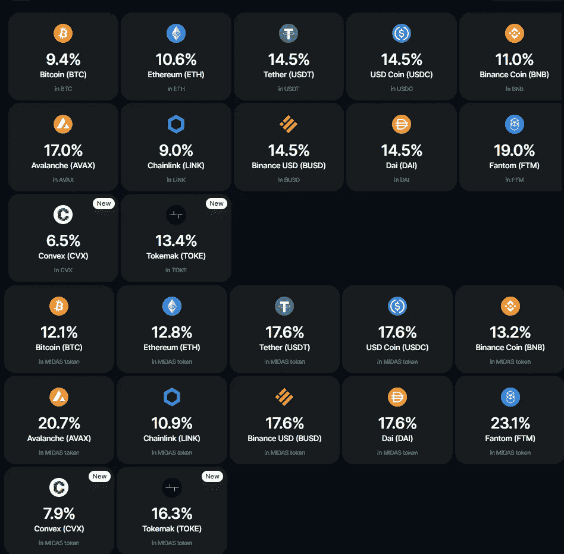
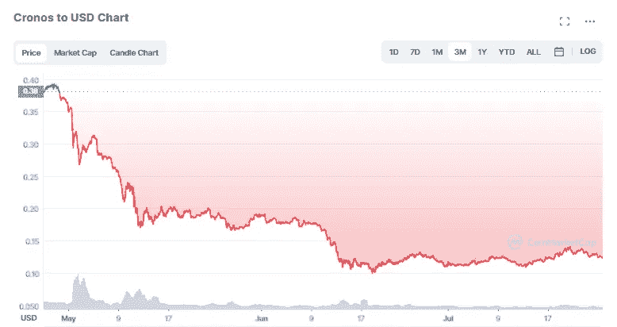
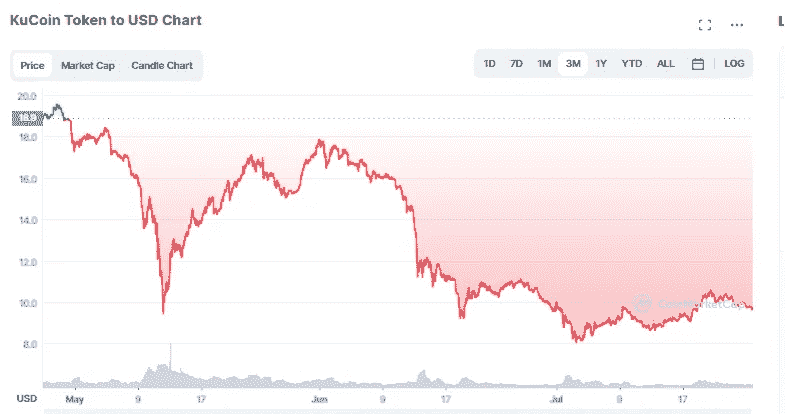
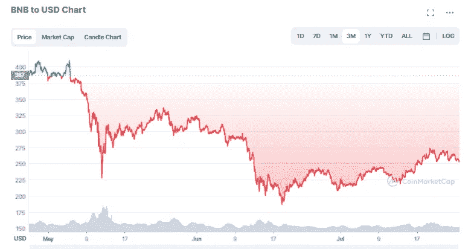
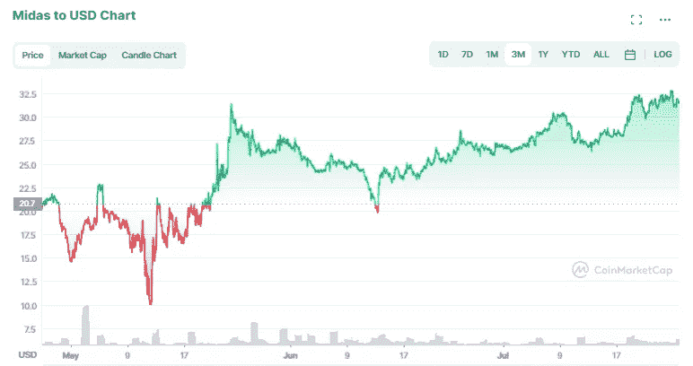
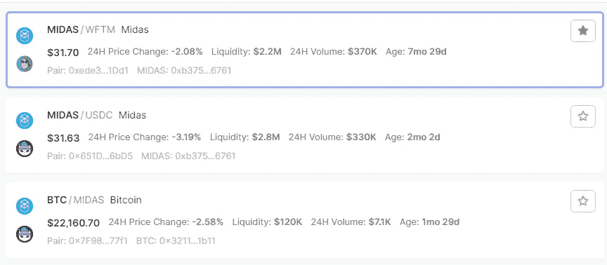
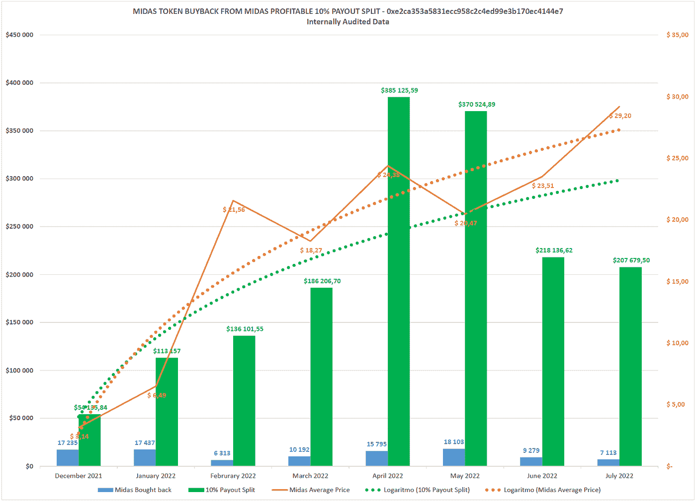

# 美元是如何在熊市中冲击 ATH 的

> 原文：<https://medium.com/coinmonks/how-midas-is-hitting-aths-in-a-bear-market-fb6c201c0da?source=collection_archive---------7----------------------->

再次大家好，如果你一直在关注我的其他文章，你会知道我是 [Midas Investments](https://midas.investments?p=0191) 的超级粉丝，你会注意到每次我提到$MIDAS token 时，它的价格总是跑赢市场，不仅如此，它似乎一直在冲击 ATH。

他们在[不和](https://discord.gg/midas)中经常被问到的一个主要问题是代币本身以及它如何能够持续产生这些稳定的回报。在本文中，我将对代币本身做一些深入的探讨，希望能对$MIDAS 代币是否值得投资有一个更好的认识。

# 快速介绍 Midas 和 Midas Boost

出于本文的目的，我不打算深入研究平台本身，但如果你对他们如何产生回报以及他们的安全措施感到好奇，请查看我的[最新评论](/coinmonks/midas-investments-unphased-through-a-bear-market-july-2022-update-41929d11dbe6)。但简而言之， [Midas Investments](https://midas.investments/?p=0191) 是一个加密投资平台，你可以通过各种不同的加密货币获得被动收入。但是是什么让它与众不同呢？APY 利率。由于没有锁定期，他们仍然继续提供一些最好的本地回报(甚至在 Midas Boost 的帮助下大幅提高)，这些回报每天都在复合和增加:

对于那些看好 MIDAS 及其长期未来的人来说，如果你选择用美元 Midas 而不是本国货币来赚取加密货币，你可以获得额外的收益率。举例来说，用户只需点击一个按钮，就可以决定他们是想在本土的$BTC 赚取 9.4%的 APY，还是想在$MIDAS 赚取 12.1%的利率。

# 兑换硬币一毛钱一打，他们通常是一个糟糕的投资

正如我以前在许多文章中提到的，有大量不同的平台和交易所试图激励用户坚持使用平台的本机令牌。无论是通过 KuCoin 的$KCS 代币赚取平台费，还是通过在 Crypto.com 持有$CRO 获得借记卡特权，基本上基本原理都是一样的——持有更多平台代币“X ”,您将获得更多“Y”优惠。不管这种“利益”可能有多好,“X”的象征性价格通常讲述着同样的故事——而不是一个有利可图的故事。为了说明这个故事，让我们首先浏览几个图表，看看最近不同交易所代币的价格变化。

过去 3 个月内，$CRO，Crypto.com 的本地令牌:

过去 3 个月期间的$KCS，库币的本地令牌:

最后是$BNB 的最后 3 个月，币安的本地令牌:

老实说，我可以继续列举无数其他平台/交易所代币，但我想你可以知道我在说什么——在过去几个月里，交易所的许多代币几乎与市场的其他代币一样暴跌。但是，相比之下，我们来看看$MIDAS 过去 3 个月的情况:

尽管加密货币世界经历了显著的全市场低迷，但 MIDAS 继续超越市场其余部分，同时创下历史新高。

# $MIDAS 有何不同？

首先，让我们从本质上分析一下$MIDAS 令牌是什么。正如我在以前的文章中提到的，投资$MIDAS 实质上就是投资这个平台本身。如果 Midas 赚的钱比预期的多，额外的价值将被转移到 Midas 流动性池，这反过来又增加了$MIDAS 代币的价值。在 Midas 中，代币的价值基本上是从 Midas boosts 循环到流动性池，然后再回到 Midas boosts。在 2 月下旬，他们报告说，目前的令牌发射率约为每天 1600 个令牌，然后在未来 3-5 年内将限制在 500 万个左右，其中 150 万个将在 Midas 平台上下注。迄今为止，大约有 286 万本在流通。我认为有几个因素使$MIDAS 相对独特:

**Midas 平台的构建类似于 OTC:** 由于平台的设置方式，持有个人用户的$MIDAS 令牌的钱包(核心钱包)基本上为希望在其平台上交易/购买/出售$MIDAS 的人建立了自己的 OTC 市场。换句话说，通过隔离平台本身的大量美元 Midas 流动，它不容易受到巨大的外部市场买入或卖出压力的影响，因为它本质上只是在用户之间移动，或者更具体地说，只是在 MIDAS 自己的用户账户之间不同地分配。

**抵抗市场力量:**只要迈达斯控制着$MIDAS 代币的绝大部分，他们将继续对$MIDAS 的市场敞口进行相对受控的检查。如果你在 ftmscan.com 的[上查找$MIDAS，看看大多数代币在哪里持有，迄今为止，超过 80%的$MIDAS 代币要么由平台直接持有，(大约 68%在 MIDAS 的](https://ftmscan.com/token/0xb37528da6b4d378305d000a66ad91bd88e626761#balances)[核心钱包](https://ftmscan.com/token/0xb37528da6b4d378305d000a66ad91bd88e626761?a=0x6cc9e8a3d90fefd4e9723d1a3c6977fb0173843b)，另外 8%用于[平台掉期购买](https://ftmscan.com/token/0xb37528da6b4d378305d000a66ad91bd88e626761?a=0x7814d71a4b12f6213bf702c3a0e31448ccb2ff29)，然后大约 6%在 MIDAS 的[国库钱包。总计约 240 万代币，价值 100 万美元。或者，如果你查看$MIDAS 在 dexscreener.com 的敞口，只有少数几个资金池拥有可观的流动性:](https://ftmscan.com/token/0xb37528da6b4d378305d000a66ad91bd88e626761?a=0xd77d15dca779a09d521a7311aa786b374da9569f)

如果考虑所有这些池的 TVL，这大约相当于 510 万美元。这 510 万美元的$MIDAS 在流动性池中仅构成总价值约 16 万美元的$MIDAS 代币，与 MIDAS 的 240 万美元相比相形见绌。**换句话说，不管是好是坏，因为大部分代币实际上是由迈达斯自己持有的，所以他们自己最有能力操纵价格。**说到价格操纵，这引出了我的下一个话题……

**支出分割回购:**或许普莱斯秘方中最大的元素是迈达斯的支出分割回购。几乎每周，MIDAS 都会在公开市场上用公司收益进行 Midas 美元回购，这相当于支付给 Midas 用户社区的利润的 10%。目前，通过拆分回购，一半的代币被指定用于迈达斯的增长基金，另一半被指定用于迈达斯 APY 提振。(请注意，有一个保留的第三选项来燃烧代币，但似乎因为它们仍处于支付拆分回购的“启动阶段”,所以此选项尚未行使。)

到目前为止，最近一次支付拆分回购是在 7 月 20 日进行的 1，786 美元的 MIDAS，这意味着假设当周$MIDAS 的现货价格约为 31 美元，相当于 MIDAS 本身回购的$MIDAS 价值约为 55，000 美元。再放大一点，你可以看到$MIDAS 的平均价格与回购相比的总体轨迹:

From Community Manager CC@ ESIR.Investments $ Midas [https://discord.com/channels/403129541243174914/817405069116309534/1001496929726906439](https://discord.com/channels/403129541243174914/817405069116309534/1001496929726906439)

以 4 月份为例，Midas 以 24.38 美元的平均价格回购了 15，795 个代币，总价值约为 385，126.59 美元。这种巨大的购买压力，如果发生在今天，公开市场 LP 上只有大约 510 万美元可用，将构成大约 7%的 TVL。如果这对你来说不是很多，如果我们对$ETH 最大的 30 家 LP 进行同样的比较，总额约为 2.37 亿美元，约 7%的回购价值约为 1660 万美元。这种比较突出了我想在下一节提出的一些东西:

# 风险，或者至少是需要警惕的事情

**$MIDAS 市值小:**虽然增长迅速，但据 [Coinmarketcap](https://coinmarketcap.com/currencies/midas/) 称，Midas token 的总市值勉强突破前 3000。这通常意味着，代币(或至少应该)受到更高波动性的影响，最终更有可能被操纵价格。回到我与$ETH 的比较，1660 万美元的买卖比 38.5 万美元的买卖更难完成，因此$MIDAS 更容易受到鲸鱼攻击。

**难道没有人说回购不好吗？:** [伊丽莎白·沃伦](https://www.cnbc.com/2021/03/02/elizabeth-warren-rips-stock-buybacks-as-nothing-but-paper-manipulation.html)当然说他们是。老实说，当她描述回购时，我同意她的观点，回购“无助于提高企业或其生产的商品和服务的质量。”然而，在 Midas 的案例中，除了用户的 APY 提升之外，一半的回购归于“增长基金”，根据他们的 [wiki 页面](https://wiki.midas.investments/midas-platform/midas-token#payout-split-program)，该基金可以资助多种选择，例如:

> 向新的或现有的流动性池提供流动性，为市场提供力量，并在新平台上创造机会。
> 
> 为用户提供新农业或赌注选项的开放流动性，这增加了 Midas 的外部认知度。
> 
> 营销机会，无论是我们评估的内部或外部活动，都会带来新的增长机会。

在 Midas 的案例中，增长基金的目的基本上是进一步发展平台和 MIDAS token 本身。从我最近看到的更新来看，增长基金正“闲置着，直到我们需要使用它们。”我的观点是，如果$MIDAS 有限合伙人的流动性变低，他们将能够使用其过剩的增长资金来提高流动性，从而将价格影响降至最低。但鉴于他们进行派息分割回购才刚刚半年，我不认为他们会有所行动，至少目前不会。

**更大的整合带来了更大的威胁:**在任何情况下，如果你的平台持有大约 80%的代币总市值，通常都会带来更大的威胁。你对这种威胁的风险的评估应该基于你对 Midas 平台及其所有者的信任程度，他们不会卖掉令牌然后逃跑。我个人的意见是，如果有地毯拉，它会发生在几年前。Midas 本身已经在[生存了 4 年多](https://www.youtube.com/watch?v=KjtH3r5ckf4)，经历了多次熊市，团队通过多个渠道保持了一致和开放的沟通，包括 [Youtube](https://www.youtube.com/c/MidasInvestments) 、 [Reddit](https://www.reddit.com/r/midas_community/) 、 [Telegram](https://t.me/midas_community) 和 [Discord](https://discord.gg/midas) 。在迈达斯上，是什么真正打动了我？过去，Midas Investments 确实经历了一次黑客攻击，但 Midas 用户从未感受到影响，因为该公司自己承担了损失。事实上，他们在将成本转嫁给用户之前遭受了严重的财务打击，这显示了 Midas 的诚信，并让我更加相信他们有多么关心社区和对他们试图创造的东西的投资。尽管如此，我们现在已经看到了 3AC 和 Celsius 等产品背后的情况，我认为我们都需要继续保持一定程度的怀疑态度，尤其是在资金用途不是 100%透明的情况下。这让我想到了下一个也是最后一个风险因素:

**当“不是你的钥匙”时，透明度是关键:** Midas 是一个托管平台，你把你的资金交给你的基金，放弃托管，委托他们基本上不会损失你的资金。迈达斯本身也没有保险，即使他们所有的资产都放在了[消防栓](https://www.fireblocks.com/platforms/security/)上，这也是有保险的。

如果你通读了对 Midas 的任何批评，也许第一个重复的批评是，他们对自己的方法和如何获得市场领先的收益率不是 100%透明。如果你想更深入地了解他们确实提供的信息，我邀请你[阅读我最新研究的评论](/coinmonks/midas-investments-unphased-through-a-bear-market-july-2022-update-41929d11dbe6)，但我发现的关于他们为什么不能对他们的方法如此透明的最清楚的解释可能来自他们的首席运营官的 [reddit 帖子，Dan Carson](https://www.reddit.com/r/defi/comments/v8fnpn/comment/ibs9phz/?utm_source=share&utm_medium=web2x&context=3) :

> 我将进一步阐述这个问题。我们没有公布确切的战略有几个原因:
> 我)这是给迈达斯我们的竞争优势。正如我之前提到的，我们有一个分析师团队，他们不断监控 defi 空间，以制定策略，使我们能够利用大量流动性支持较低风险范围内的强劲收益机会。这三个标准的组合是一个难以实现的目标。虽然我们并不担心我们的用户直接复制这些策略，但很明显，在公共领域发布我们的策略会对 Midas 提供的 USP 造成损害。我们现在的规模足以让竞争对手和潜在竞争对手关注我们的新闻和更新，而我们只会为竞争对手的增加敞开大门。
> 
> *ii)定期改变策略。我们本周发布的内容下周可能就无关紧要了。虽然我们的战略大纲将保持不变，但其中的实际战略会不断变化。*
> 
> 提供的信息不可能让每个人都满意。有些人想要更多的风险，有些人想要更少的。有些人希望我们探索其他机会。Crypto 充满了各种观点，而观点往往是分裂性的。我们坚信我们的 Defi 团队。他们在构建我们的战略时考虑到了优化的收益潜力和强大的风险管理元素，他们向我们的用户提供我们支付的收益，而没有外部影响/压力使我们的战略朝着特定的方向发展。

简而言之，Midas 的任何潜在用户都必须权衡他们是否有能力信任一个平台，以实现他们能够获得的收益。我们已经看到许多公司领导人，如首席执行官亚历克斯·马辛斯基(Alex Mashinsky)在几天内就做了 180 度的转变，所以如果过去一个月的所有 FUD 和传染告诉我们什么的话，不要愿意投资超过你可能失去的，并确保在这样做之前尝试权衡所有的风险和收益。

# 结论

虽然在熊市期间，我通常很害怕在替代币中投入任何东西，但在 Midas 团队正在做的事情之后，当$MIDAS 令牌几乎击败了整个加密货币市场时，继续袖手旁观开始感觉有点愚蠢。

数字会永远上升吗？就我个人而言，我不这么认为，因为随着 Midas 的持续增长，我认为随着 AUM 越来越多，团队继续创造收益率将变得更具挑战性，这意味着最终$MIDAS 令牌的价格必须在某个地方稳定下来。然而，目前市值只有 3000，我认为这个平台还有很大的增长空间，只要它继续提供这样的收益，我非常期待美元的价格会继续上涨。

最后，我认为 Midas 社区对他们最有利的一点是它的社区成员。如果你随意浏览一下他们的[不和](https://discord.gg/midas)，你会注意到许多成员谈论美元迈达斯，就好像他们是比特币马克西谈论美元 BTC。如果你还有任何问题，我强烈建议你要么从这里开始，要么看看 7 月中旬通过 reddit 与 Midas 首席执行官 Trevor 举办的[最后一次 AMA。在这里，他还深入回答了我们对迈达斯的未来可以期待的许多事情。](https://www.reddit.com/r/midas_community/comments/vstbav/qa_with_midas_ceo_trevor_july_2022/)

再次感谢您的阅读，如果您还没有尝试过 Midas 但感兴趣，请考虑支持我的博客并使用我的会员链接: [https://midas.investments？p=0191](https://midas.investments/?p=0191) 。此外，请务必在 twitter 上关注我，获取我所有的最新动态:[https://twitter.com/CryptosWith](https://twitter.com/CryptosWith)

免责声明:最后提醒一下，这不是财务建议，仅用于教育和娱乐目的。请一如既往地做自己的研究，找到最适合你的投资。干杯大家！

> 交易新手？试试[加密交易机器人](/coinmonks/crypto-trading-bot-c2ffce8acb2a)或者[复制交易](/coinmonks/top-10-crypto-copy-trading-platforms-for-beginners-d0c37c7d698c)