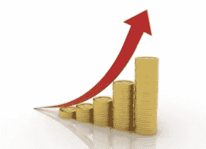

# 熊市如何造就百万富翁:

> 原文：<https://medium.com/coinmonks/how-millionaires-are-made-in-bear-market-f67fd3b10fb3?source=collection_archive---------14----------------------->

你一定听过有人说这个价格买比特币或者 DCA 你的包。但它实际上意味着什么，我们如何在熊市中开始积累？在这篇文章中，我将分享两个技巧，帮助你迈向百万美元。

首先，当你明白我们正在目睹一场崩溃时，不要惊慌。控制自己的情绪，开始理性思考如何处理这种情况。如果市场下跌，你的投资组合大幅缩水，那么你要做的第一件事就是不要恐慌性抛售。然后做一点研究，弄清楚你手中的硬币是否值得冒更大的风险。如果你已经发现硬币有很强的基本面，很可能在熊市中幸存下来，那么开始做 DCA。积累硬币是部分，并保持你的一些资金在手，总是为最坏的市场情况。现在你可能会问，什么是 DCA？

**美元平均成本(DCA):**
美元平均成本是在市场下跌或横盘时，将你的资金进行分割，并在区间内买入。制定一个百分比计划来划分你的投资组合，当市场下跌 20%时，你将把第一笔资金投入 DCA。这将平均出你的买入价，当市场恢复到你最初的买入价。由于平均每次下跌，你会有更好的利润。第二种方法是 SIP。

**系统投资计划(SIP):**
在这种方法中，你并不真正关心你想要积累的资产的价格。如果你是一个有固定工作的人，那么这种技术将适合你做熊市投资组合。基于每月的基础上，每当你收到资金。从你的薪水中拿出一定比例投资到你想要积累的资产上。在熊市中，当价格持续下跌或横盘时，应该这样做。制定一个目标，你要在这 x 的时间内持有 x 数量的硬币，不管是几年还是下一个周期。

当资产价格比之前的 ATH 至少下跌 50-80%时，应启动 SIP。在开始投资之前，做好你的研究，让他们相信这个项目的基本面将会继续存在，并在下一个周期变得更强。这是在熊市中可以用来为下一个周期带来最佳回报的两种技巧。

**我希望为下一个牛市积累的加密资产:**
从现在开始，我将定期在我的免费电报频道中分享在熊市中值得积累的项目及其基本面和技术面，这样你就不必费太多周折来找出什么是值得的。

**注:**此处发布的任何内容都不能作为财务建议。在决定投资之前，一定要做好自己的研究。

**推特**[@ Itsdehamza](https://twitter.com/Itsdehamza)
电报[https://t.me/CryptoniumG](https://t.me/CryptoniumG)

> 加入 Coinmonks [电报频道](https://t.me/coincodecap)和 [Youtube 频道](https://www.youtube.com/c/coinmonks/videos)了解加密交易和投资

# 另外，阅读

*   [交易杠杆代币的最佳交易所](https://coincodecap.com/leveraged-token-exchanges) | [购买 Floki](https://coincodecap.com/buy-floki-inu-token)
*   [3 commas vs . Pionex vs . crypto hopper](https://coincodecap.com/3commas-vs-pionex-vs-cryptohopper)|[Bingbon Review](https://coincodecap.com/bingbon-review)
*   [加密复制交易平台](/coinmonks/top-10-crypto-copy-trading-platforms-for-beginners-d0c37c7d698c) | [如何在 WazirX 上购买比特币](/coinmonks/buy-bitcoin-on-wazirx-2d12b7989af1)
*   [硬币评论](https://coincodecap.com/coinloan-review)|[Crypto.com 评论](/coinmonks/crypto-com-review-f143dca1f74c)
*   [如何在加拿大购买加密货币？](https://coincodecap.com/how-to-buy-cryptocurrency-in-canada)