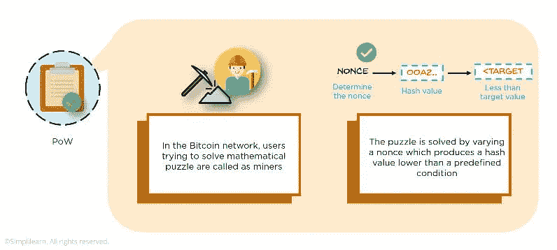
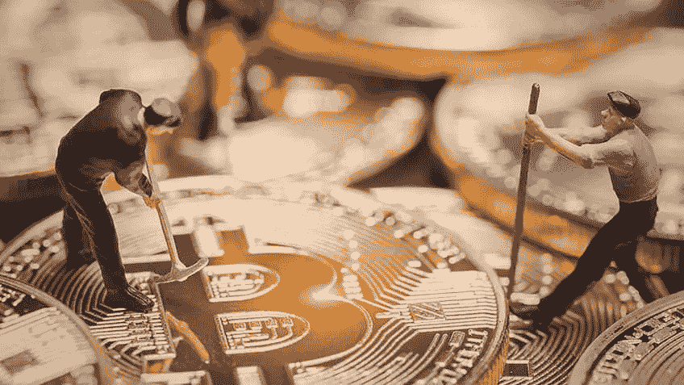

# 开采虚拟货币如何污染现实世界的环境

> 原文：<https://medium.com/coinmonks/how-mining-a-virtual-currency-pollutes-the-real-worlds-environment-c57472a5fbe0?source=collection_archive---------36----------------------->

Mendelson/Insider

随着世界努力应对气候变化，我们已经确定了化石燃料、资源开采和工业污染是主要的罪魁祸首，但近年来，争论已经转向了加密货币。

作为秘密资本家竞争，看看谁可以找到链上的下一个区块，试图建立大型采矿钻机，以获得奖励。忽略了一个事实，那就是那些钻塔比全加密钱包产生更多的污染。

# **加密货币对环境有什么影响？**

要理解加密货币的环境后果，我们必须首先完全理解新硬币的创造过程。因为加密货币不像美元那样由中央机构管理，而是由美联储印刷。

区块链依靠遍布全球的网络用户来验证交易并向区块链添加新的信息块。因此，它是自动化的，依赖于自己的网络。

[https://www.simplilearn.com/](https://www.simplilearn.com/)

工作证明(Pow)是一种共识机制，允许用户通过解决复杂的数学程序来验证加密货币交易。众所周知，这是非常困难和昂贵的验证，它有助于防止坏人试图操纵这一新的信息和窃取区块链令牌。

第一个解决每个方块的难题并验证交易的人将获得固定金额的加密货币。然后循环重复，直到所有区块都被开采。

当有人“挖掘”加密货币时，他们实际上是在自己的计算机上运行程序，试图解决问题。您的计算机越强大，您获得更新区块链并从中获益的机会就越大。因此，矿商受到激励，为其采矿业务投入更多的力量，以超越竞争对手，最终赚更多的钱。

根据剑桥大学的数据，仅比特币每年就产生 132.48 太瓦时(TWh)，轻松超过挪威 2020 年 123 太瓦时的年能耗。这种能源使用所排放的二氧化碳量将因能源产生方式的不同而不同。然而，在 2020 年，美国——自中国在 2021 年禁止加密货币开采以来，35.4%的比特币开采发生在美国——每千瓦时产生 0.85 磅二氧化碳。这相当于仅在美国比特币开采就排放了近 400 亿磅二氧化碳。

此外，每隔四年左右，比特币的分发量就会减半，简称减半。上一次减半发生在 2020 年，奖励从 12.5 个硬币减少到 6.25 个硬币。2024 年奖励会降到 3.125 币，以此类推。每减少一半，生产一枚硬币所需的碳排放量就会在一夜之间增加一倍。

[https://www.simplilearn.com/](https://www.simplilearn.com/)

# 加密货币开采可以使用更少的能源吗？

大型加密货币矿商通常位于能源丰富、可靠且廉价的地区。然而，加密货币交易和硬币铸造不一定是能源密集型的。

验证加密货币交易和铸造新硬币的利害关系证明(PoS)方法是加密货币挖掘的低计算能力替代方法。简单地说，你用 crypto 创建 crypto。

虽然以太坊开发者的目标是逐步淘汰工作证明机制，转而使用利益证明，但比特币社区却没有这样的目标。关于这个的更多信息可以在这里找到

其他验证方法也在开发中，如历史证明、经过时间证明、燃烧证明和容量证明。

# 加密货币环保吗？

一些加密货币对能源的要求很高，需要专门的设备，并且会产生大量的废物。有些在这个意义上并不环保；然而，重要的是要考虑收集自然资源和消耗能源和电力来创造和维持法定货币和我们当前的银行系统的环境成本。

# 密码和环境的未来

尽管加密货币生成的替代来源取得了进展，但工作证明挖掘没有显示出放缓的迹象，因为比特币的能源消耗随着时间的推移不断增加。

工作证明采矿的问题是找到一种可持续的方式来供应这些矿工使用的计算能力所需的电力。这需要将采矿作业从美国转移到拥有更多绿色能源生产选择的国家。

> 交易新手？试试[密码交易机器人](/coinmonks/crypto-trading-bot-c2ffce8acb2a)或者[复制交易](/coinmonks/top-10-crypto-copy-trading-platforms-for-beginners-d0c37c7d698c)