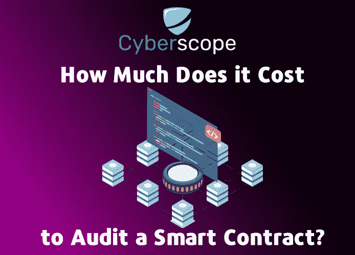
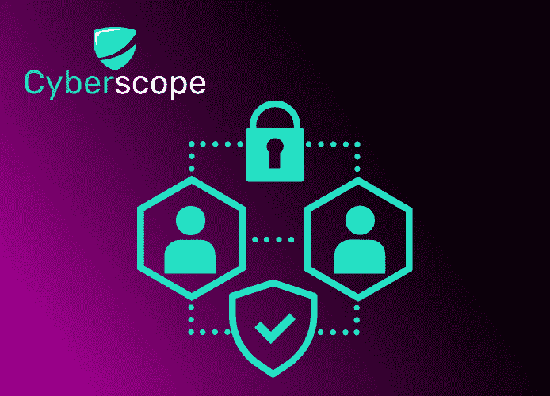
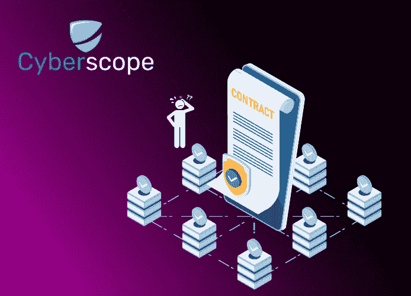

# 审计一份智能合同要花多少钱？

> 原文：<https://medium.com/coinmonks/how-much-does-it-cost-to-audit-a-smart-contract-27ace328c0ce?source=collection_archive---------2----------------------->

# 介绍

智能合同继续获得认可，甚至获得风险投资。事实上，最近的研究表明，61%的企业声称计划将区块链技术集成到其核心业务流程中。然而，采用智能合同的一个主要问题是信任和缺乏监管框架。很少有(如果有的话)适用的法律来解决自动化商业交易产生的争议。

随着智能合同安全性的日益重要，审计已经成为保护区块链最常用的方法之一。在下面的文章中，我们将分析完成一次审计需要多少时间以及可能的成本。

# 什么是智能合同审计，为什么它很重要？

智能合同是自动执行的合同，买卖双方之间的协议条款直接写入代码行。代码在区块链网络上存储、分发和复制。智能合同允许在不同的匿名方之间执行可信的交易和协议，而不需要中央权威机构、法律系统或外部执行机制。区块链可用于跟踪交易，并使交易对所有相关方透明。

一个[加密安全审计](https://www.cyberscope.io/blog/how-to-do-a-basic-crypto-security-audit-to-your-smart-contract)关注智能合同的源代码，以确保它按预期运行。审计员使用代码的自动检查和手动审查来全面了解合同的运作方式及其目的。

审计报告对开发人员很重要，因为它允许他们检查代码中的漏洞，这些漏洞可能被外部参与者利用。通过这种方式，他们可以确保合同不会以不符合其本意的方式运行。它还可以向投资者和合同用户提供他们安全地与合同进行交互所需的信任和保证。

# 智能合约有多少种？

在我们分析可能影响审计成本和时间范围的因素之前，让我们先来看看现有的 3 种类型的合同:

**1。智能法律合同** 智能合同是自动执行的法律协议。它们具有与传统合同相同的要求，如通过有效要约和承诺表达的相互同意；充分考虑；容量；和合法性。如果设置得当，智能合同在法律上是可执行的，并要求双方履行义务。如果一方未能履行其义务，合同可以自动引发对违约方的法律诉讼。

**2。分散自治组织** [道](https://www.cyberscope.io/blog/what-is-a-dao-and-how-to-create-one)代表分散自治组织，描述了一个存在于区块链的社区。这个社区由一组被编码为智能合同的约定规则定义，所有参与者都执行这些规则。每个参与者的行为都受这些规则的约束，执行这些规则的任务由网络中的所有参与者分担。规则本身由许多智能契约组成，它们一起工作来跟踪 DAO 中的活动。

**3。应用逻辑契约** 应用逻辑契约(ALCs)是多功能智能契约的重要组成部分。它们支持不同设备之间的通信，并支持物联网技术与区块链技术的融合。

智能合约拥有以高度精确、安全和高效的方式执行交易所需的所有品质。然而，由于智能合约是用代码编写的，如果没有计算机编程背景，每个人都不容易从头开始创建一个智能合约。

# 完成一次审计需要多长时间？

从各种类型的智能合同中可以看出，审计需要完成的时间框架取决于许多参数。下面我们来讨论更关键的几个:

审计要考虑的第一个也是最重要的因素是项目的规模。例如，如果您希望对一份简单的 ERC20 或 BEP20 令牌合同进行审计，那么您可以在 48 小时内获得审计报告。但是，如果令牌是 Dapp 的一部分，就不可能在相同的时间范围内检查代码。审计过程可能需要几周时间才能完成。合同类型在确定贵公司多快可以获得智能合同审计结果方面也起着重要作用。高级 ERC20 合同比基本合同具有更多功能，因此审计时间比基本合同长。

**复杂性** 在确定项目的复杂性时，考虑审计人员需要多少时间来完成他们的工作。合同包含的功能和定制代码越多，审计人员分析和运行所有测试所需的时间就越多。此外，它可能使用的外部文件越多，逐行检查就越复杂。

**审核类型** 审核类型通常分为两大类:手动**审核和自动**审核****

**人工审计**需要检查代码行的潜在漏洞和编程错误。他们还确保智能合同遵守其固有的业务逻辑，以及识别边缘情况和优化天然气使用代码。单元测试也包括在智能合约的手动审核过程中。

**自动化审计**是一种使用[审计工具](https://www.cyberscope.io/blog/free-smart-contract-audit-tools-for-investors)扫描代码缺陷的方法。它保证涵盖智能合约的所有方面，不给人为错误留下任何空间。对于 ERC20/BEP20 合同，自动审核可能需要一天时间。

# 智能合同审计的成本是多少？

提供智能合同审计服务的公司平均收费从 1000 美元到 15000 美元不等。然而，在某些情况下，价格甚至会更高。如您所知，智能合约的开发、部署和技术支持费用可能会高得惊人。尽管如此，还是推荐使用智能契约审计，因为即使是代码中的一个小错误，最终也会导致更高的成本。

# 结论

我们希望这些见解能让您在执行智能合同审计时有个好主意。如果您需要智能合同的智能合同审计报价，请随时发送消息给我们:contact@cyberscope.io

*…*

*原载于*[*www . cyber scope . io*](https://www.cyberscope.io/)

> 交易新手？尝试[加密交易机器人](/coinmonks/crypto-trading-bot-c2ffce8acb2a)或[复制交易](/coinmonks/top-10-crypto-copy-trading-platforms-for-beginners-d0c37c7d698c)