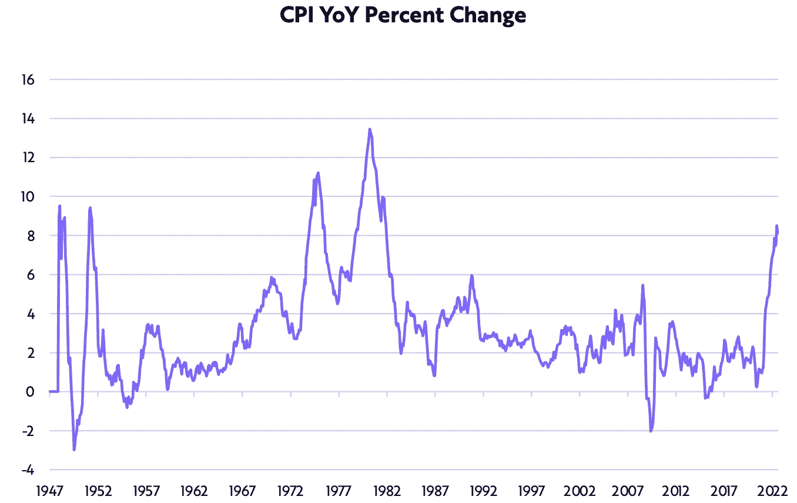

# 🦮:网络 3 对网络 2 的发展有多重要？

> 原文：<https://medium.com/coinmonks/how-much-does-web3-need-web2-to-thrive-ad355490818b?source=collection_archive---------42----------------------->

# 内容(4 分钟阅读):

*   🦮:网络 3 需要网络 2 有多强大？
*   👨‍👩‍👧‍👧[startup y](https://beta.startupy.world/membership/?ref=yarocelis)——社区管理的搜索引擎
*   📈本周表现最佳的前五名
*   😟[以太坊](http://ycobitcoin.com/)矿工会破产吗
*   🏖️个人退休帐户，避税帐户
*   **🏠房屋库存数字显示经济衰退**
*   🛍️消费价格指数达到自 20 世纪 80 年代以来的最高点
*   📰热门阅读
*   🙏🏻感激…

# 🦮:网络 3 对网络 2 的发展有多重要？

随着 Axie Infinity 的创造者 Sky Mavis 致力于进一步分散其 Ronin 网络——一个为 NFT 驱动的游戏设计的定制以太坊侧链。

今天，Sky Mavis 宣布，它已与谷歌云达成协议，将看到国际科技巨头的云计算部门在 Ronin 上运行验证器节点。这意味着谷歌云将有助于保护侧链网络和处理交易。

Sky Mavis 的一名代表拒绝透露交易的具体条款。根据一份新闻稿，自 2020 年以来，谷歌云已经是这家初创公司的“战略云合作伙伴”，但这是他们关系中的一个新问题。云解决方案公司 Searce 将协助合作。

其他 web3 和区块链公司依靠 web2 巨头来保护他们的网络，并提供云解决方案和专业知识。这让我们意识到 web3 技术是多么不成熟，它需要多么依赖强大的成熟技术才能使这些新公司的根基稳固，并安全地在准备吃午餐的黑客世界中导航。

[**Startupy**](https://beta.startupy.world/membership/?ref=yarocelis)

> 我很高兴地宣布，我已经成为 Startupy 的策展人和会员。一个社区管理的搜索引擎。零 SEO BS。 [***我邀请你加入这个为漫游、研究和思考而设计的知识和见解的令人愉快的图书馆。***](https://beta.startupy.world/membership/?ref=yarocelis)

# 📈本周顶级密码搬运工

# 😟以太坊矿工会破产吗

以太坊转向利益攸关的区块链后，矿商们将会“破产”——一个价值数十亿美元的行业将在一夜之间消失。

这是钱德勒·郭(Chandler Guo)的说法，他是一名矿工，正在领导保持网络当前工作证明共识机制的努力。以太坊将于下周完成向股权证明的过渡，许多从以太坊采矿活动中获利的矿商将需要期权。

自 2015 年推出以来，[以太坊](http://ycobitcoin.com/)一直基于比特币等 PoW，矿工负责验证交易并将其加入区块链。

但是工作证明因其使用的大量能源而受到批评，人们担心这样的网络最终会导致气候变化。

利益证明意味着验证者——需要锁定 32 个 ETH 来运行一个节点——将负责验证交易。这意味着他们将是未来获得闪亮新 ETH 的人…而不是矿工。根据以太坊基金会的说法，这种方法将削减其区块链 99.95%的能源使用——这一举措可能使这项技术更受环保意识企业的欢迎。

郭告诉 [CoinMarketRecap](http://coinmarketcap.com/) 播客，他反对 PoS 不是为了钱——相反，他担心这种共识机制会影响以太坊的审查阻力和用户的隐私。

加密货币是这些天每个人都在谈论的东西之一。有各种不同的交易所进行加密交易，但是许多人没有意识到他们在税费上损失了多少。

iTrustCapital 允许其客户通过个人退休账户或个人退休帐户投资 crypto，而不必担心税收或费用。

IRA 是避税账户，这意味着你所有的加密交易都是免税的，并且随着时间的推移可以免税。

没有隐藏的费用。[要了解更多信息，请点击此处并开通免费账户。](https://itrustcapital.com/referral100?utm_source=partner&utm_medium=youtube&utm_campaign=partner637&oid=10&affid=637)

[分享 Yaro 的技术& WebX 简讯](https://yarocelis.substack.com/?utm_source=substack&utm_medium=email&utm_content=share&action=share)

# 🏠房屋库存数字表明经济衰退

新房供应相对于新房销售的比例已飙升至 2008 年房地产危机以来的最高水平。尽管美联储处于进退两难的境地，但实际 GDP 负增长和大宗商品价格下跌可能会缓和其鹰派立场。

方舟投资智能

# 🛍️消费价格指数达到自 20 世纪 80 年代以来的最高点

与去年同期相比，以消费者价格指数(CPI)衡量的通货膨胀率已经上升到 8.5%。当冒险投资者寻找支点的迹象时，美联储的鹰派立场，以鲍威尔主席的杰克逊霍尔声明为例，表明了比预期更长的等待

[分享](https://yarocelis.substack.com/p/how-much-does-web3-need-web2-to-thrive?utm_source=substack&utm_medium=email&utm_content=share&action=share&token=eyJ1c2VyX2lkIjo4NzI4NzQyLCJwb3N0X2lkIjo3MjE5MTM2OCwiaWF0IjoxNjYyOTU1NTA2LCJleHAiOjE2NjU1NDc1MDYsImlzcyI6InB1Yi0yODIwMjIiLCJzdWIiOiJwb3N0LXJlYWN0aW9uIn0.KTkBtfyZjoxjGoTSiBWgzogJMn0guGiIG8YYZ6PIFvM)

方舟投资智能

# 📰热门阅读

*   [随着监管审查的加强，SEC 计划成立新的数字资产办公室](https://forkast.news/headlines/regulatory-scrutiny-sec-digital-asset/)
*   [比特币和以太坊泵、猿、蛋糕跑赢](https://cryptonews.com/news/bitcoin-ethereum-pump-ape-cake-outperform.htm)
*   [谷歌涉足以太坊将兴奋与俏皮的复活节彩蛋融合在一起](https://cointelegraph.com/news/google-gets-in-on-ethereum-merge-excitement-with-nifty-easter-egg)
*   [市场:比特币成为十大加密技术中唯一的赢家，以太网下跌，Polkadot 引领输家](https://forkast.news/headlines/markets-bitcoin-sole-crypto-ether-polkadot/)
*   [以太坊合并使网络更易受到攻击——安全专家](https://cointelegraph.com/news/ethereum-merge-makes-network-more-vulnerable-to-attack-security-expert)
*   [Chainlink 正在走向绿色，但 link 也会步其后尘吗](https://ambcrypto.com/chainlinks-going-green-but-will-link-follow-its-suit-too/)
*   塔伦蒂诺就低俗小说 NFTs 达成和解，暗示未来计划
*   [比特币反弹暗示熊市见底？顶级密码分析师在“辉煌”的价格行动后对 BTC 进行评估](https://dailyhodl.com/2022/09/11/bitcoin-bounce-suggesting-bear-market-bottom-top-crypto-analyst-weighs-in-on-btc-after-brilliant-price-action/)

> 交易新手？试试[密码交易机器人](/coinmonks/crypto-trading-bot-c2ffce8acb2a)或[复制交易](/coinmonks/top-10-crypto-copy-trading-platforms-for-beginners-d0c37c7d698c)