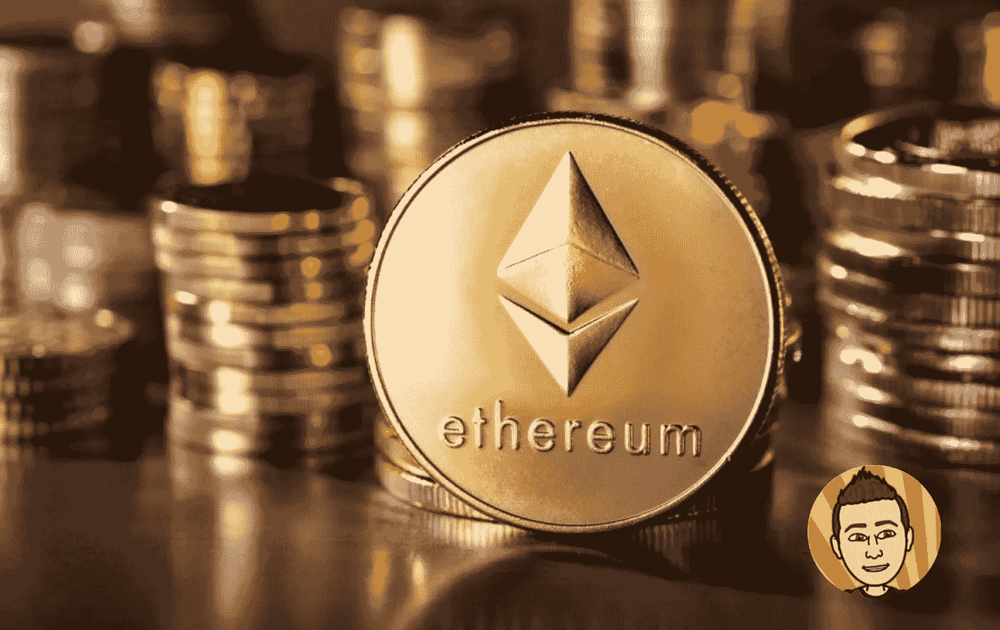

# 你需要多少以太币？

> 原文：<https://medium.com/coinmonks/how-much-ethereum-do-you-need-2e6b09068aef?source=collection_archive---------0----------------------->

说到加密货币，你需要具备的目的只有一个。尽可能多地积累比特币和以太坊。这两个硬币被认为是这个市场中仅有的两个真正的“蓝筹”资产，其余大部分都是纯粹的噪音和干扰。

但是你实际上需要拥有多少以太坊呢？答案因人而异，因为每个人都有不同的…