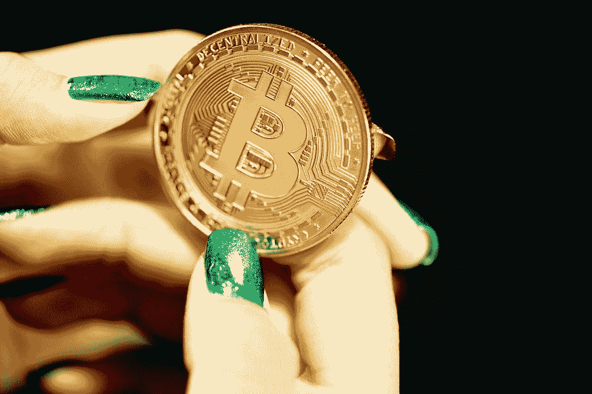

# 一个比特币值多少钱？

> 原文：<https://medium.com/coinmonks/how-much-is-a-bitcoin-worth-f325a52008bc?source=collection_archive---------26----------------------->

比特币通常被称为数字黄金。和黄金一样，比特币是一种供应有限的稀缺资源。然而，与黄金不同，比特币也是一个分散的网络，允许近乎即时的点对点交易。比特币的稀缺性和实用性的独特结合赋予了它其他资产所没有的内在价值。