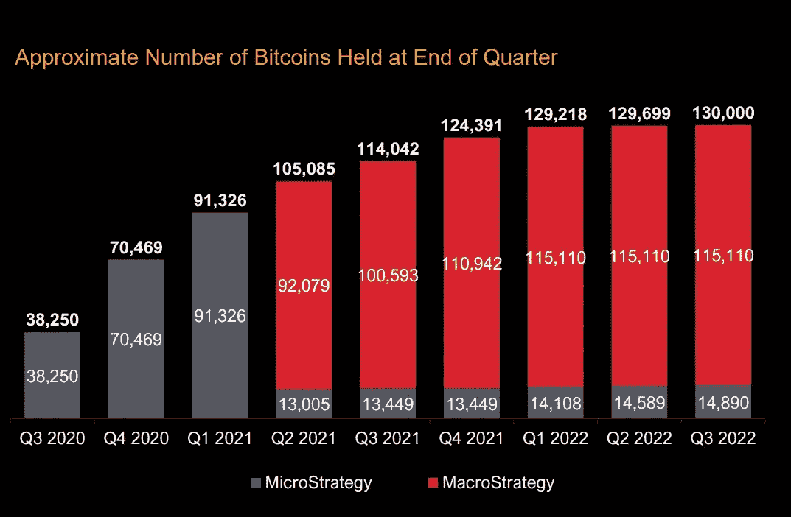

# 比特币价格下跌会给微观战略带来多大风险？

> 原文：<https://medium.com/coinmonks/how-much-microstrategy-is-at-risk-from-the-fall-of-bitcoins-price-1fce6e62f4d0?source=collection_archive---------7----------------------->

Photo by [Michael Förtsch](https://unsplash.com/@michael_f?utm_source=medium&utm_medium=referral) on [Unsplash](https://unsplash.com?utm_source=medium&utm_medium=referral)

Bitnewsbot 的老读者肯定不是第一次读到关于 [Microstrategy](https://bitnewsbot.com/microstrategy-from-the-dotcom-bubble-to-the-big-loss-of-bitcoin/) (MSTR)的报道。这是第一家以现金形式购买比特币的纳斯达克上市公司。这是一家总部位于美国的软件公司，专门从事商业智能和云服务。

该公司由迈克尔·塞勒于 1989 年创立，当时许多科技初创公司正在创建，并在 dot.com 泡沫破裂时达到顶峰。在那个疯狂的时期，MSTR 的价格从 70 美元飙升至 3300 美元。由于被美国证券交易委员会起诉，这次挤兑留下了阴影。

几乎所有当时在纳斯达克上市的公司都亏损了。很少有人获救。MicroStradegy 可能是幸存下来的公司之一，但从那以后就没怎么听说过了。

2015 年，油价曾短暂突破 200 美元。当该公司和迈克尔·塞勒开始认真对待比特币时，聚光灯都落在了他们身上。

MicroStrategy 可能是第一家上市公司，但今天已有 25 家紧随其后，其中最重要的是特斯拉。此后 12 家公司上市，主营业务为[加密货币开采](https://bitnewsbot.com/a-beginners-guide-to-cryptocurrency-mining/)和一家交易所、[比特币基地](https://bitnewsbot.com/coinbase-kraken-and-bitpanda-ceos-speak-out-on-ftx-crisis/)。

MicroStrategy 的开拓不止于此。在比特币大牛迈克尔·塞勒(Michael Saylor)的指导下，他发行债券购买额外的比特币。与 Nayib Bukele 一起，在他的总统任期内[萨尔瓦多将比特币作为其官方货币](https://bitnewsbot.com/one-year-ago-el-salvador-adopted-bitcoin-as-a-means-of-payment-what-does-its-portfolio-look-like-now/)(与美元同时)，他们要么将被写入最有远见的投资者和领导人的万神殿，要么历史将把他们视为破坏性的机会主义者。

【2020 年 8 月 MicroStrategy 首次买入比特币。金额为 2.5 亿美元。从那时起，大量的水已经流入下水道。它现在拥有 13 万个比特币，目前价值 21.4 亿美元。然而，经过最近几个月的下跌，他们的收购价格要高得多。它们以近 40 亿美元的价格被收购，平均价格为 30，639 美元，迄今为止亏损了 47%。

9 月，Microstrategy 将其持有的所有比特币整合到一个名为 **Macrostrategy** 的独立实体中。这个名字的灵感显然来自于该公司的名字及其创始人对比特币价值的长期认识。

**在我们从最新季度业绩中提取的下图中，我们可以看到比特币被收购的速度和数量。**

# 问题是

问题是，这些花出去的钱，大部分并没有来自于公司的盈利，而是来自于发债！具体来说，MicroStrategy 发行了 22 亿美元的债券，为其购买比特币提供资金。该公司提供 6%的息票。换句话说，如果未来几年比特币对美元的平均升值幅度超过 6%，那么 MicroStrategy 将会胜出。如果没有，那就亏了。

当然，除了公司第一次现金购买，还有过其他的。根据提交给美国证券交易委员会(sec)的数据文件，比特币最后一次被收购是在 8 月 2 日至 9 月 19 日之间。MicroStrategy 以约 600 万美元的价格购买了 301 枚比特币，平均每枚 19860 美元。

Saylor 已经公开承诺继续购买比特币。这是他确实在坚持的东西，尽管他辞去了首席执行官的职务，以便有空闲时间投入到他创建的基金会(还有什么？)推广比特币的理念。

鉴于目前该公司最大的资产是其拥有的比特币数量，据估计，如果加密货币跌至 13000 美元左右，Microstrategy 的内在价值将为负。它的负债将超过其资产价值。

这当然不会造成直接的现金问题。在 2025 年至 2028 年债券到期之前，它只需支付票息。然而，他还获得了一笔 3 年期 2.05 亿美元的贷款，用于购买比特币。这意味着，如果价格从一个水平或以下下跌，它将不得不提供额外的抵押品来提供覆盖。

几个月前，有传言称，如果比特币价格低于 21000 美元，MicroStrategy 将被迫清算其比特币，因为保证金通知将被触发。迈克尔·塞勒引用 2022 年第三季度的数据保证，情况并非如此。该公司持有的 13 万个比特币中，85059 个(65%)绝对没有借贷成本。

根据 Saylor 的说法，如果出现问题，加密货币将不得不退到 3562 美元。然而，即使在这种情况下，公司可以用其他资产作为抵押，这样就不会有问题。

*原载于 2022 年 11 月 21 日***。**

> *交易新手？试试[加密交易机器人](/coinmonks/crypto-trading-bot-c2ffce8acb2a)或者[复制交易](/coinmonks/top-10-crypto-copy-trading-platforms-for-beginners-d0c37c7d698c)*