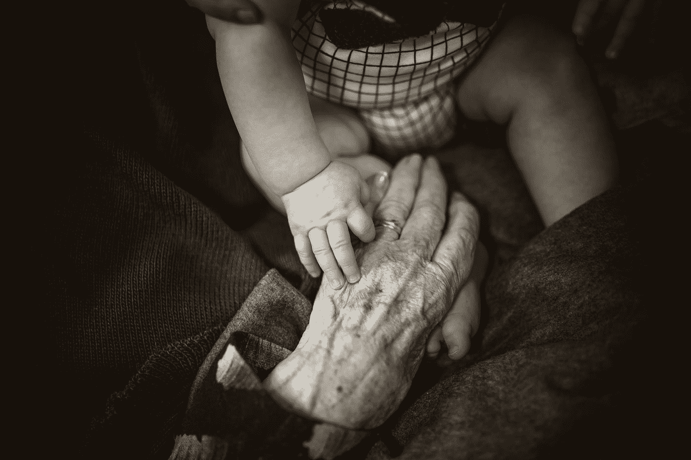

# 到英国时代，我应该存多少钱

> 原文：<https://medium.com/coinmonks/how-much-money-should-i-have-saved-by-age-uk-28863a211bcb?source=collection_archive---------20----------------------->

你应该为退休存多少钱？答案取决于你的年龄、收入和其他因素。

这篇文章最初来自我的网站 www.portfolio-hub.co.uk

Photo by [Rod Long](https://unsplash.com/@rodlong?utm_source=medium&utm_medium=referral) on [Unsplash](https://unsplash.com?utm_source=medium&utm_medium=referral)

退休对不同的人有不同的意义。对一些人来说，这是放松和享受生活的时候。其他人认为这是一个旅游或花更多时间与家人在一起的机会。不管你有什么计划，这是…