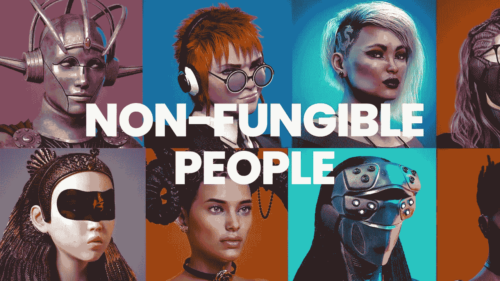

# NFT 如何重新定义全球数字包容

> 原文：<https://medium.com/coinmonks/how-nfts-are-redefining-global-digital-inclusion-4d0a4cebcf5a?source=collection_archive---------28----------------------->

毫无疑问，互联网为世界带来了许多可能性，为进一步的跨文化融合、共享经济繁荣创造了一条途径，也是一种信息可以更快流动并实时传递给世界的媒介。互联网也为企业打开了通向全球的大门，同时成为国际文化传播和团结的一个点。

虽然积极的一面不可否认，但我们仍然不能忽视公司作为人们在世界各地相互交流的平台的创造者所积累的巨大力量。比如估计[脸书](https://datareportal.com/essential-facebook-stats#:~:text=Here's%20what%20the%20latest%20data,)%3A%202.934%20billion%20(July%202022)&text=Number%20of%20people%20who%20use,)%3A%201.968%20billion%20(July%202022)&text=Share%20of%20Facebook's%20monthly%20active,%3A%2067%25%20(July%202022))月活跃用户 29 亿，而[抖音](https://wallaroomedia.com/blog/social-media/tiktok-statistics/#:~:text=Monthly%20Active%20Users%20%E2%80%93%20TikTok%20officially,1%20billion%20monthly%20active%20users.)月活跃用户 10 亿。 [Twitter](https://financesonline.com/number-of-twitter-users/#:~:text=How%20many%20Twitter%20users%20are,a%2024%25%20growth%20from%202019.) 估计也有 3.3 亿活跃用户。与此同时，谷歌已经成为世界上最受欢迎的搜索引擎，占所有搜索的 70%。更不用说谷歌和 YouTube 都属于同一个母公司 Alphabet Inc .

这种积极的权力集中导致顶级在线平台创造了一个全新的经济，有效地将互联网转变为注意力经济，用户被转化为产品，竞争企业通过支付平台来购买注意力。如今，几乎没有什么是免费的——点击、展示、互动，等等。更糟糕的是，一些内容现在被限制在特定的地理位置，因此这些地区以外的用户不可能访问它们。

随着 Web3 和 NFTs 的出现，这一潮流正在快速变化，用户可以再次梦想不仅仅是消费者，而创作者现在有了其他选择。

# 从消费者到会员

欢迎来到 Web3 的独特世界，在这里，用户不仅仅是消费者和参与工具。在这个快速发展的空间，用户现在可以被称为成员。

随着 web3 的不断发展，越来越明显的是，权力将不再集中在平台手中，而是转移到真正重要的手中——用户。用户不仅可以在他们之间创造互动，还可以创建社区，并就他们希望在平台上看到的变化提出建议。

强有力的广告将不再流行，用户将不再受制于人工智能算法的意志，人工智能算法通常决定向单个用户显示什么。

有了 NFTs，用户可以在志同道合的个性化社区中直接获得会员身份。在那里，地理限制不再是一个障碍，每个成员都可以做出有意义的贡献，同时消费满足他们需求的内容。

# 创造的新动力

问任何一个创作者他们最大的噩梦是什么，你最有可能得到的回应是看到他们的努力成果在社交媒体平台上被拒绝或禁止。流行的视频平台 YouTube 在这方面已经臭名昭著。

创作者受制于规则，其中一些是任意的，他们每次上传内容时都被交给算法，同时希望他们的内容不会被拒绝。更不用说，不能保证他们会收回制作视频的费用。分散化的流媒体平台，如 [Theta](https://www.thetatoken.org/) 、 [Livepeer](https://livepeer.org/) 和 [Chainflix](https://www.chainflix.biz/) ，已经在创造可供选择的选择，创作者可以探索并最大化他们的创造力回报。

通过 NFTs 和 Web3，创作者现在可以通过紧密联系的在线社区建立自己的在线存在，在那里他们可以提供价值，发行 NFTs，并与粉丝建立更强的联系，从而创造一种进一步实现回报最大化的途径。

# 结果

Web3 和 NFTs 可以被视为替代解决方案，有助于重新定义我们对数字包容的概念。web3 取代 web2，NFT 成为日常生活中的工具只是时间问题。尽管如此，有一点已经很明显 web3 和 NFT 在全球范围内引领着数字包容事业。

> 交易新手？尝试[加密交易机器人](/coinmonks/crypto-trading-bot-c2ffce8acb2a)或[复制交易](/coinmonks/top-10-crypto-copy-trading-platforms-for-beginners-d0c37c7d698c)