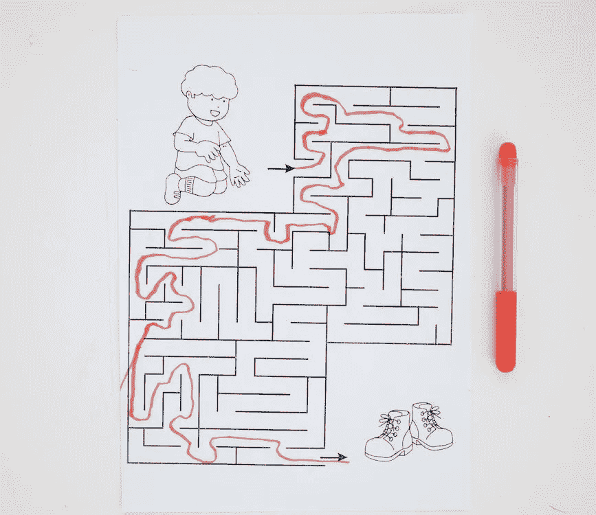

# 工作证明是如何在区块链建立共识的

> 原文：<https://medium.com/coinmonks/how-proof-of-work-is-used-to-establish-consensus-in-blockchain-8e3736ea0d6e?source=collection_archive---------38----------------------->

## 区块链

[在上一篇文章](https://www.thearmchaircritic.org/mansplainings/blockchain-consensus-using-puzzle)中，我们看到了如何使用拼图来达成共识。在本文中，我们将看到如何使用工作证明作为难题，以及它是如何工作的。

正如我们已经看到的，要创建一个有序的事务列表，我们必须对一个事务进行散列，并在下面的事务中引用该散列。这样，我们最终使用哈希创建了一个事务链。我们将使用这些散列来创建谜题。让我们看看怎么做。

# 工作证明

我们为所有事务分配一个目标哈希值。事务的哈希值必须小于或等于目标哈希值。记住，一个[散列产生一个 256 位输出](https://en.wikipedia.org/wiki/SHA-2)。因此，哈希输出可以接受的最大值是 2256–1 = 5.7896045 e+76。目标值将小于此值。

现在，如果我们的事务的输出哈希值大于目标值呢？输入随机数。nonce 是添加到事务中的随机数，用于更改输出哈希。因此，目标是通过调整 nonce 来获得小于或等于目标值的哈希值。由于我们无法计算出能够产生正确哈希值的随机数，所以我们必须通过反复试验来为事务找到正确的随机数。因此，这是节点必须破解的难题，以使它们的事务被接受。我们称这个难题为 ProofofWork，因为产生正确的散列可以证明你已经解决了这个难题。

我们现在知道这个我们称之为工作证明的难题是如何工作的了。现在让我们看看如何调整工作证明的难度。稍后，我们将看到为什么我们需要调整难度。

# 调整难度

我们通过调整目标哈希值来调整工作证明的难度。当目标值越接近最大可能值时，我们找到有效散列的机会就越大。为了给你一个更好的描述，让我们举一个简单的例子。假设最大可能输出是 100。现在，目标值应该小于或等于这个值。我们先把目标定为 100。现在，我生成的数字将在 0 到 100 之间。因为我的目标是 100，所以我有 100%的机会得到正确的输出。

现在，让我们把目标降低到 80。即使目标已经降低，我生成的数字仍然会在 0 到 100 之间，因为在散列时，我无法控制输出。现在，我有 80%的机会做对。

如您所见，目标越低，产生有效输出的机会就越低。换句话说，目标越低，难度越高。

> 交易新手？在[最佳密码交易所](/coinmonks/crypto-exchange-dd2f9d6f3769)上尝试[密码交易机器人](/coinmonks/crypto-trading-bot-c2ffce8acb2a)或[复制交易](/coinmonks/top-10-crypto-copy-trading-platforms-for-beginners-d0c37c7d698c)

# 为什么要调整工作证明的难度？

现在，为什么我们需要调整难度？记住，我们的目标是确保 t 创造的价值足够长。我们使用工作证明来确保节点花费时间来创建事务。在比特币的例子中，这个时间大约是 10 分钟。在现实中，比特币需要 10 分钟才能生成一个区块，交易速度要快得多。稍后我们将看到块，但是现在让我们假设产生一个事务需要 10 分钟。因此，目标值应该是产生下一个事务需要 10 分钟。

但是随着越来越多的人加入区块链网络，解决工作证明的时间减少了。例如，让我们说网络中当前的计算机每秒可以产生 100 个散列。我们称之为散列率。在这种哈希速率下，我们假设需要 10 分钟才能找到一个低于或等于目标值的哈希。现在，让我们假设更多的机器加入网络，或者现有的机器变得更强大，散列率上升到 1000。当一秒钟产生 1000 个散列时，网络将能够更快地找到正确的散列值。

# 猜测的次数越多，解决问题的速度越快

为了让你更好的理解，让我们举一个之前的例子。我们假设目标值是 50，我们有能力在一秒钟内产生 10 个数字。以这种速度，我们假设，需要 2 秒钟找到正确的值。现在，让我们的一个朋友和我们一起产生数字，把我们产生的数字增加到每秒 20 个。是的，我们很有可能产生相同的数字，但是我们产生的唯一数字的数量会更大。随着我们每秒钟猜测的次数增加，我们将能够更快地猜测出正确的数字。

因此，当网络的哈希速率增加时，破解工作证明所需的时间会减少。这意味着工作证明的难度不得不增加。我们通过降低目标值来增加难度，因为正如我们前面看到的，当我们降低目标时，难度会增加。因此，通过调整目标值，我们可以确保产生一个事务所需的时间保持相当稳定。

现在我们已经了解了工作证明是如何工作的，让我们在下一篇文章中尝试了解如何调整目标以保持创建一个事务所需的时间几乎不变。

*原载于 2022 年 12 月 9 日*[*【https://www.thearmchaircritic.org】*](https://www.thearmchaircritic.org/mansplainings/how-proof-of-work-is-used-to-establish-consensus-in-blockchain)*。*