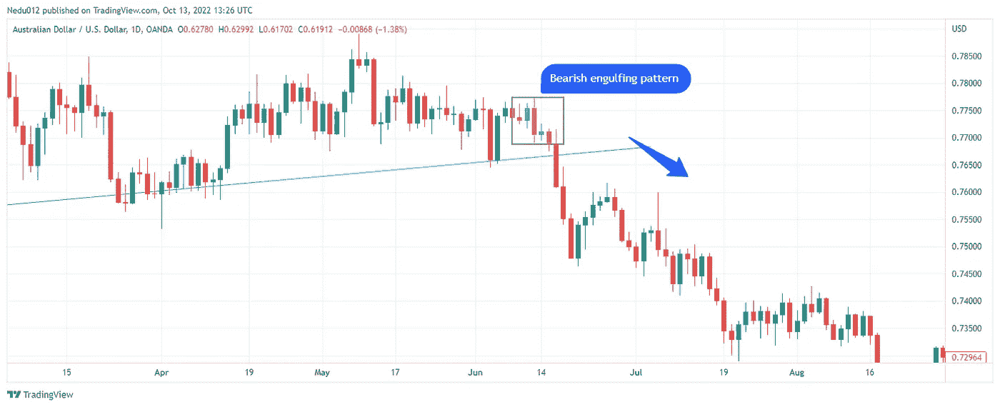
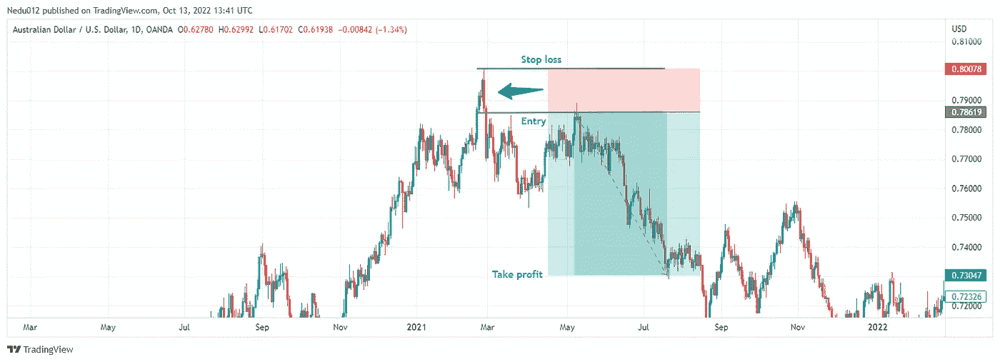
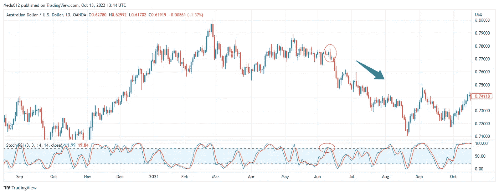

# 看跌吞没形态有多可靠？

> 原文：<https://medium.com/coinmonks/how-reliable-is-bearish-engulfing-pattern-12284b82acf7?source=collection_archive---------29----------------------->

Image by [Chikwem Chinedu Ogugua](https://liquiditytradeideas.com/participant/admin/) on Canva

看跌的吞没形态有多可靠？这个问题是烛台商每天都会问的。你是烛台交易的新手吗，想知道交易熊市吞没模式是否能让你成为盈利的交易者和投资者？如果是这样的话，那么你就可以享受一顿美餐了。

在这篇博文中，我们将讨论交易最多的烛台模式之一(熊市吞没模式)。我们将讨论烛台模式，什么是看跌吞没模式，如何识别看跌吞没模式，收益/风险，以及如何交易看跌吞没模式。

# 介绍

熊市吞没形态是一种[烛台图表形态](https://liquiditytradeideas.com/are-candlestick-patterns-reliable/)，交易者用它来预测趋势的逆转。当一个大的黑色烛台吞没一个小的白色烛台时，就产生了这种图案，它被认为是一个看跌的信号。

# 烛台图案是什么？

烛台模式是一种[交易指标](https://liquiditytradeideas.com/trading-indicators-explained/)，用于预测或跟踪金融工具的表现。烛台模式用于识别价格数据的模式，使交易者能够做出更好的交易和投资决策。

烛台交易指标通常分为两大类，准确地说是看涨和看跌。当应用于货币、商品或股票交易时，看涨烛台模式意味着如果在熊市中发现，商品的价格可能反转，而看跌烛台模式表明如果在看涨市场中发现，价格可能反转。

# 什么是看跌吞没形态？

熊市吞没形态是一种反转形态，通常出现在买家在较高价格买入货币、商品或股票，但随后以较低价格抛售的时候。

这种模式可以通过刚刚买入的货币、商品或股票的价格迅速下跌到证券卖出时的较低价格来识别。这种情况经常发生，因为买家认为金融工具将继续经历强劲下跌，股票价格将在未来上涨。

# 那么，如何识别熊市吞没形态呢？

熊市吞没形态是一种烛台形态，可以用来表示证券价格的潜在反转。该图案由两个烛台组成，第一个通常是一个小的、看涨的烛台，后面是一个较大的、看跌的烛台。

**B**earish engulfing by [Chikwem Chinedu Ogugua](https://liquiditytradeideas.com/participant/admin/) on [Tradingview](https://www.tradingview.com/gopro/?share_your_love=Nedu012)

看跌的烛台应该“吞没”看涨的烛台，这意味着它应该在价格和数量上都更大。要想在金融市场中轻松识别熊市吞没形态，需要一点点但持续的练习。

然而，最好的做法是寻找一个潜在的[支撑位和](https://liquiditytradeideas.com/what-is-the-best-indicator-for-support-and-resistance/)阻力位。支撑位和阻力位是我们图表中金融工具的价格因经济事件而停滞一段时间的区域。

# 交易熊市吞没形态有什么好处？

在金融市场交易熊市吞没模式有几个好处，从帮助你识别市场反转，做出一个好的交易决定。

然而，当交易一个熊市吞没形态时，你基本上是在向你的市场发出信号，你不相信价格会向某个方向移动，而是希望出现技术反转。

这可能是一个非常有利可图的策略，因为你可以通过购买反转回到原始价格的股票来赚很多钱。交易熊市吞没形态的另一个好处是，它可以帮助你根据你交易的市场条件的类型确定市场何时被高估到可能的反转。

# 交易熊市吞没形态的风险是什么？

虽然交易熊市吞没形态可能非常有利可图，但它也有一些潜在的风险。交易熊市吞没形态有一些风险。

第一个风险是市场可能会打破这种模式。第二个风险是，市场可能进入一个新的牛市阶段，这可能导致亏损或盈利，取决于你的偏好(多头或空头)。

# 那么，看跌吞没形态有多靠谱呢？

熊市吞没形态是一种出现在上升趋势顶部的双蜡烛线反转形态。它被认为是一个可靠的反转形态，但是它的有效性需要满足几个条件。

**B**earish engulfing by [Chikwem Chinedu Ogugua](https://liquiditytradeideas.com/participant/admin/) on [Liquiditytradeideas](https://liquiditytradeideas.com)

第一个条件是形态必须出现在持续的上升趋势之后。第二个条件是第一个烛台必须是一个小的看涨烛台被一个大的看跌烛台吞没。

第三个也是最后一个条件是，空头蜡烛线必须收在多头蜡烛线的中点以下。如果这三个条件都满足，那么熊市吞没形态就被认为是可靠的反转形态。

# 如何交易看跌吞没形态？

熊市吞没形态是蜡烛图上的两根蜡烛线形态。当当天的蜡烛线比前一天的蜡烛线有更低的低点和更低的收盘价时，就形成了这种形态。这种模式表明空头在控制，价格可能会继续下跌。

**B**earish entry by [Chikwem Chinedu Ogugua](https://liquiditytradeideas.com/participant/admin/) on [Liquiditytradeideas](https://liquiditytradeideas.com)

为了盈利，你需要注意进场和出场技术的细节。

首先，确定一个熊市吞没形态，等待市场重新测试完全吞没的熊市蜡烛线的收盘价。设置卖盘限制或使用市场执行来设置卖盘。

用空头蜡烛芯在进场价格水平以上几个点止损，最后在进场价格以下几个点止盈。

# 随机的熊市吞没

随机振荡器是一个范围有限的工具，这意味着它的读数在 0 到 100 之间。这使得它成为一个独特的超买和超卖条件的有用指标，读数超过 80 被交易者视为处于超买范围，而读数低于 20 被视为超卖。

Candlestick & stochastic by [Chikwem Chinedu Ogugua](https://liquiditytradeideas.com/participant/admin/) on [Tradingview](https://liquiditytradeideas.com/top-10-powerful-trading-indicators/)

虽然熊市吞没形态可以单独交易，但你可以更进一步，将随机交易指标纳入你的交易策略，以降低亏损风险，增加盈利机会。

在技术分析中，[随机交易指标](https://liquiditytradeideas.com/top-10-powerful-trading-indicators/)使你能够在交易资产时衡量超买和超卖区域。除了用来测量水平，它同样可以提高你的进场和出场技术。

# 结论

熊市吞没形态是潜在熊市反转的可靠形态。然而，像所有技术指标一样，它不应该单独使用，而应该与其他技术和基本面分析工具结合使用。

关于这个话题，你有什么问题或者想分享你的想法吗？对于烛台交易的最新消息，一定要加入我们的[论坛](https://liquiditytradeideas.com/community)，与你的交易伙伴联系，获得大量的好意见。

*原载于 2022 年 10 月 13 日*[*https://liquiditytradeideas.com*](https://liquiditytradeideas.com/how-reliable-is-bearish-engulfing-pattern/)*。*

# 来自 LiquidityTradeIdeas 的消息

感谢您成为我们社区的一员！在你离开之前:

*   👏为故事鼓掌，跟着作者走👉
*   📰在 [**中查看更多内容**](https://liquiditytradeideas.com/)
*   **📈**加入我们关于外汇、加密和股票的 [**论坛**](https://liquiditytradeideas.com/community/)
*   **📚发现 [**最佳交易&投资电子书**](https://liquiditytradeideas.com/trading-e-books/)**

> **交易新手？尝试[加密交易机器人](/coinmonks/crypto-trading-bot-c2ffce8acb2a)或[复制交易](/coinmonks/top-10-crypto-copy-trading-platforms-for-beginners-d0c37c7d698c)**