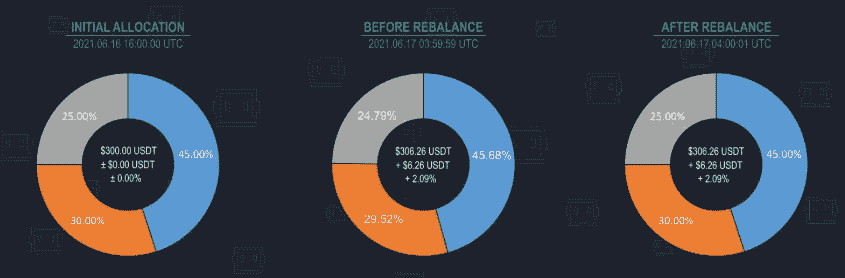
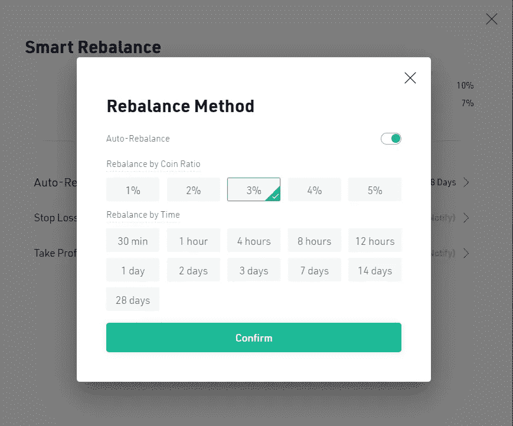
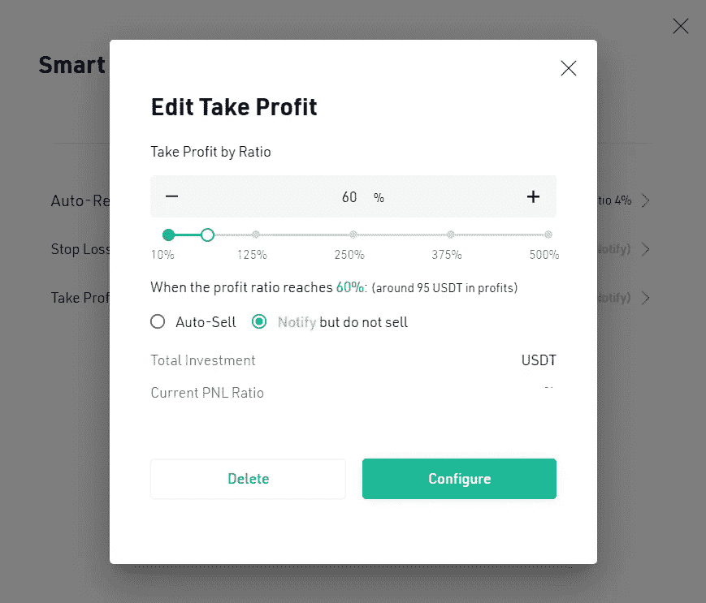
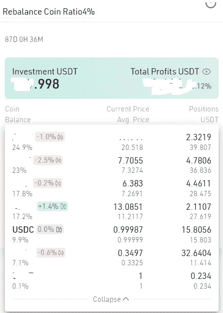
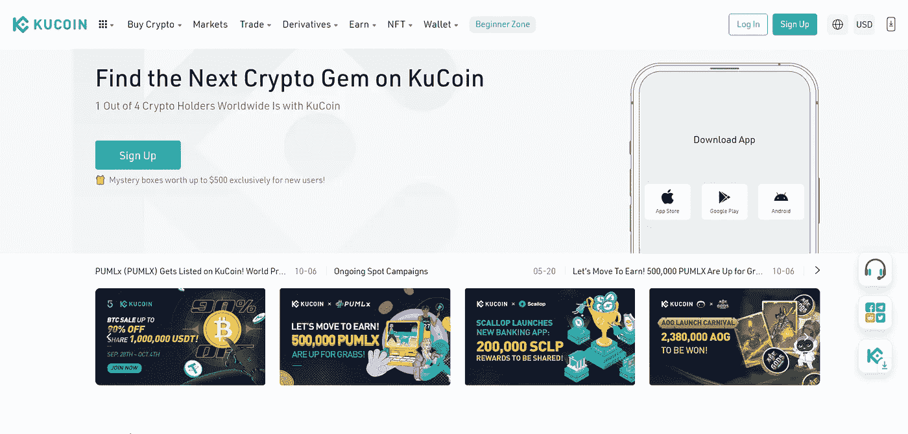

# KuCoin 的智能再平衡机器人到底有多智能？

> 原文：<https://medium.com/coinmonks/how-smart-is-a-kucoins-smart-rebalance-bot-44e6c8be4b2d?source=collection_archive---------1----------------------->

它可能不太聪明，但你可以让它变得更聪明

TL；速度三角形定位法(dead reckoning)

*   如果你是一个霍德勒，尝试聪明的重新平衡
*   如果寻求短期利润，尝试按比率重新平衡
*   KuCoin 有一个最简单的智能再平衡机器人
*   [你订阅了吗？](/@primitivebrave)

嗨，伙计们，
希望你们在这个熊市做得很好(不仅是秘密，而是所有的事情)。所以我想给 KuCoin 的自由交易机器人[一些启发。今天我们来看看智能再平衡。](https://www.kucoin.com/r/af/QBSSSAV3)

## 什么是智能再平衡机器人？

让我们这样想，你是一个密码新手。你在网上听到一个随机的家伙(肯定不是我):不要孤注一掷。所以你决定购买几种加密货币，如 CTB、HTE、SCK、洛杉矶。现在你想做一个这些密码的投资组合。此外，你是一个有原则的人。无论发生什么，你都希望自己的投资组合中有 25 %的 CTB、25%的 HTE、25%的 SCK 和 25%的亏损。您已经听说过加密市场非常不稳定，价格经常波动。你可以每 5 分钟看一下你的投资组合，试着买入或卖出你的资产以保持均衡。你真的想这么做吗？还是想给你做个 bot？

聪明的再平衡可以帮助持有者进一步增加他们的回报。这种策略的核心是在保持投资组合百分比基本不变的情况下，增加资产总量。有些人可能会问，再平衡的意义是什么？一方面，你可以始终坚持你的预期投资组合比例，另一方面，你的代币数量将通过一轮又一轮的再平衡而增长。

## 智能再平衡是如何工作的？

初始分配:SCK(45%)、RMX(30%)、MSK(25%)
再平衡前:SCK(45.68%)、RMX(29.52%)、MSK(24.79%)
再平衡后:SCK(45%)、RMX(30%)、MSK(25%) + 6.26 美元

在这张信息图中，我们可以看到，当资产价格发生变化时，分布也会发生变化，因此在下一次再平衡时(在本例中为 12 小时，基于真实数据)，过量的 SCK 被出售，然后购买所需数量的 RMX 和 MSK(尽管它们的价格也上涨了，但不足以保持分布，它们稍微低于预期%)。通过这种方式，SCK 保持了其相对于当时投资组合总价值的价值，而 RMX 和 MSK 则增加了硬币的价值。从全球来看，投资组合的净值也增加了。

然后，我们可以看到初始分布，以及在执行再平衡之前(第二个图表)，百分比和净值如何变化。重新平衡后，净值不会受到影响。只有硬币的数量受到影响，我们的投资组合再次与我们的标准和愿望完美平衡。

## 再平衡方法

Rebalancing options on KuCoin

在 [KuCoin](https://www.kucoin.com/r/af/QBSSSAV3) 上，重新平衡可以通过硬币比例或时间来完成。到那时，时间从 30 分钟到 28 天不等。如果你根本不想重新平衡，你可以关闭这个选项。现在的问题是，再平衡的最佳方法是什么？

## 最佳优化方法？

老实说，没有最好的优化方法。答案是，看情况。但是，要看市场。如果你过早重新平衡(每 30 分钟一次)，你会经常买卖资产。这意味着你必须为此付费。如果你每 24 小时重新平衡一次，可能会出现这样的情况:当重新平衡时，市场已经稳定下来，你无法利用波动性。

如果你决定优化这一比例，将门槛设为 4%，可能会出现这样的情况，资产只增加了 3.5%，你错过了再平衡的机会。

然而，如果你寻求短期利润，尤其是在熊市中，波动性较低，市场大多是横向移动，按比率重新平衡可能是最佳选择。

相反，如果你想增加利润，少买少卖，那就试试其中一种按时间再平衡的方法，更适合你。

## 我们能做得更好吗？

是的，如果你想离开重新平衡的忙乱，你可以关掉它。你可以自己做再平衡。当你的投资组合达到 x %的利润后，你可以得到通知，自己再平衡。

另一个最有效的方法是看看市场。如果某项资产价格上涨，您可以出售该资产，例如 USDC/USDT。你要做的是减少资产的百分比，增加 USDC/USDT 的百分比，保持其他资产不变。通过比较当前价格和平均购买价格，你可以充分利用这一点。

如果你认为这篇文章为你增加了任何价值，并且想在[交易 KuCoin](https://www.kucoin.com/r/af/QBSSSAV3) 并获得交易费 20%的折扣，你可以使用我的推荐链接:【https://www.kucoin.com/r/af/QBSSSAV3】T4

谢谢你支持我的工作。除此之外， [KuCoin](https://www.kucoin.com/r/af/QBSSSAV3) 还得为新用户提供高达 500 美元的优惠。

> 交易新手？尝试[加密交易机器人](/coinmonks/crypto-trading-bot-c2ffce8acb2a)或[复制交易](/coinmonks/top-10-crypto-copy-trading-platforms-for-beginners-d0c37c7d698c)