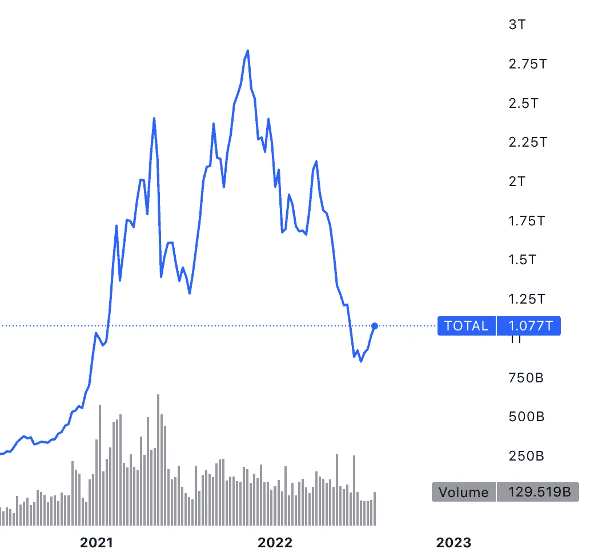

# 史密博特如何在市场崩溃期间保护我的加密投资

> 原文：<https://medium.com/coinmonks/how-smithbot-protected-my-crypto-investments-during-the-market-crash-30989920f47?source=collection_archive---------12----------------------->

过去两年的加密市场就像是一次疯狂的过山车。价格飙升至历史新高，直到 2021 年 5 月才暴跌约 50+%。随后，经济迅速复苏，比特币(BTC)和以太坊(ETH)等一些主要加密货币在 11 月份左右甚至创下了历史新高。随后是一次剧烈的调整和一次深度崩盘，约 2/3 的加密市值蒸发殆尽。

Crypto market cap (source: [Tradingview](https://www.tradingview.com/markets/cryptocurrencies/global-charts/))

许多加密投资者损失了大量资金，超过 50%的比特币地址出现赤字，这是多年来没有发生的事情。自 2022 年 6 月中旬以来，市场正在企稳，似乎正在缓慢复苏，尽管这种好转的可持续性仍有待观察。然而，令人鼓舞的是，即使在最近一次崩盘后，加密市场的市值仍比两年前高出约 4 倍。

## 交易 vs .霍德林

如果你在过去的 2 年里一直持有你的加密资产，平均来说你还是有利润的。一些例子:

*   Ripple (XRP)上涨了近两倍
*   比特币(BTC)上涨了 2.4 倍
*   以太坊(ETH)上涨了约 6 倍

如果以美元报价。然而，霍德勒损失惨重，因为价格在此期间见顶。上述符号的损耗为:

*   瑞波(XRP)损失了 81 %
*   比特币(BTC)下跌了约 65 %
*   以太坊(ETH)也损失了约 65 %

当然，如果你在市场高点附近出售你的资产，你就可以兑现 2021 年反弹的巨额利润。少数熟练且幸运的交易者避免了遭受巨大损失，但大多数密码持有者遭受了巨大打击。这包括许多专业和机构投资者，如加密对冲基金[三箭资本](https://techcrunch.com/2022/07/01/crypto-mega-hedge-fund-three-arrows-capital-reportedly-files-for-bankruptcy-in-new-york)和加密贷款[摄氏度](https://techcrunch.com/2022/07/13/celsius-one-of-cryptos-biggest-lenders-files-for-bankruptcy/)破产。

如果很多有经验的专业人士都没有把握好退出的时机，普通投资者如何保护他们的收益？当大 FUD 开始时，每个人都恐慌，你通常已经错过了以最小损失卖出的机会。情绪在交易中不是一个好的指导，但尽管如此，大多数秘密投资者还是把他们的决定建立在非理性的触发因素上。

# 交易机器人

自动化加密货币交易机器人严格执行基于数据的预定义策略。他们完全消除情绪。然而，并不是所有的交易机器人都能打败市场，而且很难找到真正有效的。

大约一年以来，我一直在使用 SmithBot 进行交易。SmithBot 利用专有的人工智能算法提供全自动交易机器人。它在现货市场交易，没有保证金交易，因此在市场上的交易机器人中，它处于风险等级的低端。另一方面，由于它只进行多头交易，因此无法从下跌的市场中获利。他们的公开路线图上有永久期货交易，所以他们可能会在某个时候提供短期和长期交易的解决方案。无论如何，让我来分享一下在最近的市场崩溃中，当前现货市场机器人的经验。

我的三个机器人分别是以欧元(Bot-ID 2)报价的交易 Ripple (XRP)、同样以欧元(Bot-ID 35)报价的以太坊(ETH)和以美元(Bot-ID 75)报价的比特币(BTC)。从 SmithBot 平台提取的最近两年的性能图如下所示。请注意，实时交易开始之前的时间是根据 SmithBot 的支持进行模拟的。

Ripple trading bot

Ethereum trading bot

Bitcoin trading bot

所有的机器人都在接近高峰时出售了加密资产，从而避免了更大的损失。尽管它们并不总是完美地命中最佳时机，但它们通常非常接近。绿色曲线显示了基本符号增益，这是相对于市场的性能指标:下降的曲线表明利润不如买入并持有，而上升的曲线意味着机器人正在击败市场。总的来说，机器人大大超过了市场，并提供了良好的利润，如黄色曲线所示。

鉴于机器人在现货市场上的交易没有保证金，在市场下跌时，最好的结果可能是保留报价资产。这相当于零下降。实际上，机器人的表现接近这一理想结果。

*   Bot-ID 2 自峰值以来下跌了 13 %(相比之下，买入并持有 XRP/欧元的表现为-80 %)
*   Bot-ID 35 自峰值以来下跌了 18 %(相比之下，买入并持有 ETH/EUR 的表现为-65 %)
*   Bot-ID 75 自峰值以来下跌不到 5 %(相对于-65 %买入并持有 BTC/美元的表现)

总的来说，去年年底前的巨额利润几乎保持不变，同时基础资产也在积累。这为下一轮牛市中的巨额利润创造了条件。重要的是，自从我一年前开始工作以来，尽管市场崩溃，所有的机器人仍然提供了不错的正回报。

# 结论

在市场崩溃时，很难找到最佳策略。霍德林造成了巨大的损失，但找到退出和重新进入加密头寸的正确时机并不容易，即使对专业投资者来说也是如此。对于大多数加密投资者来说，一个设计合理的交易机器人可能是最好的策略。至少对我来说，它运行得很好，幸运的是，我由 [SmithBot](https://smithbot.com) 管理的加密资产在大规模市场崩盘期间只遭受了最小的损失。

**亦读，**

*   [加密货币交易机器人的趋势:人工智能算法](/coinmonks/trends-in-cryptocurrency-trading-bots-ai-algorithms-38c4b24edcd9)
*   [密码交易机器人——2022 年度最佳人工智能密码交易机器人](/coinmonks/crypto-trading-bot-best-ai-crypto-trading-bots-2022-97328dc1d2cd)
*   [密码交易机器人——18 款最佳免费密码交易机器人【2022】](/coinmonks/crypto-trading-bot-c2ffce8acb2a)
*   [SmithBot AI 加密交易机器人——现场交易测试](https://blog.coincodecap.com/smithbot-ai-crypto-trading-bots)
*   【2021 年加密交易回顾:17 项高级+ 15 项神经网络策略测试【第 7 部分】

> 交易新手？尝试[加密交易机器人](/coinmonks/crypto-trading-bot-c2ffce8acb2a)或[复制交易](/coinmonks/top-10-crypto-copy-trading-platforms-for-beginners-d0c37c7d698c)