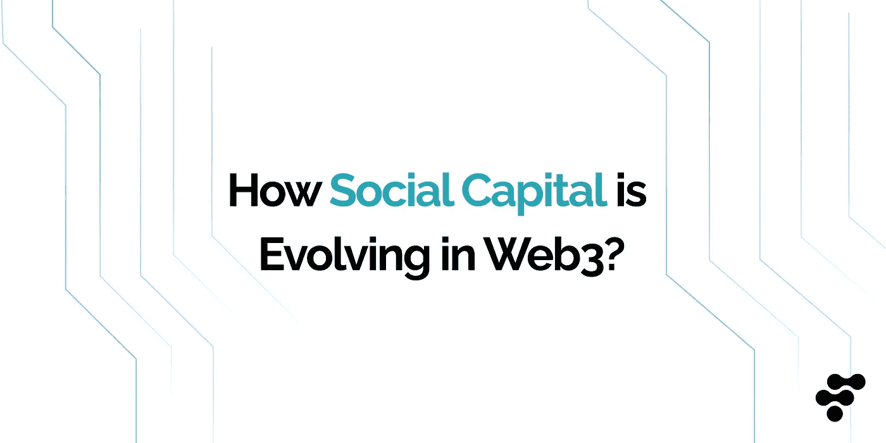
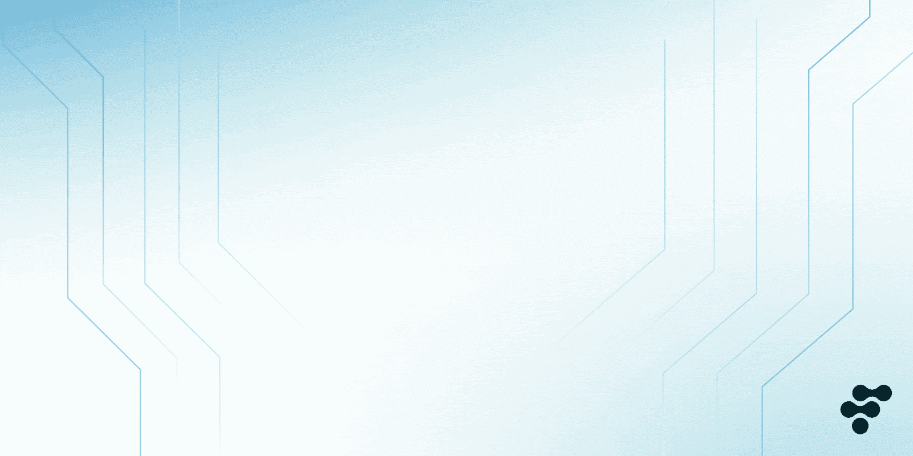
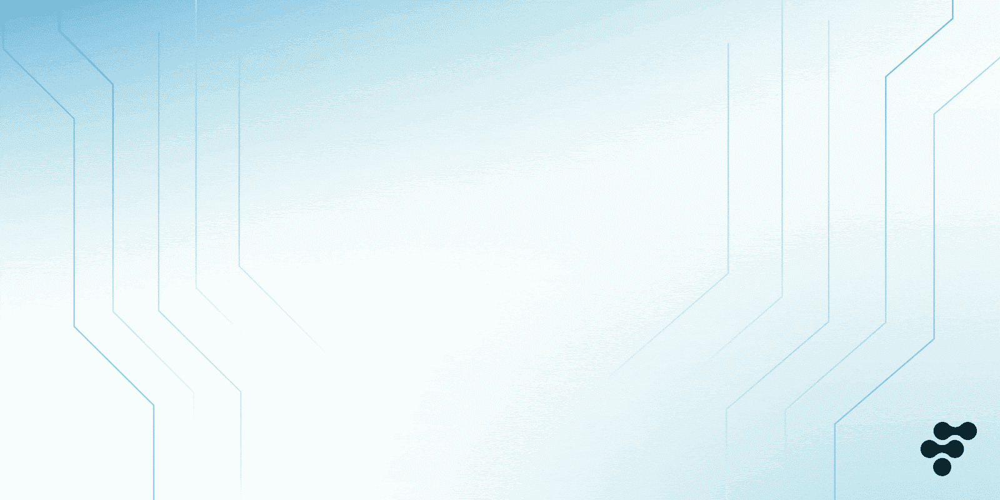
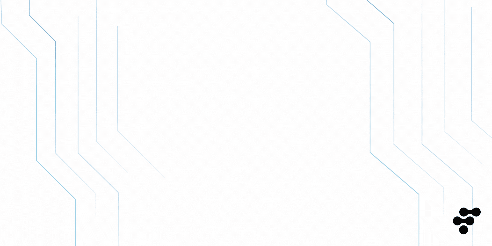

# Web3 中的社会资本是如何演变的？

> 原文：<https://medium.com/coinmonks/how-social-capital-is-evolving-in-web3-4dc33411abdc?source=collection_archive---------11----------------------->

Social capital is transforming from Web2 to Web3

## 社会资本的所有权正回到创造者手中。挑战是存在的，但是 Web3 平台提供了可行的解决方案。

自网络早期以来，社会资本一直是在线互动和协作的重要因素。最简单的形式是，社会资本是人们相互交往时产生的价值。Web2 完全是关于利用社会资本的力量，这导致了我们今天使用的一些最成功的在线平台和服务的创建。

然而，随着 Web3 的出现，情况又发生了变化。去中心化技术和平台的兴起正在催生一种新形式的社会资本，这种资本分布更加均匀，也更加民主化。这篇文章将密切关注 Web3 中的社会资本，以及它如何改变我们在线互动的方式。

> 交易新手？在[最佳密码交易所](/coinmonks/crypto-exchange-dd2f9d6f3769)上尝试[密码交易机器人](/coinmonks/crypto-trading-bot-c2ffce8acb2a)或[复制交易](/coinmonks/top-10-crypto-copy-trading-platforms-for-beginners-d0c37c7d698c)

# 什么是社会资本？

虽然“社会资本”没有特定的定义，但它通常与经济和人力资本一起定义。社会资本是指社会主体之间的密切关系，包括个人、群体和组织。社会资本是指人与人之间的联系，它可以采取多种形式，如信任、规范和权威。社会资本存在于一个社会内部，是无形的；然而，它服务于一个重要的目的，那就是让社会互动更有效率，并在人与人之间创造凝聚力。Investopedia 将它描述为*“人类互动的积极产物”*

在 Web3 中，社会资本是通过用户之间的在线互动以分散的方式产生的。这些互动可以采取多种形式，比如评论、点赞、分享。社会资本的价值在于它能够通过增加用户之间的信任和合作来提高在线互动的效率。根据 Lens Protocol 创始人 Stani Kulechov 的说法，这些功能在 Twitter 等主流社交媒体平台上是不存在的，Twitter 仍在考虑很快进入 [Web3 兔子洞](https://decrypt.co/113836/twitter-wont-go-web3-anytime-soon-aave-ceo-stani-kulechov)。这意味着 Web3 平台有足够的机会在他们的社交互动中从头开始建立信任和合作。

Organizations with unique social capital

# 不同类型的社会资本

纽带、桥梁和链接构成了我们眼前看到的整个社会资本生态系统。

**结合社会资本**

联结型社会资本是指同一社会群体内个体之间的横向联系。这种类型的社会资本通常与当地社区联系在一起，在那里许多人彼此都很熟悉。

在 Web3 中，结合社会资本可以以围绕特定兴趣创建的在线社区的形式出现。这些社区为志同道合的个人提供了一个相互交流和共享资源的空间。例如，[以太坊社区](https://ethereum.org/en/community/)就是一个结合社会资本的社区的极好例子。这个社区的成员因为对以太坊和区块链技术的共同兴趣而团结在一起。这个社区为这些人提供了一个相互交流、共享资源和项目合作的空间。

Bridging and linking social capital are great mediums to connect people together

**桥接社会资本**

从网络的角度来看，桥接社会资本在结构“洞”处连接个人，每个人都可以利用其他人的社会群体资源。这也称为垂直联系，通常通过正式的层级结构运作。

在 Web3 中，桥接社会资本可以被视为连接具有不同专业知识的个人的在线平台。例如，这个名为 [JUMP Community](https://jumpcommunity.xyz/) 的平台连接了其他对 Web3 充满热情的营销人员、代理专业人员和企业家。

**链接社会资本**

链接社会资本是桥接的延伸分支。例如，桥接发生在社会经济地位或阶层相似的人之间。相比之下，联系发生在社会经济群体之间。

联系社会资本的一个很好的例子是一个有 CEO 的传统公司。首席执行官可能需要了解底层员工的日常工作是什么样的。但是，一个较低级别的经理可能会将他引入团队，由此在首席执行官和普通工人之间形成社会资本。CEO 可以从这些介绍中更好地了解他们的员工，同样，也可以介绍实践！也就是说，低层员工也会从首席执行官提供的任何建议或关系中受益。反过来，我们就有了两个群体之间的垂直桥梁来产生社会资本。

关于 Web3,“普通工人”没有任何繁文缛节来接近分散社区中的任何人。程序是透明的，允许每个人与他们想联系的人建立联系。

Social capital generates value in a decentralized way

# 社会资本的金融潜力

从金融的角度来看，社会资本可以被视为一种潜在的资产，可以用来创造价值。换句话说，社会资本可以被视为“人力资本”的一种形式这是因为社会资本代表了可以用来产生经济价值的个人和群体之间的关系。

例如，一个人的社会资本可以用来帮助他们找到工作或获得资源。同样，一家公司的社会资本可以用来帮助它赢得合同或进入新市场。

在这两种情况下，社会资本都是一种可以用来创造经济价值的“人力资本”。

在 Web3 的背景下，社会资本可以用来帮助个人和团体获得资源和机会。例如，一个人的社会资本可以帮助他们在分散的空间找到工作或进入新的市场。反过来，公司的社会资本可以用来帮助它赢得合同或获得新客户。

# 社会资本货币化

**Web2:**

MediaShift 是一个提供媒体和技术见解的在线网络，它深入研究了几个[案例，研究一些公司如何利用他们的社会资本创造巨大的品牌并取得成功。法国数字新闻初创公司 Mediapart 就是一个例子。它是由五个人发起的，他们自己投资了 200 万美元，又筹集了 400 万美元，完全是基于他们的“社会资本”，吸引了对他们创业想法的投资。](http://mediashift.org/2017/02/digital-media-can-monetize-social-capital/)

The official community token of MakerDAO (MKR)

**网络 3:**

与 Web2 不同，在 web 2 中，社交资本主要用于吸引大公司或品牌的投资，在 Web3 中，社交资本通过使用社交令牌来利用。这些社会标志代表了项目的社会资本，可以用来访问资源或机会。

例如，社交令牌“MKR”代表 [MakerDAO](https://makerdao.com/en/) 社区的社会资本。持有这个令牌可以让一个人参与治理决策、参与 DAO 平台上的新项目，以及许多其他独有的好处。

# 社会资本货币化的挑战

虽然社会资本可以被视为一种有价值的资产，但必须注意的是，一些挑战与社会资本的货币化有关，尤其是在 Web3 中。

在 Web3 领域经营业务涉及许多风险，从汽油费到连接钱包和交易所。最大的危险[包括](https://www.vccafe.com/2022/03/27/10-challenges-investors-face-in-metaverse-and-web3/)失去你的观众或者需要帮助来有效地赚钱。虽然您无法消除平台风险，但您可以通过依赖多个渠道而不是一个渠道来降低风险，并对您的用户进行一些控制。

根据面向创作者和社区的 Web3 平台 Coinvise 的说法，Web3 的第二个货币化时代已经[允许](https://mirror.xyz/0x71F499FB4d853b9f190fE8c3415C8daC8607ddBa/_rjDhvKbhmD798DjHbSueeElTL5PAh6K-UAR3UwEki0)分散的项目通过授权他们创建符号化的社区，以他们的整体愿景实践更多自由；改进仍然需要通过社交令牌来实现。如果你想从你的内容中赚钱，你必须专注于吸引你的粉丝，而不是品牌。这意味着创造更高质量的内容来吸引他们，因为他们正在花钱。基于注意力的盈利——这是 Web2 中大多数创作者所做的——意味着推出大量低质量的内容，并优先考虑数量而不是质量(更多视频>更多广告>更多收入)。

这也是链上社会资本(OCSC)充分发挥作用的地方。OCSC 在没有传统资源的情况下，在社区内创造增长、有机层级和协作的能力，使其成为一股破坏性力量。它有[的潜力](https://joanwestenberg.medium.com/on-chain-social-capital-is-the-killer-app-c58ca6c141b7)通过在没有高水平互动的网络成员之间产生信任来创造可持续的生计和提高效率。通过利用链上社会资本，个人可以通过发展他们的社会资本为自己创造价值——这是一种既有价值又能够被验证的资产。

Top three SocialFi platforms

# Web3 如何让你的社交成为你的财产？

非技术人员是新的社会资本。在 Web3 世界中，一切都是去中心化的，你的社交互动也是你自己的。因此，如果你在一个特定的平台上建立了强大的追随者，如果你想转移到另一个平台，你可以带上你的互动。这增加了你的选择，让你对如何与世界互动有了更多的控制。

NFTs 也可以用来表示物理对象，比如艺术品或衣服。所以如果你有一个对你有价值的实物，你可以把它转换成 NFT，在市场上交易。这允许你以一种前所未有的方式将你的财产货币化，从而赋予你手中的社会资本的力量。一些顶级的 SocialFi 平台正在将社交资本交还给你，包括:

**镜头协议**

[Lens Protocol](https://lens.xyz/) 是一个任何人都可以撰写和管理的社交图。它是去中心化的，所以创作者可以控制他们的内容和数据。Lens Protocol 背后的团队希望“创造更好、更可持续的在线社交体验”，让每个人都能完全控制自己的社交资本。

**斯蒂米特**

Steemit 是一个社交媒体网络，为加密货币用户的内容和参与付费。像 Reddit 和 Medium 等其他流行网络一样，Steemit 为用户提供了一个根据参与程度获得奖励的机会。在 Steemit 上制作的每一个内容都归其用户所有，这意味着如果他们离开平台，可以带走他们的内容。

**分权财政**

[DeSo](https://www.deso.com/) 是一个区块链协议，旨在分散社交媒体。这个平台专注于将控制权还给用户，而不是平台，允许他们以一种不受审查的方式拥有自己的身份、个人资料、内容和社交图。它允许用户将他们的内容和参与货币化，并且仍然拥有他们 100%的社会资本。

Kindeck.com

# 一个商业 P2P 网络应用

Kindeck 是一个去中心化的平台，允许任何人拥有自己的社会资本。有了 Kindeck，你可以充分优化你的网络，并以适合你的方式将你的社会资本货币化。此外，跨整个网络的自动化点对点流使得与平台上的其他人分享内容和收入变得容易。

由于[Kindeck NFT](https://www.kindeck.com/collection)被测量和存储，你不必担心信任。此外，你的所有权将永远可以在多边形 PoS 区块链上验证-许多人使用的非常可靠的来源。

Kindeck 用户可以通过 NFT 连接和参与平台。同样，您的私钥提供了访问您的钱包或加密货币的权限；你的 Kindeck 允许你单独拥有扩展的网络和社会资本文档——根据用户协议，一切都是自主的。

在我们路线图的未来阶段，Kindeck 用户将能够利用关注、收集和发布 NFT 来验证他们网络的价值，并涉足一个新的领域:Web3 社交图。