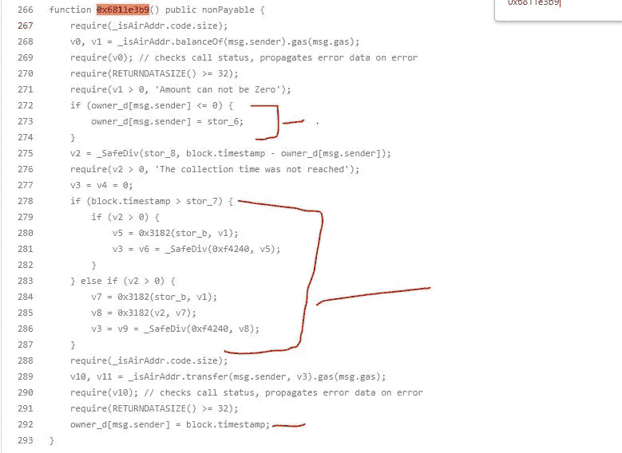

# 125 万美元闪贷攻击新的免费道是如何运作的

> 原文：<https://medium.com/coinmonks/how-the-1-25m-flash-loan-attack-on-the-new-free-dao-worked-256b0b6bec0?source=collection_archive---------40----------------------->

2022 年 9 月 8 日，利用“闪贷”攻击，利用新的免费道。

攻击者从这一漏洞中获利 4481 WBNB(约 125 万美元)，导致原生令牌$NFD 价格下跌 99%。

在 BNB 链上，“新自由道”是一个“道工程”道代表“去中心化的自治组织”

治理决策由整个社区做出，实体的本地令牌(NFD)持有者通常会对其进行投票。

$NFD 被制作成具有许多不同的特征，并且是专门为 NFT 制作的。

快速贷款攻击是指有人利用平台的智能合同安全，在没有任何抵押的情况下借入大量资金。

然后，他们在一个交易所操纵加密货币资产的价格，并在另一个交易所迅速出售。

为了成为契约的成员，攻击者首先部署一个未经验证的契约，并调用函数 addMember()。

这是黑客的地址:0x22c 9736 D4 fc 73 A8 fa 0 EB 436 D2 ce 919 f 5849 d6fd 2

攻击者从 pancakeswap 获得了约 250 WBNB 的闪贷，用于部署合同。

而且，他用 WBNB 换了 NFD 代币，送去了攻击合同。

然后攻击者通过调用契约中的 0xe2f9d09c 函数来调用奖励契约函数。

攻击者随后签订了一系列新合同，并从头再做一遍以获得奖励。

获得奖励后，黑客将 NFD 代币兑换回 WBNB，兑换金额约为 3202 WBNB。

然后，他们向 PancakeSwap 偿还了 250 WBNB 的快速贷款，并获得了 2952 WBNB 的利润。

同样，攻击者在执行交易三次后获利 4481 WBNB，或大约 125 万美元。

## NFD 项目未经核实的奖励合同是漏洞所在

下面代码片段中的函数 0x6811e3b9 是根本原因。

代码实施有两个主要方面会影响奖励:

*   时间间隔:激励越大，定期存款时间越长。
*   用户拥有的代币越多，获得的奖励就越多。

然而，由于 flashloans 不受护栏的限制，攻击者可以使用它们来显著增加他的令牌余额。

*另外，因为“block.tmestamp — store 6”在 L169 中有一个非零值，所以用户的打赏开始时间将被初始化为“store 6”。因此，攻击者可以通过借用令牌并使用 flashloan 放大它来大大提高收益。*

由于这个漏洞，新 DAO 的本机令牌有 99%崩溃。龙卷风现金被用来存放偷来的资金。

## 最后的话

一份提交给区块链的合同没有链接到 GitHub 上的相关源代码，成为了新的免费 DAO 黑客攻击的目标。

可以反汇编和读取合同代码，但这更困难，并且使用未经验证的代码表明合同没有经过安全审计。

在 DeFi 领域，已经出现了许多利用不安全的价格预言或报酬计算的快速贷款攻击。

在启动包含此功能的任何合同之前，建议对其进行审核，以确保该机制不易受到攻击。

> *交易新手？试试* [*密码交易机器人*](/coinmonks/crypto-trading-bot-c2ffce8acb2a) *或* [*复制交易*](/coinmonks/top-10-crypto-copy-trading-platforms-for-beginners-d0c37c7d698c)
> 
> *分散密码持有量，了解* [*币安替代品*](https://coincodecap.com/binance-alternatives)
> 
> *加入 Coinmonks* [*电报频道*](https://t.me/coincodecap) *和* [*Youtube 频道*](https://www.youtube.com/c/coinmonks/videos) *获取每日* [*加密新闻*](http://coincodecap.com/)

# 另外，阅读

*   [复制交易](/coinmonks/top-10-crypto-copy-trading-platforms-for-beginners-d0c37c7d698c) | [加密税务软件](/coinmonks/crypto-tax-software-ed4b4810e338)
*   [网格交易](https://coincodecap.com/grid-trading) | [加密硬件钱包](/coinmonks/the-best-cryptocurrency-hardware-wallets-of-2020-e28b1c124069)
*   [密码电报信号](/coinmonks/top-3-telegram-channels-for-crypto-traders-in-2021-8385f4411ff4) | [密码交易机器人](/coinmonks/crypto-trading-bot-c2ffce8acb2a)
*   [最佳加密交易所](/coinmonks/crypto-exchange-dd2f9d6f3769) | [印度最佳加密交易所](/coinmonks/bitcoin-exchange-in-india-7f1fe79715c9)
*   [面向开发者的最佳加密 API](/coinmonks/best-crypto-apis-for-developers-5efe3a597a9f)
*   最佳[密码借贷平台](/coinmonks/top-5-crypto-lending-platforms-in-2020-that-you-need-to-know-a1b675cec3fa)
*   [免费加密信号](/coinmonks/free-crypto-signals-48b25e61a8da) | [加密交易机器人](/coinmonks/crypto-trading-bot-c2ffce8acb2a)
*   杠杆代币的终极指南