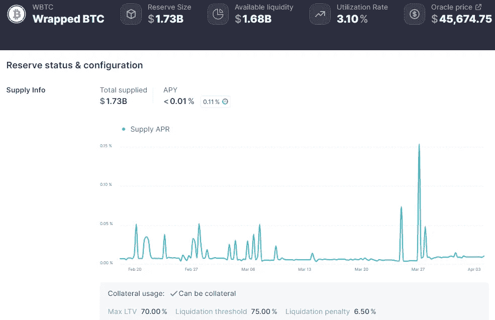
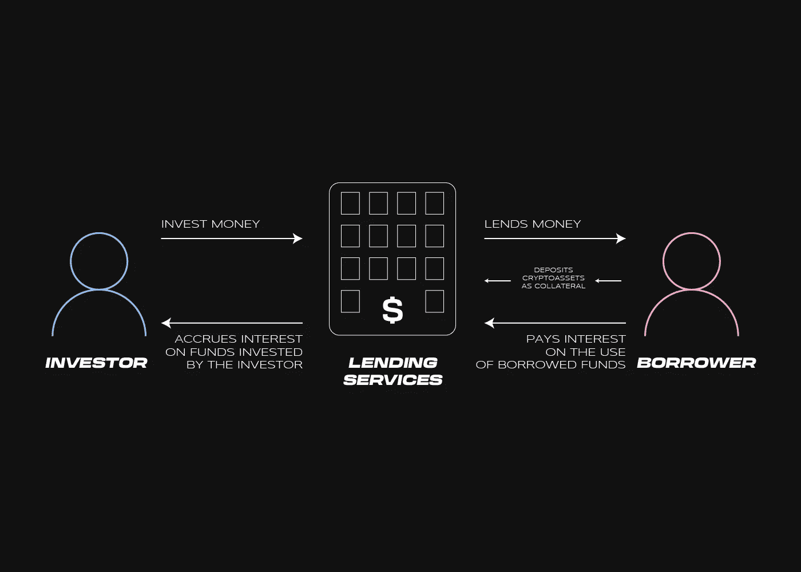
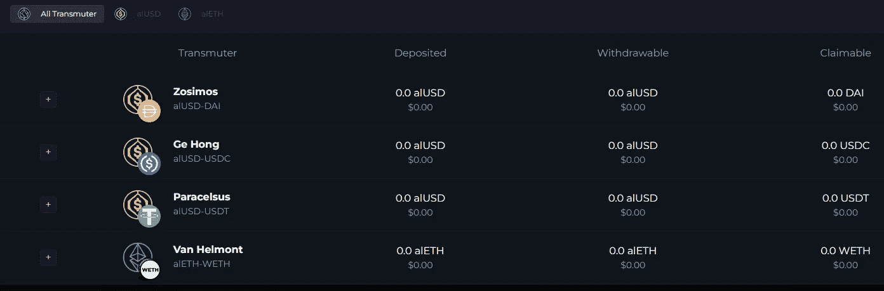
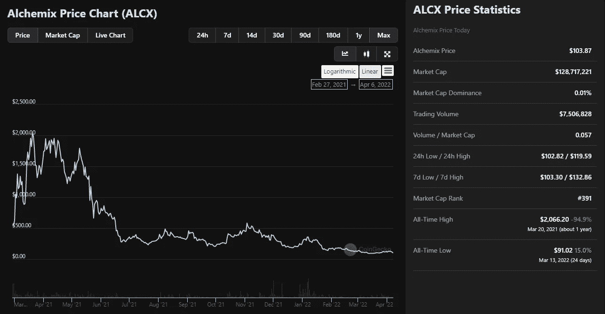
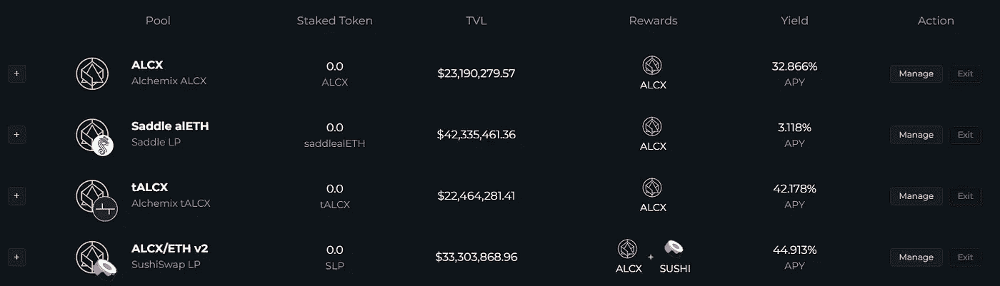
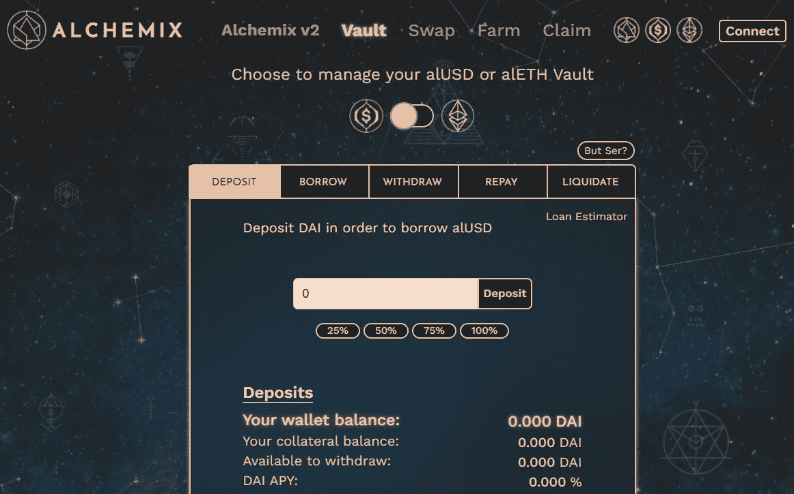
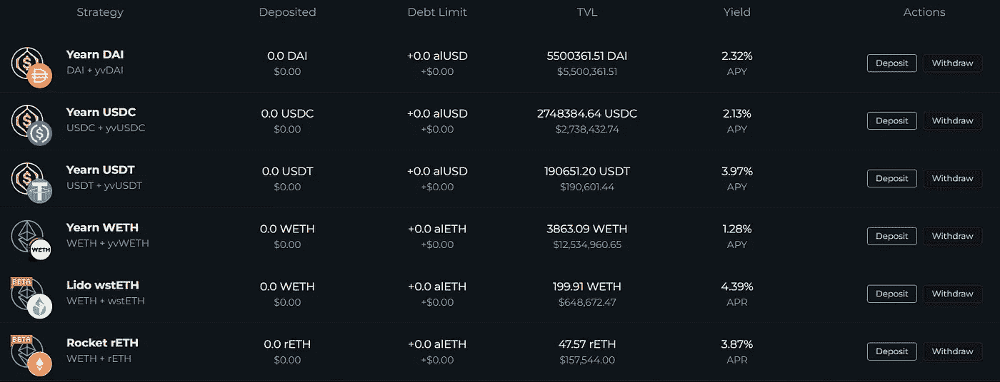
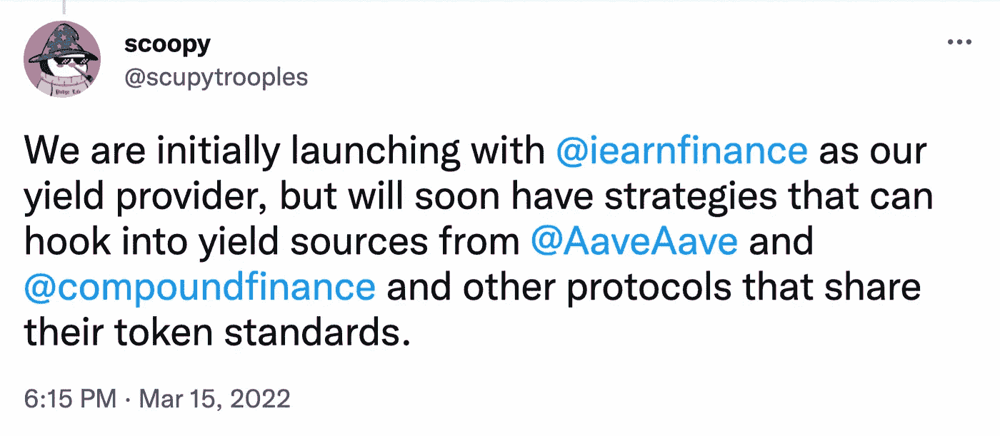

# Alchemix 贷款协议如何成为 DeFi 2.0 的增长动力

> 原文：<https://medium.com/coinmonks/how-the-alchemix-lending-protocol-became-the-growth-driver-of-defi-2-0-6ce703c2dc63?source=collection_archive---------29----------------------->

***与 DEX 一样，贷款服务也是 DeFi 细分市场的基石之一。它是如何工作的？它提出了什么？一起看看吧！***

它们使霍德勒能够赚取利息收入，并通过点击几下鼠标和相对简单的界面以数字资产为抵押进行借贷。

**马克尔道**、 **Aave** 、**复合**长期处于市场顶端。它们各自的总价值分别为 151.5 亿美元、135.9 亿美元和 66.4 亿美元(截至 2022 年 10 月 4 日)。Terra 生态系统的锚协议也越来越受欢迎。其 TVL 已经超过 150 亿美元大关。

像 Alchemix 这样的 DeFi 2.0 贷款项目也越来越受欢迎，在这些项目中，债务是自我清算的，不会被清算。

*   Alchemix 通过发行抵押品资产的合成版本，专注于提高资本效率和最小化清算。
*   该平台的关键创新在于通过与渴望金融的整合实现的自偿性贷款。
*   Alchemix 提供使用各种稳定硬币进行部分头寸清算和债务偿还的选项。

# **经典着陆协议的关键特征**

在任何贷款协议中都有数字资产池和杠杆资金池。每个都有一套独特的硬币。

用户将资产存入要约池，允许他们从投资中赚取利息并借入硬币。可用贷款资金的数量是供应池中资产价值的一定比例。

例如，以太坊网络上的 Aave 平台上的“包装比特币”WBTC 的贷款价值比( [LTV](https://www.investopedia.com/terms/l/loantovalue.asp) )参数为 70%。这意味着，如果抵押品是 10，000 美元，用户可以在 WBTC 贷出不超过 7，500 美元。

Source: [Aave](https://app.aave.com/reserve-overview/?underlyingAsset=0x2260fac5e5542a773aa44fbcfedf7c193bc2c599&marketName=proto_mainnet)

无许可协议与基于部分预约和 KYC 的传统金融市场产品的主要区别在于供过于求。

The scheme of user interaction with the lending services

清算是贷款协议的另一个重要方面。如果抵押品的价值低于某个阈值，用户的抵押品资产将被强制出售。

# Alchemix 价值主张

Alchemix 是一个新的贷款协议，具有一些独特的功能。

由质押资产合成版本支持的贷款避免了清算风险。例如，用户可以将抵押品存入 ETH 或 DAI，然后发行与它们相关的资产，如 alETH 和 alUSD。

当抵押品和杠杆资产的价值下降时，硬币的价值也会下降。然而，这对用户的债务头寸或 LTV 参数没有负面影响。

这是 Alchemix 与传统贷款协议的关键区别，在传统贷款协议中，你通常会存入 ETH 等不稳定资产，并接受稳定硬币形式的贷款(如果抵押品价值下降，稳定硬币形式的贷款金额保持不变，从而使债务头寸变得有风险)。

平台使用的是 Andre Cronje 的向往金融协议。作为这种整合的结果，用户将从他们存放的抵押资产中获得收入。

用户的贷款是通过渴望知识库产生的利息收入逐步偿还的。这种方法效率更高，因为它允许借入更多资金，同时降低了清算风险。

Alchemix 方案的贷款比率参数为 50%。这意味着用户的贷款金额不能超过抵押品价值的一半。换句话说，抵押品的价值必须至少是贷款金额的两倍。

用户可以随时清算抵押品或其一部分，以立即偿还 alUSD 中的债务。如果用户迫切需要抵押资产，但无法全额偿还借入资金，部分清算头寸可能是有益的。

贷款既可以用合成稳定币偿还，也可以用大家更熟悉的戴、、偿还。

在撰写本文时，戴稳定币的[跳马收益率仅为 2.53%。对于 farming COMP 和 CRV 代币，策略包括与复合和曲线平台交互。产生的硬币卖给戴，并存入金库。](https://yearn.finance/#/vault/0xdA816459F1AB5631232FE5e97a05BBBb94970c95)

所有收入的 10%进入 Alchemix 分散自治组织的国库。这些资金用于支付开发人员，资助各种社区活动，定期进行审计，等等。其余 90%用于清偿用户所欠债务。

为了保持 alUSD 的稳定性，使用了类似于 Terra 的套利系统。

假设 1 alUSD 比 1 DAI 便宜。套利者可以在其中一个交易所从 Alchemix 购买“打折”的合成稳定债券，然后卖出获利以偿还他金库中的债务。

如果 1 alUSD 的价值超过 1 DAI，则可以发行该资产，然后以低于市场价格的折扣出售。

该平台包括一个转换工具，可以将 WETH 和 stabelcoins 转换为合成资产，并以 1:1 的比例转换回来。例如，为了最大化资本回报，您可以将借来的 alUSD 换成 DAI，然后在第三方定义协议中使用后者。

Transmuter second version of the Alchemix protocol

Alchemix 有自己的令牌，ALCX。它用于协议管理投票。代币也可以在牛排餐厅或 SushiSwap 的 WETH/ALCX 流动性池中使用。

根据下面的图表，ALCX 汇率在项目启动后不久，于 2021 年 3 月在**短暂突破 2000 美元大关。结果，资产价格暴跌。**

Source: [CoinGecko](https://www.coingecko.com/en/coins/alchemix)

这些资产的 ALCX、ETH 和合成版本也可以被养殖。

Pools of the Farming section of the second version of Alchemix.

集合的年收益率(APYs)差异很大。比如 2022 年 2 月 6 日鞍阿利斯的 APY 是 3.12%，而 ALCX/ETH v2 的 APY 是 44.91%。

# Alchemix 2.0 及该项目的未来展望

Alchemix 的第一个版本于 2021 年 2 月发布。最初，这个平台只有两个金库:DAI/alUSD 和 ETH/alETH。

Source: [legacy.alchemix.fi](https://legacy.alchemix.fi/farms)

随着 2022 年 3 月第 2 版的推出，Alchemix 的界面得到了改造，平台的功能得到了显著扩展。

Stores in the second version of the protocol. Source: [Alchemix](http://alchemix/).

基于流行的集中式稳定硬币 USDC 和 USDT 的金库，以及来自利多的“包裹”以太(wstETH)和 rETH 协议火箭池已经出现。

嬗变术的能力随着新资产的增加而增加，农场部分也被更新。

Alchemix 的联合创始人 Scoopy Trooples 宣布与 Aave、Compound 和其他 DeFi-protocol 进行集成，此外还有 earning。

Source: [Twitter](https://twitter.com/scupytrooples/status/1503751727857688584?ref_src=twsrc%5Etfw)

# 结论

Alchemix 有一个有趣的价值主张:开发商已经完全重新设计了他们的非托管贷款方法。

通过集成收益聚合器和使用合成资产，用户的抵押品得到有效利用。债务头寸实际上不受清算的影响，自动由未来的利息收入支付。

该平台的缺点包括,(在撰写本文时)“渴望战略”的盈利能力较低。也不支持 Fantom 和 Avalanche 等提供快速低成本交易的下一代网络。然而，鉴于开发人员的乐观声明和跨链解决方案的日益流行，这些问题可能很快就会得到解决。

在未来，我们可以期待 DeFi 2.0 概念中同样创新的方法，以及鼓励用户积极参与分散生态系统的新解决方案。

> 你有什么想法？如果你对 Alchemix 有任何补充，请在下面留下你的评论！
> 
> 在[媒体](/@SunflowerCorpAdmin)或[推特](https://mobile.twitter.com/sunflower_corp)上关注[向日葵公司](https://sunflowercorp.com/)，定期更新热门的秘密新闻。

[*向日葵公司*](https://sunflowercorp.com/) *—专注于最佳交易体验和卓越技术的新型加密货币衍生交易所。*

我们提供杠杆高达 x100 的 BTC/USDT 永久期货，以及最具趋势性的工具。当您与我们交易时，您将获得一个可定制的交易终端、各种图表、技术分析工具、各种订单类型以及“止损”和“获利”订单选项。

> 交易新手？在[最佳加密交易](/coinmonks/crypto-exchange-dd2f9d6f3769)上尝试[加密交易机器人](/coinmonks/crypto-trading-bot-c2ffce8acb2a)或[复制交易](/coinmonks/top-10-crypto-copy-trading-platforms-for-beginners-d0c37c7d698c)