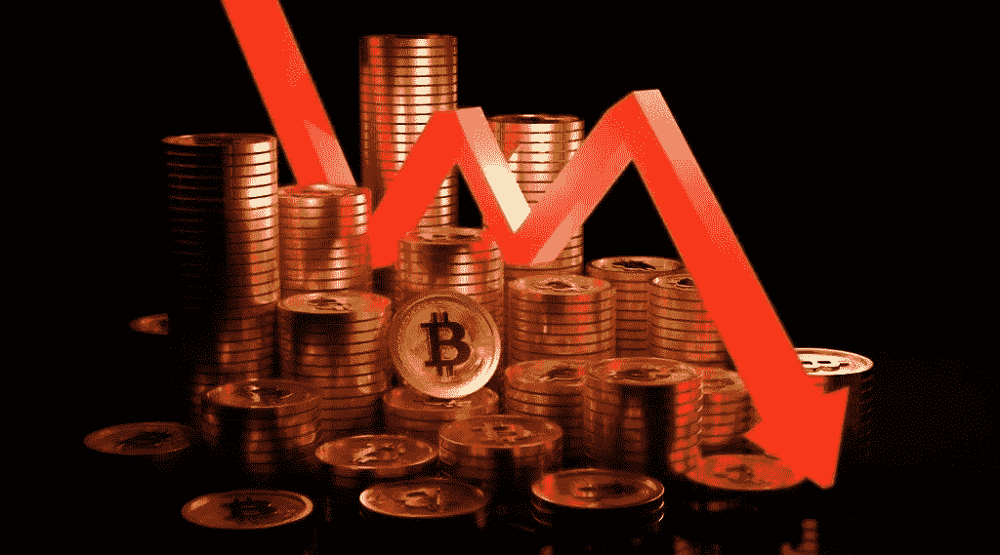

# 加密下降趋势将如何帮助生态系统

> 原文：<https://medium.com/coinmonks/how-the-crypto-downtrend-will-help-the-ecosystem-f86ea83d1e3e?source=collection_archive---------48----------------------->

# 秘密下降趋势

 [## 加密下降趋势将如何帮助生态系统

### 了解加密下降趋势将如何帮助生态系统有效增长。专家说它将作为一种…

koop360.com](https://koop360.com/blog/how-crypto-downtrend-will-help-ecosystem/) 

> 最新形式的货币体系创下了其汇率的新低。比特币已经跌破 2 万美元大关。投资者急于抛售手中的比特币，以免遭受更多损失。五年前，当加密市场建立起来时，同样的 20，000 美元看起来像是加密市场的成功。然而，时代已经改变，这个标记现在是许多人梦想的墓碑。

许多人进入[秘密](https://koop360.com/blog/cryptocurrency-trading-strategies/)市场，希望通过购买**兰博斯**和**游艇**来赚快钱并过上超级奢华的生活。亏损教会了投资者在本质上高度波动的市场中表现得像坚韧的企业家。这种隐秘的下降趋势教会了他们思考如何为生态系统创造价值，而不是消耗它。

# 了解市场状况

目前市场正在经历下跌趋势。 [**天使投资人**](https://en.wikipedia.org/wiki/Angel_investor) 长期以来一直在警告人们加密市场的这种加密下降趋势。任何懂得风险管理的人都在为这场衰退做准备。众所周知，熊市总是跟随牛市，反之亦然。然而，大多数投资 crypto 的投资者并没有为这个事实做好准备。结果，泡沫膨胀并最终破裂。

人们甚至组织是否有适当的风险管理？答案是否定的。任何类型的投资，任何类型的市场都有风险。投资者通常都知道这一点。承认存在风险是一个相当明智的举动。这意味着做好准备，看着垮台成为现实。

市场低迷几乎没有影响到那些建立自己企业的人，或许还影响到那些经营企业并完整记录利润、支出和风险评估的人。下跌趋势主要影响了那些认为永远会有牛市的人。

# 市场崩溃实际上对生态系统有益

市场崩溃打破了白日梦和快钱的泡沫。许多投资者对市场进行投机，而不是准备风险评估计划。目前，密码市场上近 75%的投资者是投机型的。亏损拖累了相关企业。

专家说，市场崩溃将作为一个教训，为无用的奸商和那些投机市场。它赶走了那些幸运地赚了一些钱，然后宣称自己是金融救世主和大师的人。这将扼杀那些建立在无止境的拨款而不是良好的商业模式上的创业公司。这将导致程序员加入到具有稳定经济、风险管理和真正可持续性的真实项目中。

有风险评估计划的投资者和组织将会幸存下来，因为还会有崩盘。市场会再次下跌，就像市场通常会做的那样。然而，随着每个周期的到来，更有效率的企业将会崛起，这些企业关心的是做出改变，而不是快速获利。

**结论**

密码市场将在未来发展并变得更加稳定。它还会带来高回报，会有认真的投资者。加密货币和 NFT 是技术的未来，许多投资者和大机构都对它们感兴趣。如果你想充分发掘 NFTs 的潜力，你可以尝试使用 [**Koop360**](https://koop360.com/) ，这是一个通过机器人由社区维护的基于社区的项目。

秘密市场不是骗局或传销。就像传统的证券交易所一样，这也经历了上升和下降的周期，但变得比以前更有吸引力。作为一个企业家，你必须更加关注在这样一个高风险和动荡的生态系统中的风险管理。

不要忘记适当的风险管理。

> 交易新手？尝试[加密交易机器人](/coinmonks/crypto-trading-bot-c2ffce8acb2a)或[复制交易](/coinmonks/top-10-crypto-copy-trading-platforms-for-beginners-d0c37c7d698c)