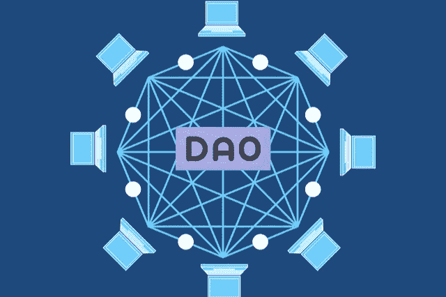

# DAO 将如何彻底改变区块链的未来

> 原文：<https://medium.com/coinmonks/how-the-dao-will-revolutionize-the-future-of-blockchain-1db857868049?source=collection_archive---------9----------------------->

有许多令人兴奋的新方法可以利用区块链科技来改善世界。区块链的新用例每天都在涌现，但到目前为止，大多数都是针对金融交易的。然而，区块链最有趣和令人兴奋的用途之一在于分散自治组织(Dao)。DAO 是一个通过软件代码而不是传统的领导或层级来运作的组织。在本文中，我们将探讨什么是 Dao 以及它们将如何影响区块链的未来。

# 什么是刀？

DAO 是一个通过分散方式运行的组织。组织由一套编入系统的规则管理。组织运行在遵循组织规则的智能契约上。这样，组织是自治的，因为它不依赖于中央或等级权威。它通过在其系统中实现的代码来运行自己。这就是它成为刀的原因。Dao 是分散的，因为它们没有中央权威。他们没有一个可以操作的中心位置。该组织通过分散的网络运行，其中网络中的每个节点都是系统的管理员。这意味着如果网络足够大，没有人能控制整个网络。每个节点在管理系统方面都有同等的责任。

# 一把刀是怎么操作的？

Dao 的操作方式由写入系统的代码控制。这个代码被称为“[智能契约](https://cyberhubintelligence.com/smart-contract-business-use-cases/)，因为它遵循 DAO 设置的规则。该系统具有预定义的规则和协议，通过这些规则和协议来运行。例如，系统的用户可能需要对决策进行投票。这些规则由 DAO 的创始人编码到系统中。创始人决定系统如何运行，并实现确保系统按照他们希望的方式运行的代码。为了实现这些规则，DAO 可以使用区块链技术。区块链技术是去中心化和加密的，这样就不能被篡改。这确保了在编写时遵循了 DAO 中的规则。

# 道斯和区块链科技

区块链技术使得实现 DAOs 成为可能。区块链技术是去中心化的，所以一个机构如果想去中心化，使用它是有意义的。然而，区块链技术也使 Dao 比传统组织更有效率成为可能。这是因为它是去中心化的，不可改变的。这意味着系统是安全的，不能被黑客攻击或操纵。除非 51%的用户同意，否则系统的数据和规则不能改变。使用 DAO，对重大决策的投票是自动化的，并确保每个人都得到公平的代表。

# 道组织和传统组织

传统的组织以自上而下的层级方式运作。该组织有一个集中的权力结构，其中一个或几个人有控制权。这些人为组织的其他人做决策。例如，公司的首席执行官做出关于公司发展方向的重要决策，而其他员工做出不太重要的决策。在很大程度上，这些决策是根据首席执行官的突发奇想做出的。有时，员工会被要求对决策进行投票，但最终决定权仍在首席执行官。然而，在 DAO 中，网络中的每个用户对每个决策都有发言权。每张[选票](https://consensys.net/blog/blockchain-explained/what-is-a-dao-and-how-do-they-work/)都根据用户拥有的令牌数量进行加权。无论用户在组织中的职位如何，他们在重大决策中都有发言权。

# 提议道中的变化

如果用户不同意 DAO 的运行方式，他们可以建议对系统进行更改。这些更改将作为提案输入，发送给网络的其他部分进行审批。如果网络中的大多数人同意该提议，它将得到实施。如果用户不喜欢某个具体提案的编写方式，他们可以建议对其进行修改。这些变化也作为一个新的提议被提出，网络的其他成员可以投票决定他们最喜欢哪一个。所有这些投票都记录在区块链上，不能被[篡改或更改](https://cyberhubintelligence.com/7-smart-contract-security-threats/)。这确保了系统的安全和透明。

# 道的优点

Dao 有许多优势，使它们成为组织的一个引人注目的选择。DAO 最重要的优势之一是它是去中心化的。因为该组织没有中心位置，所以无法关闭。这意味着该组织不能被政府关闭。停电也关不了。它不能被任何一个人或事件所关闭。组织是分散的，没有一个人能杜绝。这也意味着组织永远不必担心丢失数据。这是因为数据分布在整个网络中。这使得黑客或网络攻击几乎不可能搞垮组织。

# 道的缺点

Dao 是管理一个组织的绝佳方式。然而，它们并不完美。刀最大的缺点是很难改变规则。因为组织是通过代码运行的，所以很难改变规则。这意味着，如果你犯了错误，你不能改变它。你能做的最好的事情就是把它放在代码中来纠正它。如果你意识到组织没有按照你想要的方式运行，这就是一个问题。如果你有能让组织更有效率的新信息，这也是一个问题。如果你有新的信息，你不能改变规则，因为你没有能力改变代码。

# 最后的想法

Dao 是公司运营的一种令人着迷的新方式。他们给用户一种自主和控制他们组织的感觉。他们还允许用户参与组织的成功。有了一把刀，你就能知道你投资的东西是会持久的。因为一把刀是去中心化的，要扳倒它是难以置信的困难。这意味着您可以相信您的投资是安全的，并且该组织将存在很长时间。对于那些想投资一家持续发展的公司的人来说，这是一个极具吸引力的投资机会。

***本文一个版本最早发表在*** [***赛博智能***](https://cyberhubintelligence.com/how-the-dao-will-revolutionize-blockchain/) 上

> 加入 Coinmonks [电报频道](https://t.me/coincodecap)和 [Youtube 频道](https://www.youtube.com/c/coinmonks/videos)了解加密交易和投资

# 另外，阅读

*   [交易杠杆代币的最佳交易所](https://coincodecap.com/leveraged-token-exchanges) | [购买 Floki](https://coincodecap.com/buy-floki-inu-token)
*   [3Commas 对 Pionex 对 Cryptohopper](https://coincodecap.com/3commas-vs-pionex-vs-cryptohopper)|[Bingbon Review](https://coincodecap.com/bingbon-review)
*   [加密复制交易平台](/coinmonks/top-10-crypto-copy-trading-platforms-for-beginners-d0c37c7d698c) | [如何在 WazirX 上购买比特币](/coinmonks/buy-bitcoin-on-wazirx-2d12b7989af1)
*   [CoinLoan 评论](https://coincodecap.com/coinloan-review)|[Crypto.com 评论](/coinmonks/crypto-com-review-f143dca1f74c)
*   [如何在加拿大购买加密货币？](https://coincodecap.com/how-to-buy-cryptocurrency-in-canada)