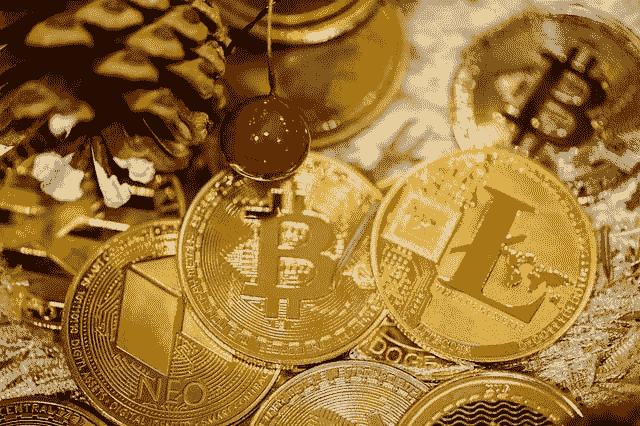

# 比特币汇率的动态在它存在的整个历史中是如何变化的

> 原文：<https://medium.com/coinmonks/how-the-dynamics-of-the-bitcoin-exchange-rate-have-changed-over-the-entire-history-of-its-existence-83383aae7b1c?source=collection_archive---------60----------------------->

【2022 年 7 月底，比特币价格略高于 2 万美元。回想一下 2009 年至 2022 年第一种加密货币的价格

自 2022 年初以来，比特币的波动性极高，特别是到 2022 年 7 月底，汇率跌至 2 万美元的水平。对于一个不熟悉加密货币行业的人来说，这种不稳定性似乎很危险。然而，对于比特币来说，这是一个熟悉的故事——即使没有人预料到这一点，也会让投资者感到惊讶。在本文中，我们将回顾这种资产的主要涨跌，并追踪比特币从 2008 年诞生到今天的汇率动态。

## 内容

*   **比特币价格历史**
*   **按年计算的比特币价格**

# 比特币价格历史

当年晚些时候，有人用笔名中本聪发表了一篇题为“比特币:一种电子点对点支付系统”的论文在这篇文章中，他描述了未来的加密货币将如何工作。

2009 年，加密货币挖矿开始。然而，比特币并没有在任何地方出售。当时，根本没有加密货币交易所。

# 按年计算的比特币价格

## 2010

在整个 2010 年，比特币未能达到 1 美元大关，但价格已经开始上涨。当年最搞笑的事件是美国人拉兹洛·哈内奇花 1 万 BTC(当时 1 BTC 值 0.0025 美元)买了两个披萨的瞬间。如果拉兹洛将这些比特币再保存 10 年，那么到 2021 年，他将拥有超过 4 . 5 亿美元。

> 交易新手？尝试[加密交易机器人](/coinmonks/crypto-trading-bot-c2ffce8acb2a)或[复制交易](/coinmonks/top-10-crypto-copy-trading-platforms-for-beginners-d0c37c7d698c)