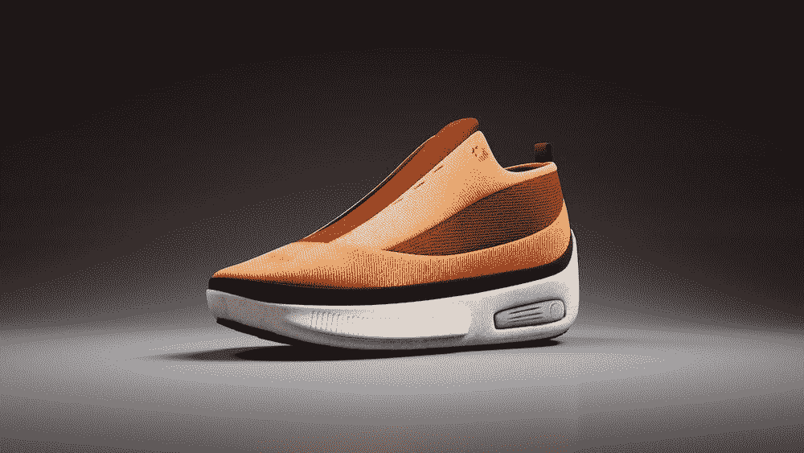

# 元宇宙和 NFT 是如何颠覆时尚产业的

> 原文：<https://medium.com/coinmonks/how-the-metaverse-and-nfts-are-disrupting-the-fashion-industry-d2791e0d1e7a?source=collection_archive---------45----------------------->

时尚界对隐语的探索已经不是秘密，杜嘉班纳、古驰和蒂芙尼等品牌都在元宇宙 t 台上走自己的路。分散的元宇宙时装周暗示了一股新的时尚潮流。这项创新技术已经说服人们为虚拟土地支付数百万美元——那么，时尚为什么不呢？