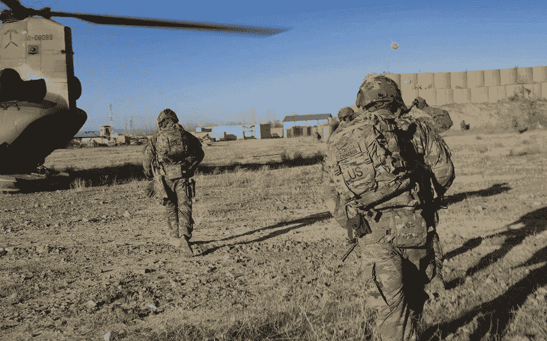

# 军工复合体如何融入元宇宙

> 原文：<https://medium.com/coinmonks/how-the-military-industrial-complex-fits-into-the-metaverse-a16d87c9eb7?source=collection_archive---------38----------------------->

围绕元宇宙的大部分讨论都是关于它将如何被商业化用于商业目的和个人用途。虽然这将在未来十年占据中心位置，但元宇宙的适用性可能会对军方有用。2023 年美国国防预算最近增加了 8%,达到惊人的 8580 亿美元。军事预算预计将涵盖军队的所有部门，包括培训和武器等。

在元宇宙时代，军事活动和处决将变得身临其境，国家安全方针将呈现新的层面。在这篇文章中，我讨论了军工复合体如何融入元宇宙，以及沉浸将如何重新定义世界各地的国防方法。

# 元宇宙的军事训练

自第二次世界大战以来，军事行动迅速发展。多年来，工业、技术和军事研究的融合极大地影响了军事演习的水平。今天，世界顶级军队在全球不同角落都有军事基地和特种部队。

随后的合作引入了新的军事训练体制。作为该过程的一部分，军事模拟经常进行，而新的实验也定期进行。众所周知，参与军工综合体复杂景观的一些[顶级公司](https://about.bgov.com/top-defense-contractors/)包括洛克希德·马丁公司、雷神技术公司、波音公司、诺斯罗普·格鲁曼公司和通用动力公司等。

元宇宙将为军事训练提供一个新的环境。复杂的模拟、军事演习、虚拟战斗等等可以在虚拟世界中进行，而不会造成真正的伤亡。元宇宙将作为一个身临其境的环境，使所有这些活动看起来真实，并达到预期的效果。

# 战斗交战模拟

目前，军事演习经常在物理空间进行。这方面的一些共同之处包括一年一度的美韩军事演习和俄罗斯-白俄罗斯军事演习。

虽然我们不能否认这些演习服务于特定的目的，如威慑和展示军事力量，但它们往往需要付出巨大的代价。除了成本问题，军事演习也会导致温室气体排放。如果此类活动在元宇宙进行，资金可以得到更好的利用，同时还可以消除排放。

在元宇宙，军队可以在专门为此目的定制的环境中进行演习。元宇宙的身临其境的能力将成为近真实模拟演练的基础。

此外，军方将受益于元宇宙，用它来模拟有计划的行动。在一个可以相对容易地获得位置和地图的时代，军队可以用它们来建立虚拟环境。他们可以在这些环境中计划行动和模拟任务。当最终交战发生时，元宇宙还可以增加他们的成功机会，因为士兵们只会执行一项精心设计的任务。

# 将智能融入元宇宙

虽然有可能在实际军事行动之前模拟在元宇宙的任务，但可以通过军事情报进一步提高精确度。军方可以利用当地的情报报告，在执行任务前很久就为可能发生的情况做好计划。

在实地收集的情报可用于设计可能的情景，这将进一步有助于行动规划。这种方法的主要优点是将智能融合到元宇宙中，可以立即反映现实生活中的情况。因此，元宇宙沉浸式向士兵们描绘了一幅真实的地面场景。从而帮助他们计划可能的反应和整体协调。

利用对当地情报的了解来构建元宇宙场景，可以极大地提高军事行动的成功率，减少伤亡，并限制意外袭击的可能性。然而，必须指出的是，战争和现代军事行动比以往任何时候都更加复杂。

# 元宇宙和国家安全

随着元宇宙的商业化，安全世界将被重新定义。虽然无法否认元宇宙的好处，但它也可能成为恐怖分子议程和全球圣战网络扩张的工具。

目前，已知恐怖主义网络在当地建立潜伏小组，并通过互联网招募新兵。工具，如录制的视频，电话和电子邮件，已被记录为使用的教派。虽然这些工具在物理交互方面没有提供太多，但它们已经被用来产生毁灭性的效果。

元宇宙的演变有为黑暗势力和恐怖网络招募新兵、训练新兵、策划和协调袭击创造新渠道的趋势。元宇宙将创造一种身临其境的联系——这是长久以来一直缺失的东西。

因此，必然会重新定义国家证券的样子，以及各国在当前和长期将如何对待它们。因此，重要的是，国家军队应尽早进入这一巨大的无人管理的空间，以掌握其运作方式以及为防止国家安全问题应采取的适当步骤。

# 元宇宙可能很贵

建造元宇宙的成本可能是一个主要问题，尽管它可能带来好处。然而，必须指出，对国家军队及其合作伙伴来说，相关费用可能不多。

据估计，建造一座元宇宙的费用在 4 万至 40 万美元之间。然而，这样一个项目的特点应该是简单的。因此，建立一个高度复杂的虚拟环境，如军事训练设施，模拟地面，或特定任务的目标位置，预计成本更高。

虽然没有确切的费用数字，但最近的事态发展表明，它可能比看起来要复杂得多。总部位于英国的军事元宇宙项目[最近将注意力](https://nftnewstoday.com/2022/12/14/improbable-shuts-down-military-metaverse-project/?utm_source=rss&utm_medium=rss&utm_campaign=improbable-shuts-down-military-metaverse-project)转向了商业元宇宙，此前它在早期为国家安全机构和军方建立了一个名为 [Skyral](https://defense.improbable.io/skyral/) 的元宇宙项目。

# 结论

毫无疑问，军方会从元宇宙中获益匪浅。然而，在军事上采用元宇宙的早期尝试并不乐观。虽然资金可能不会给各国造成太大的问题，但需求是巨大的，不断为军事行动和国家安全建立虚拟环境所需的人力资本还很遥远。

> *交易新手？试试* [*密码交易机器人*](/coinmonks/crypto-trading-bot-c2ffce8acb2a) *或* [*复制交易*](/coinmonks/top-10-crypto-copy-trading-platforms-for-beginners-d0c37c7d698c)
> 
> *分散加密持股，了解* [*币安的替代方案*](https://coincodecap.com/binance-alternatives)
> 
> *加入 Coinmonks* [*电报频道*](https://t.me/coincodecap) *和* [*Youtube 频道*](https://www.youtube.com/c/coinmonks/videos) *获取每日* [*加密新闻*](http://coincodecap.com/)

# 另外，阅读

*   [最佳加密交易所](/coinmonks/crypto-exchange-dd2f9d6f3769) | [印度最佳加密交易所](/coinmonks/bitcoin-exchange-in-india-7f1fe79715c9)
*   开发人员的最佳加密 API
*   最佳[密码借贷平台](/coinmonks/top-5-crypto-lending-platforms-in-2020-that-you-need-to-know-a1b675cec3fa)
*   [免费加密信号](/coinmonks/free-crypto-signals-48b25e61a8da) | [加密交易机器人](/coinmonks/crypto-trading-bot-c2ffce8acb2a)
*   [杠杆代币](/coinmonks/leveraged-token-3f5257808b22)终极指南