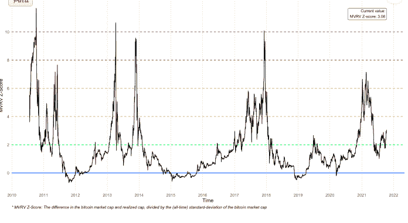
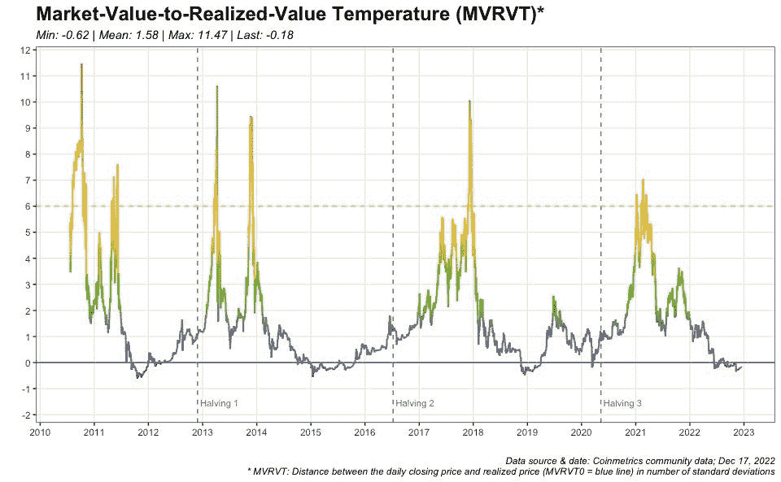

# MVRVT 指标如何与历史熊市底部相关联。

> 原文：<https://medium.com/coinmonks/how-the-mvrvt-indicator-correlates-with-the-historical-bear-market-bottom-54e1d3f71ee8?source=collection_archive---------36----------------------->

## 链上分析指标显示比特币市场正在降温。

**TL: DR**

*   MVRV 是一个比率，用于衡量数字资产的市值与其基础区块链的交易量之间的关系。
*   MVRV 在加密货币投资者和分析师中越来越受欢迎，因为它可以提供对当前市场的宝贵见解。
*   在一条[推文](https://twitter.com/dilutionproof/status/1604047624520273920)中，On-chain 分析师防稀释比较了三个比特币减半后的周期，他使用 MVRVT 指标图将当前的熊市与其历史对应情况进行了比较。
*   在 Jakub Dziad Kowie 的后续分析中，他观察到，根据与历史市场降温数据的比较，比特币价格已经触底，牛市趋势可能很快就会逆转。

> 从顶级交易者那里复制交易机器人。试试看 [**免费**](https://coincodecap.com/go/pionex-coinmonks) **。**

# 介绍

当前[的低迷](https://www.gate.io/blog_detail/1932/The-crypto-market-forecast-2023)将成为加密市场历史上持续时间最长的一次。专家们已经开始寻找黑暗的加密冬天结束的可能迹象，这个冬天已经看到价格像一副纸牌一样下跌。虽然整体市场也开始显示出一些降温的迹象，但分析师的注意力主要集中在比特币(BTC)的链上指标上。

明确检查市场价值与已实现价值比率温度(MVRVT ),将其与之前的市场周期进行比较。一项最近发表的分析研究了标志着加密货币熊市结束的五个指标和一项链上分析。分析师还研究了自上一次比特币减半以来的 65%时期，采用 MVRVT 指标评估当前的市场周期，特别是鉴于即将到来的比特币减半事件。

# 什么是市场价值与实现价值比率温度(MVRVT)？

MVRV 是衡量数字资产市值与其基础区块链交易量之间关系的比率。MVRV 比率是一个链上指标，用于研究价格在成本基础上下波动时的总体投资者行为。这是一个均值回归模型，其中已实现上限(总市场成本基础)作为均值，而 MVRV 衡量与该均值的偏差。

高 MVRV 比率可能表明资产被高估，准备抛售。另一方面，较低的 MVRV 比率可能表明一项资产被低估，价格应该上涨。MVRV 在加密货币投资者和分析师中越来越受欢迎，因为它可以提供对当前市场的宝贵见解。

MVRV 的这一新概念标志着链上分析新兴领域的分水岭时刻。2018 年 10 月 9 日，Awe 和 Wonder 通过开发一种称为 MVRV z-Score 的指标来提高 MVRV 比率。MVRV z 分数代表每个比特币市场估值相对于其实现价值的标准偏差的数量。这一指标的可视化使得使用比特币减半作为基准，将相对比特币市场估值与之前的比特币市场周期进行比较变得容易得多。

模拟 BTC 市场温度的颜色是 MVRVT 指标固有指标的补充。从零开始的标准偏差决定了它们。它对应的是 MVRV 指标的 1 级——比特币的“公允价值”。

[Bitcoinmagazine](https://bitcoinmagazine.com/markets/market-value-realized-value-bands-bitcoin)

上图描述了 MVRV z 值的演变。MVRV z 值 0(蓝色)、2(绿色)、4(黄色)、6(橙色)、8(红色)和 10 由彩色水平线(棕色)表示。

随着偏差的增加，MVRVT 指示器向红色移动。这发生在 2011 年、2014 年、2017 年和 2021 年的牛市高峰期间。有趣的是，在之前的牛市中，该指标没有达到红色，牛市以橙色结束。

当 MVRVT 低于 0 时，颜色越来越冷，越来越趋向蓝色。每次熊市结束时都会出现这种情况。

# MVRV 是怎么测出来的？

MVRV 的公式为:

**MVRV =市场资本总额/已实现资本总额**

已实现资本化衡量在特定时期内买卖的所有加密货币的价值。它是通过将所有未完成的买卖订单的价值与市值相加来确定的。已实现资本化可用于评估加密货币市场的健康状况，并预测未来的价格走势。

市值:一种加密货币的市值是其所有流通硬币的总价值。(令牌数 X 令牌值)

MVRV 值为 100%(或 2.0)表示，如果所有持有人以当前价格出售他们的硬币/代币，他们将获得 100%的利润(x2)。

# 使用 MVRV 投资加密货币的优势

1.  MVRV，即市场价值与实现价值之比，是一种加密货币投资者指标，用于确定一枚硬币是被高估还是低估。
2.  MVRV 可用于识别市场周期并做出适当的投资决策。如果 MVRV 高，可能是卖出的时候了，如果 MVRV 低，可能是买入的时候了。
3.  MVRV 也可用于评估风险。高 MVRV 表明下行风险大于上行潜力，而低 MVRV 表明下行风险大于上行潜力。
4.  MVRV 是加密货币投资者的宝贵资源。关注自己喜欢的币的 MVRV，可以做出更好的投资决策，实现利润最大化。

# MVRVT，鉴于比特币减半

12 月 16 日，on-chain 分析师在一条推文中比较了三个比特币减半后的周期。他使用 MVRVT 指标图将当前的熊市与历史熊市进行了比较。发现在每次减半后的第一个 12-18 个月，每个周期开始时都有异常高的 MVRVT 偏差。然而，所有三个比特币周期都导致该指数在减半后的 25-35 个月内跌破零。比特币进入第 31 个半月，MVRVT 保持在 0 以下。

[Dilution-proof](https://twitter.com/dilutionproof/status/1604047624520273920/photo/1)

*MVRVT 指标与熊市结束时的历史数据相关。*

在 Jakub Dziad Kowie 对“稀释证明”的帖子进行的[后续](https://twitter.com/JakubDziadkowie)分析中，他观察到，基于与历史市场降温数据的比较，分析表明比特币价格已经触底。此外，根据当前价格走势类似的周期，看涨趋势反转并升至 0 水平以上可能会在短至两个月(周期 2-绿色)或长达四个月(周期 3-红色)(周期 1-蓝色)内发生。

他进一步指出，如果比特币今天极度过热，就像它在以前牛市的顶峰时期一样，BTC 价格将是 165200 美元。该预测是 MVRVT 比率在水平 10 时的标准偏差。

他的结论是，虽然比特币将能够达到这个价格，但它只会在下一次减半后大约十几个月才会出现，目前的账单显示是在 2024 年 4 月 10 日。

# 结论

MVRVT 是链上分析发展领域的一个突破。最近的 MVRVT 指标，与熊市结束时的历史数据相关，引起了分析师和观察人士的注意。该指标与比特币减半之间的关系进一步将人们的注意力引向了加密行业时代的这一重大事件。

> 加入 Coinmonks [电报频道](https://t.me/coincodecap)和 [Youtube 频道](https://www.youtube.com/c/coinmonks/videos)了解加密交易和投资

# 另外，阅读

*   [加密货币储蓄账户](/coinmonks/cryptocurrency-savings-accounts-be3bc0feffbf) | [YoBit 审核](/coinmonks/yobit-review-175464162c62)
*   [Botsfolio vs nap bots vs Mudrex](/coinmonks/botsfolio-vs-napbots-vs-mudrex-c81344970c02)|[gate . io 交流回顾](/coinmonks/gate-io-exchange-review-61bf87b7078f)
*   [CoinFLEX 评论](https://coincodecap.com/coinflex-review) | [AEX 交易所评论](https://coincodecap.com/aex-exchange-review) | [UPbit 评论](https://coincodecap.com/upbit-review)
*   [AscendEx 保证金交易](https://coincodecap.com/ascendex-margin-trading) | [Bitfinex 赌注](https://coincodecap.com/bitfinex-staking) | [bitFlyer 点评](https://coincodecap.com/bitflyer-review)
*   [Bitget 回顾](https://coincodecap.com/bitget-review)|[Gemini vs block fi](https://coincodecap.com/gemini-vs-blockfi)cmd |[OKEx 期货交易](https://coincodecap.com/okex-futures-trading)