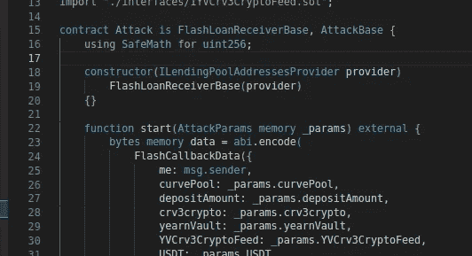

# 甲骨文操纵攻击如何发生在逆向金融上

> 原文：<https://medium.com/coinmonks/how-the-oracle-manipulation-attack-happened-to-inverse-finance-cb95e5343034?source=collection_archive---------0----------------------->

## 让我们用 hardhat 重现以太坊 mainnet 分叉上的攻击！

an attack contract I reproduced

今天，我将演示我是如何复制逆向金融攻击者的代码(不是实际的代码)的，这样您就可以更好地理解整个过程。您可以执行与攻击者在以太坊 mainnet fork 上执行的几乎相同的事务…