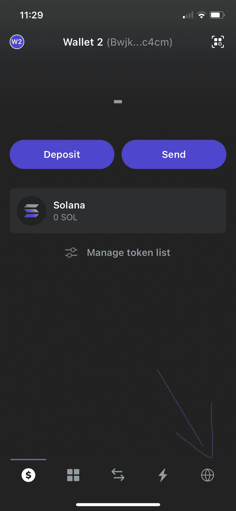
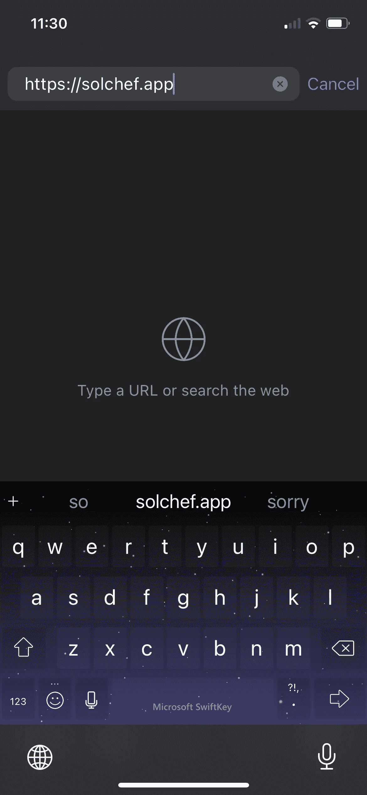
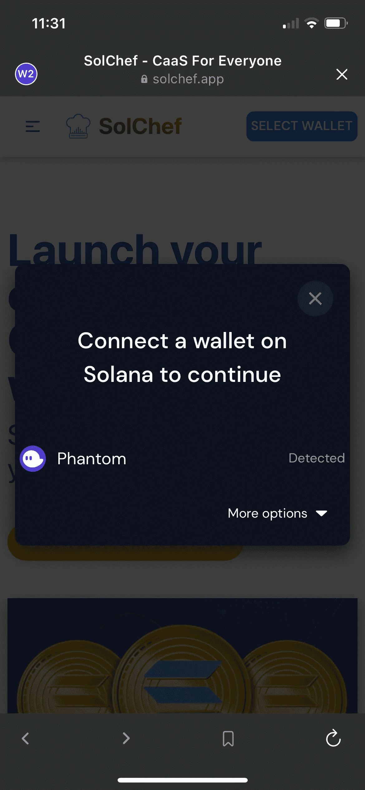
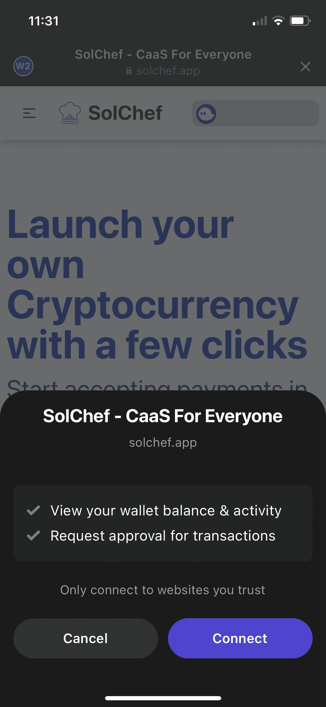
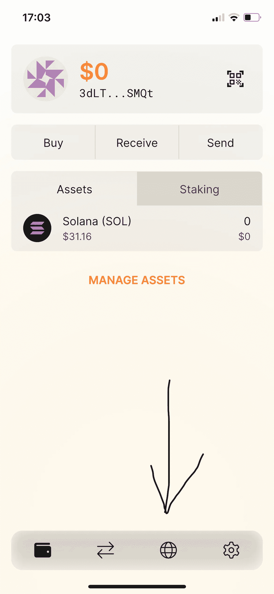
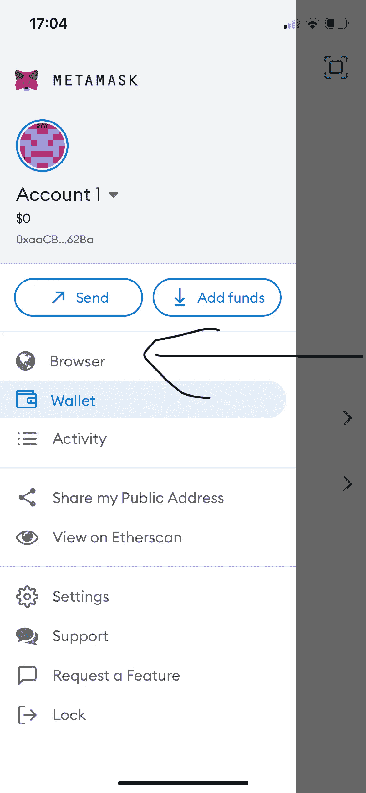

# 如何在移动端访问 dApps？

> 原文：<https://medium.com/coinmonks/how-to-access-dapps-on-mobile-657993d36ebe?source=collection_archive---------35----------------------->

这些天有很多区块链，支持区块链生态系统的 dApps 也是如此。不可否认的事实是，这些 dApps、DeFi 应用和 Dao 是任何区块链生态系统的支柱。

# 问题陈述

钱包是访问这些应用程序的重要组成部分，或者可以被视为访问这些应用程序的唯一手段。在这里阅读更多关于加密钱包的信息:
[https://medium . com/coin monks/how-can-I-start-interactive-with-cryptos-D5 bad 141 cf 0](/coinmonks/how-can-i-start-interacting-with-cryptos-d5bad141cf0)

现在，这些加密钱包基本上有两种形式。一是原生 Android/IOs/桌面应用，二是钱包扩展的形式。大多数 dApps 要求您首先将钱包连接到服务，以便使用该服务。

这个过程在桌面浏览器上是如此的流畅，以至于它从来不会打扰任何人。但是，手机浏览器呢？一般来说，本地应用程序无法直接连接到本地应用程序，也没有钱包的移动浏览器扩展。

# 解决方案

这个问题的解决方案隐藏在钱包本身的原生移动应用程序中。每个手机加密钱包应用程序都内置了一个浏览器，可以用来访问任何需要先连接你的钱包的分散式应用程序。

我正在用 iPhone 上的幻影钱包访问 [SolChef](https://solchef.app/token) 。SolChef 是一个加密即服务平台，可以非常容易地创建您自己的加密货币，并创建一个交易市场。SolChef 旨在成为一个跨链加密货币支付系统。我现在将尝试使用 iPhone 上的 Phantom wallet 应用程序创建一个测试令牌:

**第一步:**打开 Phantom wallet 应用，选择浏览器

**This is the phantom wallet and that arrow points to the browser**

**步骤 2:** 输入 dApp 的 url(在我们的例子中是 [https://solchef.app](https://solchef.app/token) )

**There is no difference in accessing this browser from the usual browsers**

**步骤 3:** 将钱包连接到服务

**Now onwards the experience is as same as with desktop browser**

一旦钱包连接到 SolChef，其余的服务体验保持不变。

不仅是 Phantom，所有其他加密手机钱包都支持内置浏览器，可以用来访问任何 dApp。下面是 Solflare(索拉纳区块链)和 MetaMask(以太坊区块链)，都支持浏览器内。

**Solflare Wallet**

**MetaMask Wallet**

快乐学习！！！

> 交易新手？尝试[加密交易机器人](/coinmonks/crypto-trading-bot-c2ffce8acb2a)或[复制交易](/coinmonks/top-10-crypto-copy-trading-platforms-for-beginners-d0c37c7d698c)