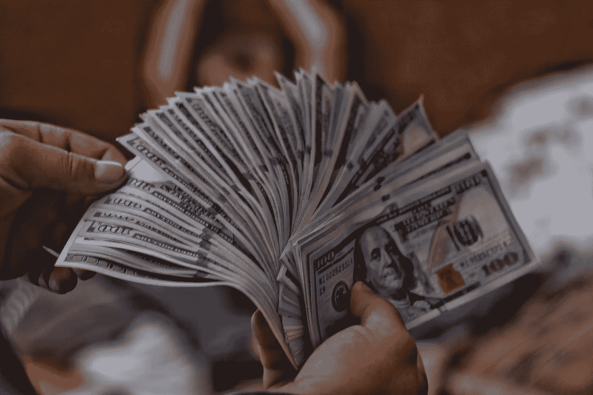

# 如何实现财务独立？

> 原文：<https://medium.com/coinmonks/how-to-achieve-finance-independence-e2b80bee44fb?source=collection_archive---------39----------------------->

Source photo [100 US dollar banknotes photo — Free Grey Image on Unsplash](https://unsplash.com/photos/6WXbPWhT8c8)

财务独立意味着拥有足够的储蓄、投资和被动收入流来支持你的生活方式，而不依赖于传统的就业或政府援助。这可能是一个具有挑战性的目标，但也是一个值得的目标，因为它让你可以自由地按照自己的方式生活，做出符合你的价值观和目标的选择。这里有一些提示可以帮助你实现…