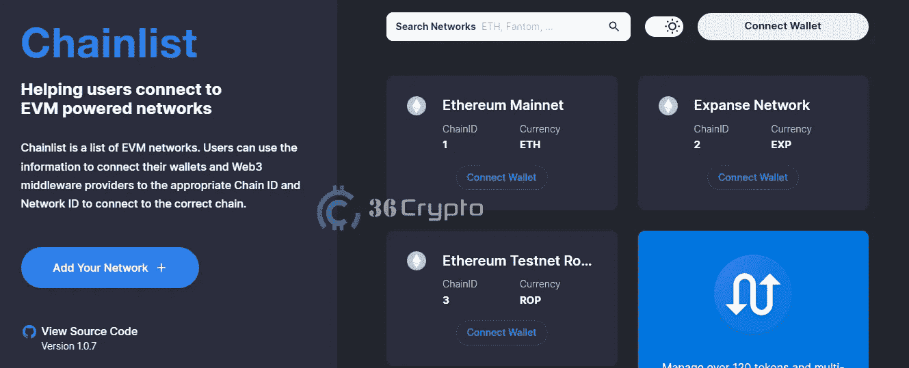
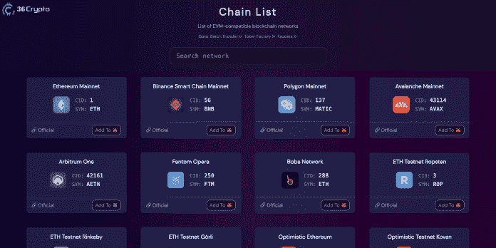
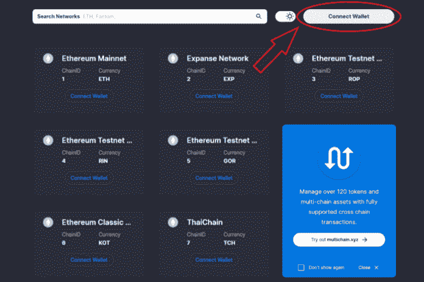
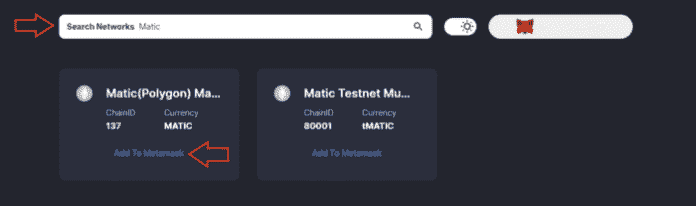
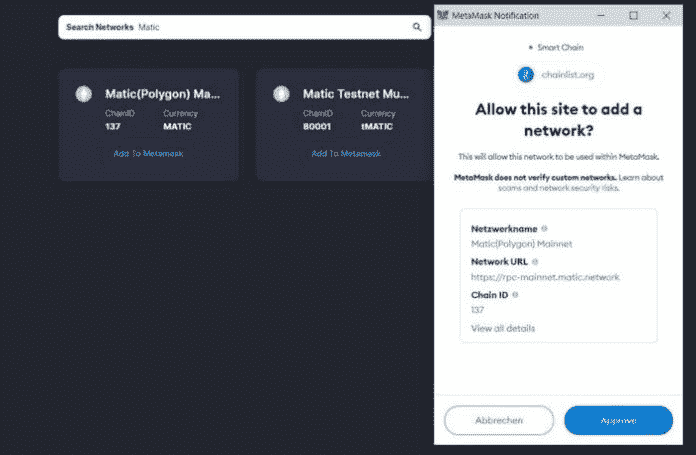

# 如何使用元掩码上的链表添加网络

> 原文：<https://medium.com/coinmonks/how-to-add-a-network-using-chainlist-on-metamask-2c8d2f56a703?source=collection_archive---------6----------------------->

随着许多项目在不同的网络下跨越[加密货币](https://36crypto.com/cryptocurrency/)空间开发，这些网络的具体使用的困难要求人们在进行交易时小心谨慎，以避免特定链的令牌完全通过另一个网络发送的情况。特别需要学习如何使用元掩码上的链表来添加网络。

以太坊区块链是开发具有各种用例的多个链的令牌时最常用的。

为了绕过将这些网络添加到容纳许多网络(如 Metamask)的钱包中的困难，Chainlist 开发了一个平台，使人们能够轻松地在 metamask 上添加网络。

在这篇文章中，36crypto 提供了一个关于如何使用元掩码上的链表来添加网络的详细指南。

# 如何使用元掩码上的链表添加网络

在 metamask 上添加网络所涉及的传统方法需要一个紧张且耗时的过程，由此用户手动输入建立网络所需的各种数据。

随着 [**链表**](https://chainlist.org/) 网站的开发，用户可以在 metamask 上自动添加网络，而无需经过严格的手动方法。该网站在几秒钟内快速跟踪添加到 metamask 的网络链，因此使过程变得无缝简单。

> 交易新手？尝试[加密交易机器人](/coinmonks/crypto-trading-bot-c2ffce8acb2a)或[复制交易](/coinmonks/top-10-crypto-copy-trading-platforms-for-beginners-d0c37c7d698c)

如果您想将网络添加到元掩码中，访问链表是最简单的方法之一。

Chainlist 是一个在线网站，列出了一系列不同的 EVM(以太坊虚拟机)网络。它目前支持 205 个不同链的连接，包括测试网。这让你只需点击几下鼠标，就可以将任何网络添加到你的钱包中。

以下是如何使用元掩码上的链表添加网络的详细方法。

**1。连接钱包。**

打开网站，后台加载完成后，点击桌面或手机右上角的**连接钱包**图标。

**2。搜索网络**

一旦你成功地将你的钱包连接到网站，点击搜索栏并输入你的首选网络，testnet 或 mainnet。选择您想要的特定网络类型(Testnet 或 Mainnet ),并点击每个选项下方的**添加到 METAMSK** 按钮。

**3。批准连接**

将弹出一个通知框，然后点击**批准**按钮，自动在 metamask 上添加网络。

通过这种在元掩码上使用链表的简单方法，现在可以轻松快速地添加不同的网络，而无需手动复制和粘贴链接。这个程序最好的一点就是**免费**和**开源**！

最初出现在 [36crypto](https://36crypto.com/blockchain/how-to-add-a-network-using-chainlist-on-metamask/)