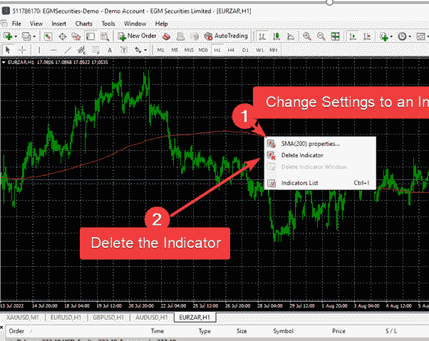

# 如何在 MT4 上添加和调整自定义移动平均线指标

> 原文：<https://medium.com/coinmonks/how-to-add-and-adjust-custom-moving-average-indicators-on-mt4-c3ab5d181b43?source=collection_archive---------9----------------------->

Screenshot by Author

均线指标是交易者分析市场的许多方法之一。

均线是了解市场趋势的简单方法。或者确认市场是否正在整合。

在这篇文章中，我将指导你如何定制指标，并充分利用它们。

具体来说，我们将讨论 SMA 200、SMA100 和 SMA25 的设置。

我会用大量的图片来帮助一个新人想象一切。

# 访问 MT4 帐户

首先，登录你的 MT4 账户。

从文件菜单开始，点击标记为“登录交易账户”的选项。

Screenshot by Author

点击—登录交易账户后，您需要提供如下登录凭证。

Screenshot by Author

提供有效凭据后，系统将登录并打开 MT4 界面。请参见下面的示例

Screenshot by Author

# 添加指标的逐步过程- SMA

添加移动平均线从单击插入菜单开始。

插入菜单是第三个(第一个是文件，第二个是编辑)

Screenshot by Author

点击插入菜单后，点击第一个选项—指示器。

指示器将打开另一个子菜单，点击最后一个标记为“自定义”的选项。

自定义将打开另一个带有指示器列表的子菜单。在此，选择自定义移动平均线。

一旦你点击自定义移动平均线，你会得到一个新的窗口，如下所示。

Screenshot by Author

上面的窗口将帮助你定制你的 SMA。

第一，你可以改变期限——从默认的 13 年到你想要的特定期限。

你可以把颜色调整到最吸引你的颜色。

此外，您可以根据自己的喜好改变指示器的宽度——MT4 允许您有 5 个可选选项。

# 自定义指示器首选项

要更改周期，您可以双击并更改周期记录下的数字，以及值列下的数字。

在下面的情况下，首选使用周期 200 (SMA200)

Screenshot by Author

当然，设置完值后，您还可以点击保存按钮。

提示:以上同样适用于 SMA100 和 SMA25。你如上输入数字。然后，总是点击保存。

另一个提示:您可以通过右键单击特定 SMA 的行来更改设置，并根据您的喜好更改设置。您也可以通过点击相关选项来删除指标。

Screenshot by Author

# 调整 SMA 指示器的颜色、宽度和线型

您可以通过点击指示器的颜色设置来调整颜色。

Screenshot by Author

默认情况下，您有多达 144 种颜色选择。

但是，您可以通过选择“自定义”选项卡来进一步自定义颜色，并且您可以使用 RGD 或十六进制代码选项中的任意多的选项来调整颜色。

Screenshot by Author

提示:一旦你选择了你所选择的颜色，点击确定接受。或者，单击重置按钮切换到默认设置。

# 更改指示器宽度

要更改指示器宽度，请使用宽度选项。单击下拉菜单显示所有 5 个选项。单击您的选择，并通过单击确定按钮进行确认。

Screenshot by Author

更改指示器样式

要更改指示器样式，请使用如下所示的样式选项卡。

Screenshot by Author

设置完成后，单击“确定”按钮确认更改，或单击“重置”按钮切换回之前的选择。

正如你所看到的，3 SMA 在图表上非常清晰。

Screenshot by Author

从分析的角度来看，根据 SMA 25，价格呈上升趋势。

然而，一个更重要的外观是 SMA 25 和 SMA 100 在 SMA 200 上的黄金交叉

# 结论

给你。

定制均线是你进行市场分析的可靠方法。

和其他一些指标一起工作，你就增加了捕捉成功信号的机会，来帮助验证你的交易策略。

> 交易新手？试试[加密交易机器人](/coinmonks/crypto-trading-bot-c2ffce8acb2a)或者[复制交易](/coinmonks/top-10-crypto-copy-trading-platforms-for-beginners-d0c37c7d698c)