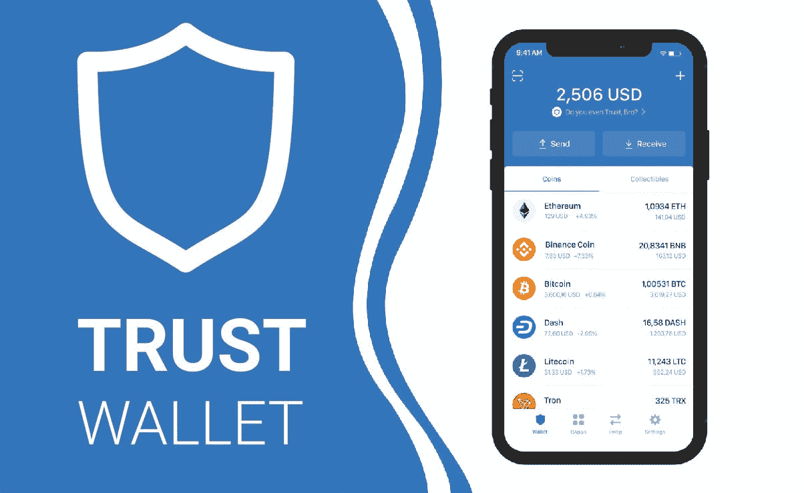
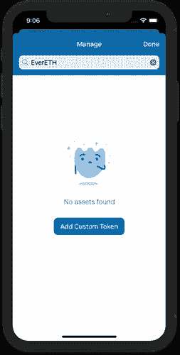
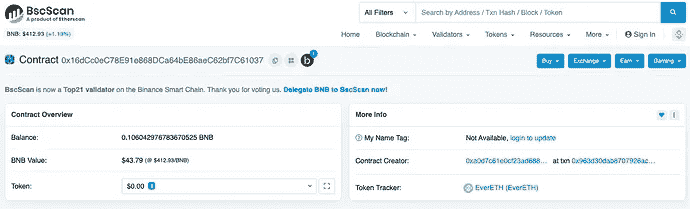
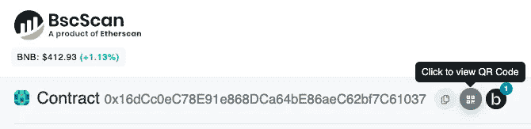
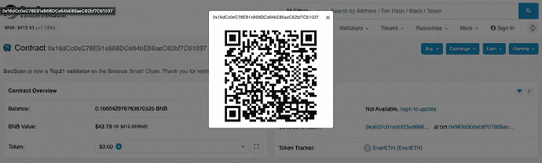
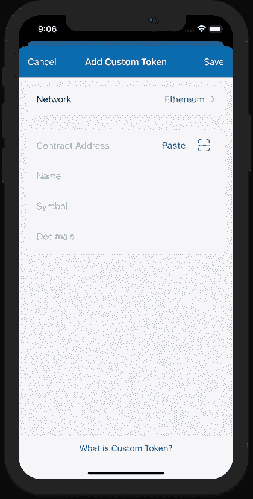
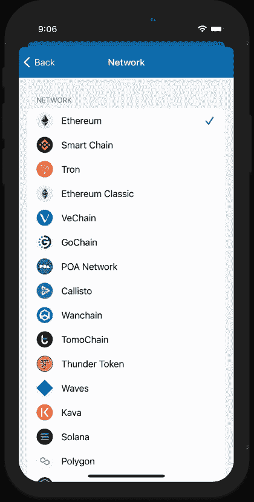
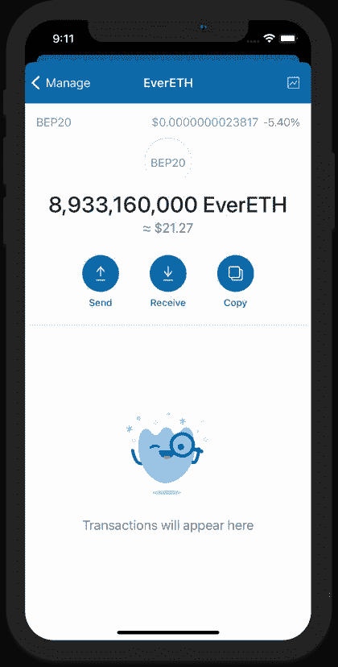

# 如何在信任钱包中添加带有合同地址的硬币

> 原文：<https://medium.com/coinmonks/how-to-add-coins-with-contract-addresses-in-trust-wallet-50b650d3ce5d?source=collection_archive---------28----------------------->

Trust Wallet 支持多个区块链，在这些地方发行令牌。一些例子是以太坊网络上的 ERC20，币安智能链上的 BEP20，以及索拉纳区块链上的 SPL 代币。

以下步骤仅适用于在应用程序支持的区块链上发送的令牌。交易也应该在区块链浏览器上确认。没有确认交易，你的钱包没有收到代币。你可以参考这份指南了解更多信息。

当令牌已成功发送到 wallet 但未出现时，可以手动将其添加为自定义令牌。对于本指南，我们将尝试添加一个位于币安智能链上的 BEP20 令牌。

# 第一步。搜索令牌

点击钱包主屏幕右上角的切换标志。搜索令牌，如果令牌不可用，您将看到“ **No Asset Found** ”消息和 **Add Custom Token** 按钮。

# 第二步。获取令牌信息

使用 BSCScan 28.5k，搜索要添加的令牌。你需要找到**合同地址**。

**示例:**
Ever ETH Token:Address/0x 16 DCC 0 EC 78 e 91 e 868 DCA 64 be 86 AEC 62 BF 7c 61037

如果有别的设备，尽量获取令牌合同地址的二维码。这将是向您的钱包添加令牌的最简单方法。那里会有一个按钮，你可以点击显示二维码。这可以用于下一步。

# 第三步。填写令牌详细信息

点击添加自定义令牌按钮，然后确保您选择了正确的网络。对于本指南，我们需要选择受支持网络上的智能链，因为这是驻留在币安智能链上的令牌。

使用您的二维码扫描仪轻松获取所有代币详情。
为此，点击“**粘贴**”旁边的“**扫描仪**”图标。

粘贴或扫描合同地址后，其他细节如**名称**、**符号、**和**小数**将自动填写。如果没有，请手动填写。点击**保存**继续。

> ***重要！***
> 
> 请确保信息正确无误。如果没有正确填写，应用程序将显示不正确的余额。

# 第四步。令牌已成功添加

您已成功添加自定义令牌。如果令牌尚未在 CoinMarketCap 上列出，价格信息将不会显示。

# 第五步。请求更新令牌信息

您可以请求将令牌信息添加到代码库中。

点击这里关注我们的更多故事[。](http://t.me/etellworld)

> 交易新手？试试[加密交易机器人](/coinmonks/crypto-trading-bot-c2ffce8acb2a)或者[复制交易](/coinmonks/top-10-crypto-copy-trading-platforms-for-beginners-d0c37c7d698c)