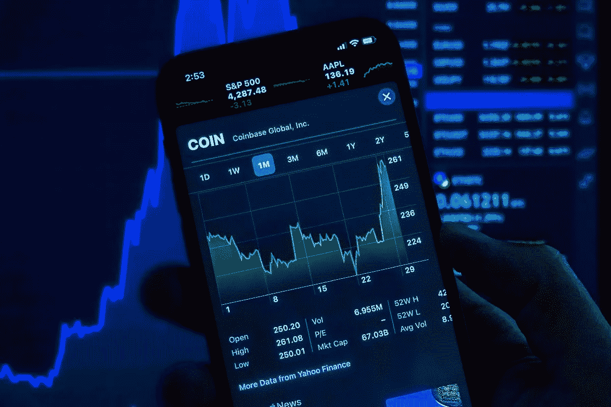

# 我分析一个 10 倍的潜在加密项目|发现我的过程&开始做你自己的研究！

> 原文：<https://medium.com/coinmonks/how-to-analyze-a-10x-potential-crypto-project-criteria-to-analyze-fc4a7b092d34?source=collection_archive---------27----------------------->

每个投资者都梦想找到下一个爆炸 x10 的加密项目，但这远比说起来容易！要么你跟着金·卡戴珊·雷科，要么你开始投入时间分析项目。

在本文中，我们将回顾在考虑投资早期加密项目之前需要分析的四个基本标准。

声明:这绝不是财务建议，所以请学会如何自己做调查，不要依赖他人。

让我们从对 [Ternoa](https://www.ternoa.com/) 的评价开始吧，这是一个我从开始就一直关注的法国项目。

Ternoa |The Blockchain of augmented NFT’s

# 1.分析商业环境

*   **创始人** 我们知道创始人是谁吗？他们以前有显著的创业经验吗？他们有多少人？分析创始团队对于考虑早期加密项目的严肃性至关重要。由 Clément Tequi & Mickael Canu 领导的 Ternoa 拥有一支由来自不同背景的创始人组成的强大团队。 [*米卡埃尔·卡努*](https://www.linkedin.com/in/netick/) *被誉为 Web3 行业法国最优秀的工程师之一，得到了* [*欧文·西蒙尼*](https://www.linkedin.com/in/owensimonin/) *等生态系统领袖的支持。*
*   团队团队是项目的核心，肩负着实现创始人愿景的使命。让我们看看谁在构建&扩展产品。
    *Ternoa 迅速成长，建立了一支由 45 名以上国际人才组成的远程团队，包括游戏设计师、软件工程师、产品负责人、社区经理……*
*   **投资方&合伙人**
    谁是投资方&合伙人？他们关注 web3 吗？他们是否参与并为团队提供额外的经验和/或网络？
    *Ternoa 背后有 Master Ventures、道创客、水滴资本、方舟流资本、资本、晨星创投、SevenX、GD10 ventures、MRBeast、、Gate.io 等，他们拥有强大的顾问合伙人网络&。包括 Polygon，埃尔隆德，Kyve，AscendEX，Just Mining，Gate.io，Phala。*
*   **路线图** 每个项目，尤其是 web3，都要定义一个清晰的、最新的路线图。确保检查什么是按计划进行的，以及它是否听起来与你的现实相关(成就、产品开发、筹款……)
    *Ternoa 路线图是清晰的、最新的。在他们的* [*网站*](https://www.ternoa.com/) 上很容易找到

# 2.分析商业模式

*   **用例与效用** 区块链技术可以改善许多行业中重要的服务。在定义 10 倍潜在加密项目时，评估项目的效用和真实用例非常重要。Ternoa 背后的团队表示，该平台的服务可以“通过为其添加独特的实用程序和操作，带来 NFTs 的未来。”通过 Ternoa 的区块链，这是可能的，允许分散数据加密、长期存储、增强内容和 VR 房间访问授权的无限用例。
*   **用户采纳** 用户采纳是新用户适应某个产品或服务并决定继续使用它的过程。用户只采用有助于他们实现目标的产品&如果 UX 是体面的！
    *Ternoa 拥有一个快速增长的 NFT 生态系统，包括艺术、音乐、体育、游戏、元宇宙和 Web3 应用。它包括用户如* [*跨时代*](https://www.crosstheages.com/) *(最有前途的法国 P2E 游戏之一)或* [*元斗*](https://www.metafight.com/) *(全球首款斗&赚交易卡游戏)。*
*   **令牌组学** 加密项目的成功很大一部分可以归功于其令牌组学，令牌组学决定了加密经济的两件事:
    -规定如何分发令牌的激励措施
    -影响其需求
    *上限的令牌的效用是特诺瓦区块链令牌。在特尔诺阿区块链进行的交易以大写形式进行。随着时间的推移，它尤其用于创建 NFTs、加密和存储数据。在创始人团队、投资者、合作伙伴、赌注回报等之间，代币分配似乎是公平的。完整的记号组学可在* [*Ternoa 记号组学*](https://www.ternoa.com/token) 上获得
*   **竞争对手** 随着事情发展得越来越快，在区块链蓬勃发展的市场中发现潜在的竞争对手总是一个好主意。
    *虽然 Ternoa development&提供了一个快速、安全和分散的网络，但挑战将是在繁荣的 NFT & P2E 市场吸引足够的建筑商&用户，那里已经存在不同的网络。*

# 3.分析技术

该技术是开源的吗？是否有良好的文档记录？我们能很容易地找到并咨询一个 GitHub 吗？有开发者专用空间吗？
即使你不能理解所有的技术特性，理解基础知识并了解开发者的世界也是必不可少的

*   **创新** 解决方案创新吗？区块链是一个发展非常迅速的环境，创新是关键！
    *Ternoa 是一个基于 Substrate 的专注于 NFT 的链，旨在为 NFT 驱动的 dApps 的开发者和用户提供最佳体验。*
*   **开源代码** 开源软件是设计成可供公众访问的代码。
    *Ternoa 代码开源&所有信息完全透明，可在*[*https://docs . Ternoa . network/*](https://docs.ternoa.network/)上获取
*   **技术|智能合约&/或令牌审计** 如今智能合约部署最迫切的问题之一就是安全性。智能合约审计服务提供对适用于每个智能合约的
    *Ternoa 令牌 cap 认证的已知漏洞的检查。* [*审计-认证-区块链*](https://www.certik.com/)

# 4.分析营销和沟通策略

*   社交媒体和社区社交媒体彻底改变了人们在线交流的方式，并引入了许多新功能来改善用户体验。到今天为止，这个新的营销时代还没有特别的手册，Web 3 营销是关于与社区建立有意义的关系。
    *Ternoa 是法国最大的区块链社区之一，在 Twitter 上有 13 万多名粉丝，在 Discord 上有一个非常活跃的&支持社区。他们每天通过多种渠道(Twitter、Youtube、Discord、Telegram……)与其社区互动*
*   **线上线下知名度** 品牌是否涉及不同的线上&线下事件？他们赞助世界性的活动吗？他们正在举行会议吗？
    *Ternoa 正在赞助&在多个全球活动中举办会议，例如 NFT、纽约市、PBWS、NFT 比亚里茨等等！他们是法国生态系统的主要参与者和领导者。*

现在你已经有了分析早期加密项目的方法，让我们开始吧！请随意分享一些你支持的项目。

*罗宾*

*来源*:

 [## Ternoa *首个以 NFT 为中心的区块链。

### 分散式开源第 1 层，它提供了一个技术堆栈来构建安全且可扩展的实用 NFTs。真的…

www.ternoa.com](https://www.ternoa.com/)  [## 开发和测量用户采用| Mixpanel 博客

### 用户采用，有时称为入职，是新用户适应产品或服务的过程…

mixpanel.com](https://mixpanel.com/blog/how-to-develop-and-measure-a-user-adoption-strategy/)  [## 什么是令牌组学，为什么它很重要？

### 罗伯特·史蒂文斯是一名自由记者，他的作品曾出现在《卫报》、《美联社》、《纽约》…

www.coindesk.com](https://www.coindesk.com/learn/what-is-tokenomics-and-why-is-it-important/)  [## 什么是智能合同安全审计？初学者指南

### 阅读本指南，了解智能合同安全审计的重要性以及如何实施。

cointelegraph.com](https://cointelegraph.com/blockchain-for-beginners/what-is-a-smart-contract-security-audit-a-beginners-guide) 

> 交易新手？试试[密码交易机器人](/coinmonks/crypto-trading-bot-c2ffce8acb2a)或[复制交易](/coinmonks/top-10-crypto-copy-trading-platforms-for-beginners-d0c37c7d698c)