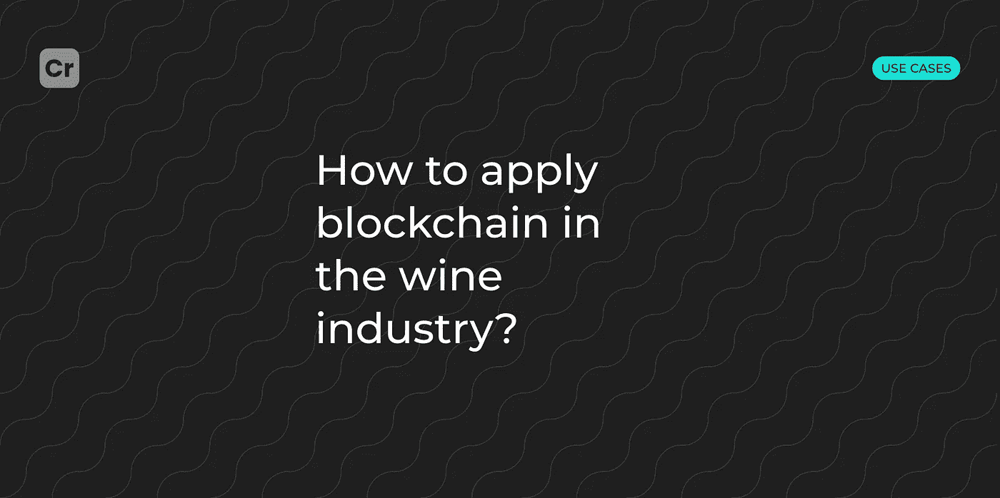

# 如何在葡萄酒行业应用区块链？

> 原文：<https://medium.com/coinmonks/how-to-apply-blockchain-in-the-wine-industry-ad38e58b20f?source=collection_archive---------9----------------------->

你是在葡萄酒行业，想跳进一个有前途的行业让你的生意更上一层楼吗？继续阅读，了解更多信息

葡萄酒仍然是表现最好的另类投资之一，其涨幅经常超过资源和古典艺术品的价格涨幅。

从葡萄园的机械化到更环保的包装选择和营销方式，葡萄酒行业正慢慢接受过去十年带来的诸多变化。新技术使该行业能够以全新的方式应对最新趋势，甚至克服所有出现的挑战。

# 你为什么要在乎？

作为葡萄酒行业，我们已经到了需要认识到技术正在改变葡萄酒生产、销售和消费方式的时候了。

大大小小的葡萄种植者对维护自己的品牌负有最大的责任，但他们对供应链的控制也最少。

一个基于工艺、质量和出处的品牌和声誉是多年积累起来的，而且非常昂贵。骗子造成了巨大的危险，并可以用劣质假货来降低声誉。

有了这些问题可以帮助区块链的使用。

# 怎样才能打击假酒？

伪造证书的容易程度是证明葡萄酒原产地的最大弱点。骗子已经学会非常准确地伪造任何纸质证书。

传统保护系统的另一个弱点是需要购买者自己检查证书和瓶子的一致性。

在区块链的帮助下，一些制造商找到了解决这个问题的方法。可以创建一个服务，允许双击一个按钮来验证瓶子的真实性。最重要的是，存储所有交易和瓶子信息的分布式注册表是不可能伪造的。

# 系统里的数据被篡改了怎么办？

区块链可以解决数据篡改问题，提供可靠透明的葡萄酒供应链跟踪系统。与葡萄酒生产和销售相关的每个实体都被记录为链中的一个块，并对所有相关参与者可见。如果链中的任何实体试图篡改链，所有相关的参与者都会意识到这种篡改。这要归功于与每个区块链实体同步的通用分类账系统。添加的每个数据块都由其他实体验证，并在他们的分类帐中同步。区块链数据验证的透明性使系统变得健壮。只有在交易由最大数量的相关实体验证的情况下，对分类账的任何更改才会得到批准。

通过这种方式，买家和收藏家可以了解葡萄酒的历史。他们可以获得关于葡萄、葡萄种植者、葡萄园、酿酒厂、酒窖、包装商、批发商、分销商甚至零售店的信息。

# 我们如何标记所有这些实体？

射频识别(RFID)、快速响应码(QR)、电子产品码(EPC)等。也可以用来给酒贴标签。给葡萄分配一个独特的标识有助于确定确切的来源。与特定葡萄园生产的一批葡萄相关联的条形码接收到一个秘密条形码，然后被上传到通用区块链总账。所有进一步的葡萄活动都被记录并保存在区块链中。

# 它将如何工作？

## **1 名酿酒师**

这是销售链的最初环节，因为葡萄酒生产始于葡萄园。专业种植和收获葡萄的人被称为葡萄种植者。他们照料植物并控制生长参数(湿度、酸度和土壤紧实度、温度等)。)，以及负责保护免受杂草和昆虫的侵害。

## **2 名酿酒师**

这些是参与葡萄酒生产的人和公司。为确保可追溯性，此类实体必须向区块链添加数据:

供应商、葡萄品种的数据；收到原材料的日期；获得的原材料的状况和质量的描述；关于交货条件的数据。

桃红葡萄酒生产过程中的内部程序记录，如倾析、发酵、保存和通风。

关于温度、化学成分和添加剂的信息。

关于储存条件和生产装瓶的数据。

关于酵母及其用途的信息。

没有必要在系统中对葡萄酒的生产过程进行详细描述，因为这可能会侵犯商业秘密——精英葡萄酒的生产者会对生产的一些要素保密(这不仅是葡萄酒行业的典型情况)。

## **3 家批发经销商**

这些人或组织负责从酿酒商那里接收葡萄酒，混合，并将成品送到中转酒窖或包装厂。批发分销商为区块链做出了贡献:

接收日期、运输数据和储存条件。

关于加工、取样、散装葡萄酒分析和装运日期的信息。

如果执行了混合过程，这也会记录在区块链中。

## **4 号中转地窖**

他们负责接收、储存、运输、加工、取样和分析散装葡萄酒。本质上，转运地窖的作用类似于批发分销商的作用，不同之处在于物流链中的小细节。因此，在此阶段需要输入到区块链中的数据与上一节中描述的相同。

## **5 灌装机/包装机**

从批发经销商或中转酒窖接收葡萄酒，将其倒入桶、小桶、瓶子或袋子中。在这一阶段，进行产品识别和贴标签。为了正确使用区块链，确保不同市场参与者之间此类标签的一致性非常重要。这适用于两种类型的数据:

1.  与产品和生产直接相关:验收、储存、加工、取样、分析、灌装、包装和成品装运。
2.  关于防伪的信息:纸张的类型，激光压花，热和冷箔冲压，热敏油墨，全息图，烫印，等等。

补救数据非常重要，因为消费者还可以访问区块链(通过应用程序和二维码)。人们应该能够将商店里的一瓶酒与工厂里生产的酒相匹配。更好的是，如果你能在此时此地验证单个产品。例如，用手机中的扫描仪检查全息图的真实性，或者找出供应链中是否有特定的商店、地区或国家。

## **6 成品分配器**

装满葡萄酒的包装被送到成品零售商或经销商处。后者负责储存和运输包装好的成品到零售点，以及管理库存。为了做到这一点，产品通常是重新包装和重新标签大批量。

## **区块链应该体现什么:**

*   接收日期、储存条件和装运日期；
*   关于重新包装和重新贴标签的信息；
*   关于货物目的地的信息。

## **7 零售**

零售商从成品分销商或批发商处接收瓶装、罐装、桶装和纸箱装的成品，并将其销售给最终消费者。零售商负责将收到、储存和在线销售的商品过账。必须记录销售情况，以便不能重复使用相同的识别标签。

# 还有哪些优点？

## **1。增加透明度**

对于许多新兴品牌来说，区块链的价值在于能够以可验证且安全的方式分享客户最想知道的信息。他们希望凝聚所有人和地方的共识，让一瓶酒独一无二。

## **2。顶级行业标准**

制定了质量保证计划后，专家组将评估收成、质量并确认葡萄酒原产地，以确保葡萄酒符合最高行业标准。他们旨在增加对格鲁吉亚葡萄酒的信任。在区块链注册葡萄酒可以改善生产商的防伪系统，这将减少市场上的假冒行为，提高品牌价值。

## **3。自动化**

新技术可以实现合规、认证和支付的自动化，以保护传统品牌的声誉，并向新进入者开放全球市场。这值得举杯庆祝。

## **4。创新和新葡萄酒体验**

游戏化将通过新的葡萄酒促进创新。

## **5。市场营销的挑战和机遇**

该行业面临的最大挑战是，吸引与过去见过 NFT 魅力的大多数买家截然不同的买家。它的目标受众不是年轻的、精通技术的、投机的数码影像购买者；传统酿酒厂的老板们常常迟迟不采用数字解决方案来解决他们的问题。

# 使用示例:

1.  2021 年 11 月，标志性的澳大利亚酿酒厂奔富(Penfolds)以 12 秒 13 万美元的价格向 NFT 出售了一桶 Magill Cellar 3 Cabernet Shiraz 2021。10 个小时。
2.  BitWine 与侍酒师 Loren Weil 合作，开发了 1000 种数字葡萄酒，灵感来自真正的葡萄酒。它们中的每一个都是独一无二的艺术品。如果脸书创始人马克·扎克伯格是对的，很快我们都将生活在一个超世界，为什么不拥有一个装满虚拟葡萄酒的地窖，当朋友来访时向他们炫耀呢？BitWine 出售来自不同产区的 50 种 NFT 葡萄酒，甚至有一批价值 30 万美元的葡萄酒。
3.  类似的项目 Winechain 将由亚马逊前欧盟零售副总裁 Xavier Garambois 在 2022 年底推出。“我们的目标是在知名酒庄和高要求消费者之间建立一种动态的互动关系。买家将有机会接触到具有真实性保证的稀有葡萄酒——葡萄酒将被储存在葡萄酒链的酒窖中，直到它们被运走。如果收藏者愿意，他们可以出售 NFTs 葡萄酒。
4.  成立于 2007 年的 Cult Wines 平台也帮助葡萄酒厂象征他们的葡萄酒。例如，2021 年 7 月，他们以 10 万美元 NFT 的价格出售了一批 2020 年份的安杰露酒庄葡萄酒，还附带了数字艺术品、品酒会、晚宴和收获会的邀请函。
5.  同时，你好，Fam！与以色列酿酒厂 Jezreel Valley 合作，这是他们的 Genesis Vintage 2021 葡萄酒，只能通过区块链购买，它还带有数字艺术。葡萄酒将无限期储存在有保险的温控室内。在任何时候，投资者将能够赎回他们的代币，并收到瓶子。

# 结果

使用区块链技术的葡萄酒物流将确保安全性并消除假冒风险。区块链记录不能更改，这允许物流过程的自动化。

你想在你的葡萄酒生意中使用区块链吗？ [**联系我们**](https://t.me/crypton_studio_bot) **，我们将为您的项目开发任何区块链解决方案！**

> 交易新手？试试[加密交易机器人](/coinmonks/crypto-trading-bot-c2ffce8acb2a)或者[复制交易](/coinmonks/top-10-crypto-copy-trading-platforms-for-beginners-d0c37c7d698c)