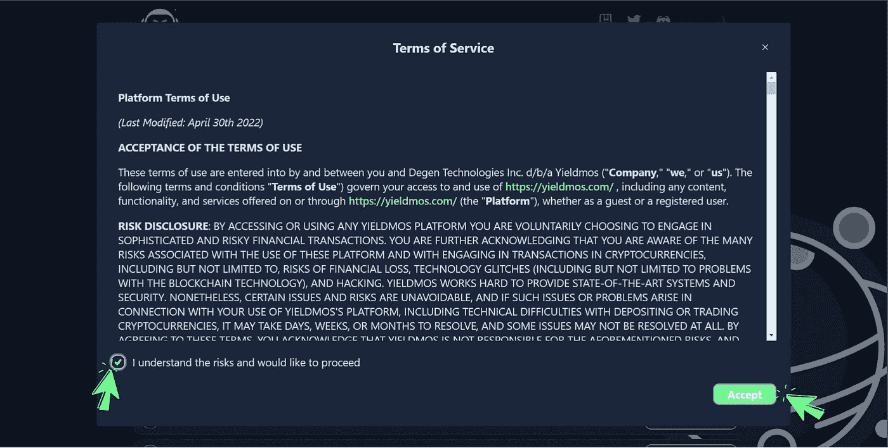

# 如何使用 Yieldmos 自动合成宇宙生态系统令牌

> 原文：<https://medium.com/coinmonks/how-to-auto-compound-cosmos-ecosystem-tokens-using-yieldmos-1debeba9bf29?source=collection_archive---------11----------------------->

## 自动复合指南

## [自动复合您的 POS 奖励](https://yieldmos.com)

Auto-compound crypto tokens for high APY

这是一个简单的指南，告诉你如何[自动复合](https://yieldmos.com)你的代币，并享受高 APY 与你的非保管钱包。

# Yieldmos 是什么？

Yieldmos- Auto compounding

*   [Yieldmos](https://yieldmos.com) 允许你通过自动复利来增加收益。该协议通过在单个平台中识别、组合和打包各种可能性，在整个宇宙生态系统中产生收益。
*   Yieldmos 计划在宇宙生态系统内外提供全方位的选择。同样，我们希望在整个风险范围内部署收益产品，允许客户简单地混合和组合收益可能性，以实现他们选择的风险敞口。
*   Yieldmos 提供非托管解决方案，这意味着您可以完全控制您的资产，同时将它们投入使用。

## 非常感谢你的支持。

> [***https://www.yieldmos.com/v/smartnodes***](https://www.yieldmos.com/v/smartnodes)

# 为什么是 Yieldmos 及其优势？

## 非监禁解决方案

非托管选项使您能够完全控制您的资产，同时消除与托管做法相关的威胁。

[**Yieldmos**](https://yieldmos.com) 从不占有你的资金，只能执行你的指令。

## 怎么会？

[**Yieldmos**](https://yieldmos.com) 使用 authz grants，一个 Cosmos SDK 消息授权模块，代表你做非托管活动。

# 为什么重要？

## 风险减至最小限度

如果你把你的财产交给某人保管，你不能保证他们只会做你想让他们做的事。黑客，盗窃，还有坏演员？所有这些都是与保管解决方案相关的实际问题。

当您选择像 [**Yieldmos**](https://yieldmos.com) 这样的非托管解决方案时，您将始终保持对您资产的控制权。

**Yieldmos 的**非托管解决方案降低了托管风险——毕竟，这不是你的钥匙，也不是你的加密货币。

## 透明度

与闭源保管品不同， [**Yieldmos**](https://yieldmos.com) 总是公开收益的来源。

您必须**授权**以您的名义进行的每项活动，同时使用非监禁替代方式。不认可的话，不发生在 [**Yieldmos**](https://yieldmos.com) 身上。

[Smartnodes-Youtube](https://www.youtube.com/channel/UCWE4DmXbutLlUuMJx3-NhCw)

# 如何为重新启动或自动复合设置 Yieldmos

您必须设置一次**自动复合**，它将在接下来的 90 天内自动发生。遵循下面给出的步骤。

**第 1 步** -转到[https://yieldmos.com](https://yieldmos.com)并点击**启动应用**。

Yieldmos- Auto compounding

**步骤 2-** 点击**连接钱包**，勾选勾号，接受**服务条款。**

Yieldmos- Auto compounding

**第 3 步** -连接好钱包后，滚动浏览给出的**链列表**。选择您要为**重启**设置的链条。

Yieldmos- Auto compounding

**步骤 4** -选择链条后，点击**选择策略**。

Yieldmos- Auto compounding

**第 5 步-** 阅读有关战略和会议持续时间(固定为 90 天)的详细信息，然后**点击下一步**。

Yieldmos- Auto compounding

**第 6 步-** 如果您已经锁定，它将显示在“**现有委托**”下，但正如您所见，我们没有锁定任何 Atom 令牌。以木桩搜索验证器中的“**新委托”部分。**

Yieldmos- Auto compounding

**第 7 步** -输入您想要**委托**的代币数量，然后点击**下一步**。

Yieldmos- Auto compounding

**第 8 步** -点击**使用精细分配**，为**自动复合**定义您的奖励比例。

Yieldmos- Auto compounding

**第 9 步-** 我们选择了**10–90%策略**，通过这样做，90%的**赌注奖励**将**自动复合**返回给验证器( [Smartnodes](https://smartnodes.family) )，其余将留在钱包中。

Yieldmos- Auto compounding

**第 10 步** -我们已经创建了我们的定制策略，它将在接下来的 90 天内每天自动合成 Atom。点击**确认**保存策略。

Yieldmos- Auto compounding

**步骤 11** -批准 keplr 中的**授权请求**。通过授予该权限，用户只允许 [**Yieldmos**](https://yieldmos.com) 代表他们委托奖励。它不会给你钱包的监护权。

Yieldmos- Auto compounding

**第 12 步**——恭喜你，你已经为你的宇宙生态系统代币设置了**自动合成**。您将在主页面中看到**活动策略**。(**预计 APY、获得的奖励、授权金额和您的策略到期日)**

https://yieldmos.com

# 关于智能节点

Smartnodes Validator 提供利益相关证明服务。您的资产受到我们 100%的斜线和双标志退款保护。

1.  我们完全融入了宇宙，并乐于尽我们所能帮助他人。社区是我们前进的动力。由 [Smartnodes validator](https://smartnodes.family/) 对想法进行主动投票，以确保有效的治理。
2.  只有最好的基础设施中最好的才被 Smartnodes 所采用，并且有 10 层保护来保护您的投资。
3.  查看我们的网站，了解更多关于我们的验证器节点的信息。我们目前在 33 个加密货币链上提供利益证明服务(POS ),并且还在增加。
4.  如果您有任何其他疑问，请随时通过我们的社交媒体平台或电子邮件(hello@smartnodes.one)与我们联系。

https://smartnodes.family

# 在社交媒体上关注我们

[Reddit](https://www.reddit.com/r/smart_nodes/)|[Twitter](https://twitter.com/nodes_smart)|[网站](https://smartnodes.family/) | [电报](https://t.me/smartnodesvalidators) | [Instagram](https://www.instagram.com/smartnodes_validator/?igshid=YmMyMTA2M2Y%3D) | [不和](https://discord.com/invite/TA3UVPwn6D)

# **参加赢取我们的每周彩票头奖。**

# **每周日公布获奖者。**

## **立即玩—** [Smartnodes 彩票](https://lotto.smartnodes.family/)

> 交易新手？试试[加密交易机器人](/coinmonks/crypto-trading-bot-c2ffce8acb2a)或者[复制交易](/coinmonks/top-10-crypto-copy-trading-platforms-for-beginners-d0c37c7d698c)