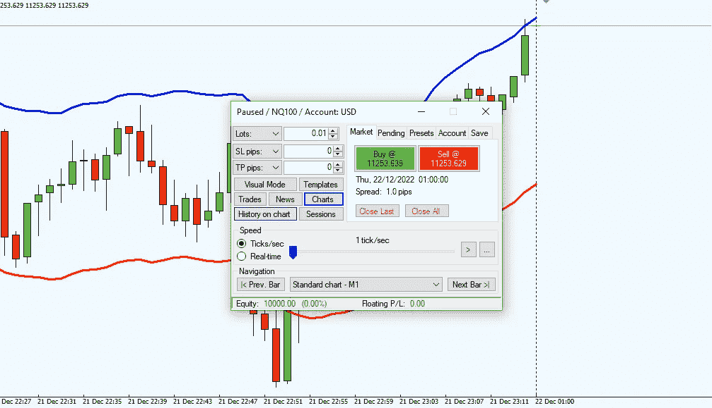

# 如何在 2023 年对交易策略进行回溯测试

> 原文：<https://medium.com/coinmonks/how-to-backtest-a-trading-strategy-in-2023-ad196df39578?source=collection_archive---------61----------------------->

回溯测试交易中的策略是指通过模拟历史数据来评估[交易策略](https://www.nasdaqstrategy.com/)的性能的过程。这是发展任何交易策略的重要一步，因为它帮助交易者评估他们的策略在不同市场条件下的可行性和有效性。

[回测策略的一个主要好处是，它允许交易者在市场上拿真金白银冒险之前，发现他们策略的潜在陷阱和弱点。通过对历史数据进行策略模拟，交易者可以了解他们的策略在过去的表现，并做出必要的调整以改善其表现。](https://www.nasdaqstrategy.com/2022/12/top-metatrader-backtesting-software-in.html)

> 交易新手？在[最佳加密交易](/coinmonks/crypto-exchange-dd2f9d6f3769)上尝试[加密交易机器人](/coinmonks/crypto-trading-bot-c2ffce8acb2a)或[复制交易](/coinmonks/top-10-crypto-copy-trading-platforms-for-beginners-d0c37c7d698c)

回溯测试的另一个好处是，它可以让交易者对他们的策略有信心。通过查看他们的策略在大型数据集上的表现，交易者可以更好地了解与他们的[策略](https://www.nasdaqstrategy.com/)相关的风险和回报，并对他们的交易执行做出明智的决定。

然而，需要注意的是，回溯测试策略有其局限性。一个主要的限制是，历史数据可能无法准确反映未来的市场状况。因此，交易者需要谨慎，不要盲目相信后验测试的结果，并确保结合其他形式的分析，如远期测试和纸上交易，以验证他们的策略的表现。

在这篇文章中，我们将深入探讨交易中回溯测试策略的各个步骤，并讨论交易者在回溯测试策略时需要记住的一些关键因素。

回溯测试策略的步骤

[确定交易策略](https://www.nasdaqstrategy.com/)

回溯测试策略的第一步是确定你想要测试的交易策略。这可能是趋势跟踪策略，均值回归策略，或任何其他你认为有潜力在市场上产生利润的交易策略。

在开始回溯测试之前，对策略的基本逻辑和规则有一个清晰的理解是很重要的。这将使您能够根据历史数据准确地模拟策略，并准确地衡量其性能。

选择历史数据

回溯测试过程的下一步是选择将用于测试策略的历史数据。历史数据应该代表你期望你的策略在市场中的表现。

例如，如果你正在测试一个趋势跟踪策略，你应该使用历史数据，包括各种趋势和范围内的市场条件。另一方面，如果你在测试均值回归策略，你应该使用历史数据，包括高波动期和低波动期。

当[对策略](https://www.nasdaqstrategy.com/2022/12/top-metatrader-backtesting-software-in.html)进行回溯测试时，使用大型数据集以确保结果具有统计显著性是至关重要的。较小的数据集可能无法提供策略性能的准确表示，并且结果可能不可靠。

设置参数

[回溯测试](https://www.nasdaqstrategy.com/2022/12/top-metatrader-backtesting-software-in.html)过程的下一步是设置策略的参数。这包括定义进入和退出规则，以及您的策略可能具有的任何其他规则或约束。

例如，如果你正在测试一个趋势跟踪策略，你可以把你的进场规则定义为当价格突破某个阻力位时买入，当价格突破某个支撑位时卖出。

仔细考虑你的策略的参数并确保它们是现实的和定义明确的是非常重要的。这将使您能够根据历史数据准确地[模拟策略](https://www.nasdaqstrategy.com/2022/12/top-metatrader-backtesting-software-in.html)，并准确地衡量其绩效。

运行模拟

一旦您确定了策略并设置了参数，下一步就是根据历史数据运行模拟。有几种工具和软件可以帮助你

> 加入 Coinmonks [电报频道](https://t.me/coincodecap)和 [Youtube 频道](https://www.youtube.com/c/coinmonks/videos)了解加密交易和投资

# 另外，阅读

*   [瓦济里克斯 NFT 评论](https://coincodecap.com/wazirx-nft-review) | [比茨盖普 vs 皮奥克斯](https://coincodecap.com/bitsgap-vs-pionex) | [坦吉姆评论](https://coincodecap.com/tangem-wallet-review)
*   [如何使用 Solidity 在以太坊上创建 DApp？](https://coincodecap.com/create-a-dapp-on-ethereum-using-solidity)
*   [加密交易机器人](/coinmonks/crypto-trading-bot-c2ffce8acb2a) | [OKEx vs 币安](https://coincodecap.com/okex-vs-binance)
*   [币安 vs FTX](https://coincodecap.com/binance-vs-ftx) | [最佳(SOL)索拉纳钱包](https://coincodecap.com/solana-wallets)