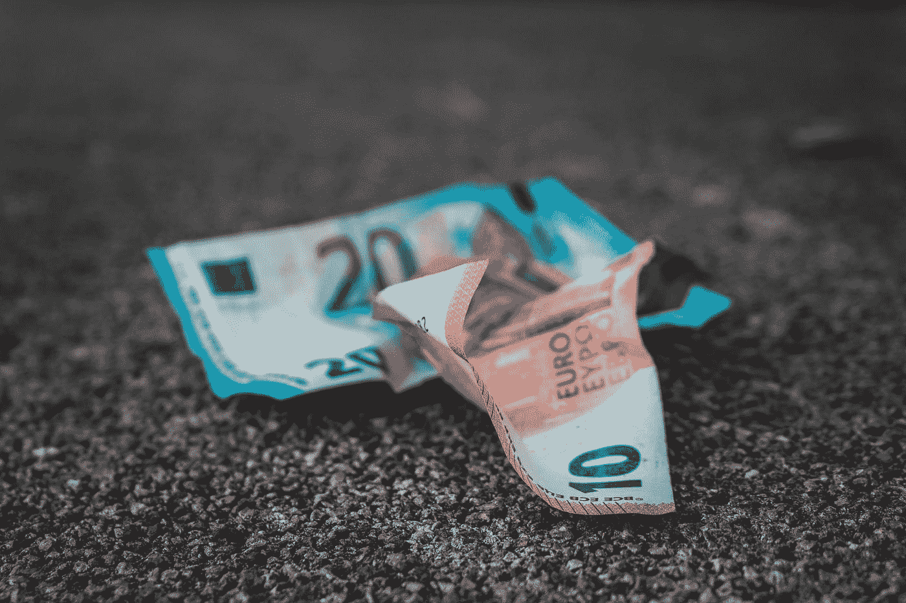

# 如何让你的储蓄战胜通货膨胀

> 原文：<https://medium.com/coinmonks/how-to-beat-inflation-on-your-savings-b18aedbbe0cb?source=collection_archive---------36----------------------->

我每个月应该存多少钱？通货膨胀真的影响了我的储蓄吗？

Photo by [Sara Kurfeß](https://unsplash.com/@stereophototyp?utm_source=medium&utm_medium=referral) on [Unsplash](https://unsplash.com?utm_source=medium&utm_medium=referral)

生活成本随着时间的推移而增加，通货膨胀是物价上涨的主要因素。因此，越来越难挣到足够的钱来支付基本开支。这意味着存钱变得更加重要。