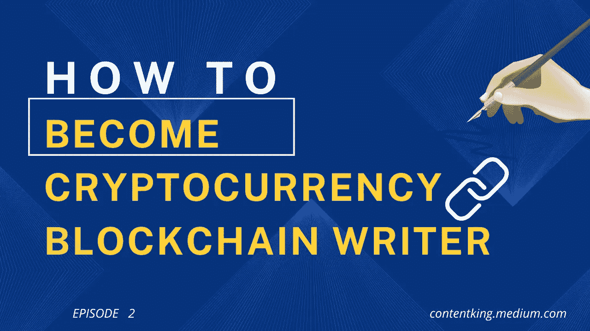
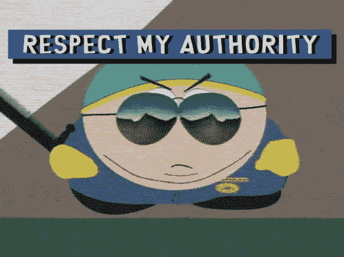
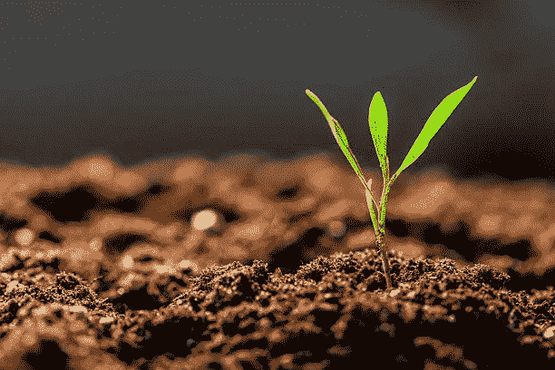

# 如何成为加密货币和区块链作者:获得加密写作工作

> 原文：<https://medium.com/coinmonks/how-to-become-cryptocurrency-and-blockchain-writer-get-crypto-writing-jobs-54253a5c7604?source=collection_archive---------5----------------------->

所以在我发表的 的最后一篇文章 [**中，我谈到了为什么作为一个加密货币或区块链作家你需要热情。**](https://contentking.medium.com/how-to-become-cryptocurrency-and-blockchain-content-writer-4d4916979a9d)

几周前，我给你们布置了为自己创建一个中型博客的任务，但是你们中的很多人在这个阶段都不愿意有一个博客。

**Designed By Me:)**

嗯，我一点也不会怪你。我们都是人，在有理由采取行动之前，我们很少采取行动。

所以，一点也不要难过，我理解。

今天，我要谈谈在这个区块链内容写作的旅程中你为什么需要一个中型博客的原因。

***我知道你可能很忙，所以你更喜欢看视频而不是看文章。我给你做了一个视频教程，现在就看。***

**Video tutorial on how to become a cryptocurrency writer**

# **对于密码作者来说，中型博客的优势**

当你在自己的 WordPress 博客上发表加密文章时，谷歌不会真的关心你，因为你是无名小卒。这是一个痛苦的事实。

他们不知道你的网站，除非你做了很多工作，否则很难信任你。

有一种东西叫做 ***域权限*** ，通俗地解释；它是搜索引擎信任你的内容和网站的百分比。

一个网站越受信任，搜索引擎就越愿意向发布在这些平台上的加密内容发送流量。

## 为什么域名权威很重要

我给你举个例子。

如果 DA 代表信任，那么 Medium 在 100 分中有 70 分。

而一个新网站 100 分只有 1 分。

我想问你，如果你是搜索引擎，你会更喜欢哪一个？

我能猜到，我已经知道你的答案了:)

同样的内容在你的 WordPress 或 WIX 博客上没有获得足够的流量，当你在媒体上发布时，它会在几天内被索引，如果信息被认为对互联网用户或你所在行业的人有用，谷歌可能会将其发送到第一页。

> 这种生活是不平衡的，耶！我们对此无能为力。

# 媒体博客就像是作家的沃土

我认为媒介是我种子的沃土

但这并不意味着我不能在其他土壤上种植，只要我准备花钱买肥料，没问题！

[**Image Source**](https://www.istockphoto.com/photos/fertile-soil)

提高你的 WordPress 博客作为加密货币和区块链内容作者的信任度。你必须准备好学习页面内和页面外 SEO(搜索引擎优化)。

而且你必须有足够的现金来支付页面排名、反向链接生成、域名权威专家等等。

如果你做得过分，谷歌可能仍然会处罚你的博客。

既然你已经看到了我为什么更喜欢你从中等开始的原因？

返回并创建您的博客，自定义它，并添加个人简历和个人资料图片。

这还不是全部

# 让我与你分享一个简短的秘密故事

大约两年前，有人遇到了问题，他开始在互联网上寻找解决方案。

幸运的是，我已经在 Medium 上发布了一个解决方案，它得到了 Google、Bings、Yahoo 和其他搜索引擎的关注。

他发现我的*文章非常有用*，因此，他在文章上留言后给我发了一条电报，表达了他对我在 Medium 上阅读了我的加密货币文章后帮助他解决问题的兴奋之情。

我们开始谈论不同行业的特定话题。

有一句非洲谚语说:

> 那是从拍手舞开始的。

大致翻译过来就是说**跳舞**通常从简单的动作开始，比如**鼓掌**。

我们成了共同的网上朋友，他会让我帮点小忙，比如帮他管理几天他的 NFT 加密项目的电报组。

几个星期后，他问我是否可以作为社区经理和他一起工作，因为我已经有了很好的加密写作技巧。

你瞧，没有发送简历或写申请信。

我得到了那份工作。

当你在互联网上的曝光率足够高时，你就会开始得到你从未申请过的工作。它会自然到来。

这是众多案例中的一例。

我已经分别经历过这种情况，它也可能发生在你身上，只要你现在采取行动，开始在你的个人博客上发布有价值的加密货币和区块链内容。

回头见！

PS:当我按下发布按钮的时候，这将是我在我的媒体博客上的第 62 篇加密文章。

当一篇文章是有帮助的，你应该给 50 次掌声并跟随作者。哈哈，只是开个玩笑。请立即关注我，了解更多有见地的加密信息。

我有一门课程，可以让你在 30 天内成为加密货币作者，当你进入这门课程时，你将能够加入我的私人导师小组，我将帮助你建立你的加密写作生涯。买得起的课程。

# 关于作者

**Ojeniyi Ayobami Abimbola** 自 2015 年以来一直从事加密货币交易，他是区块链的内容创作者和 Cryptoniche 的加密教练。你可以和他联系:[https://t.me/cryptoniche_hangout](https://t.me/cryptoniche_hangout)

**Tubebuddy 附属链接:**[https://www.tubebuddy.com/abimbola](https://www.tubebuddy.com/abimbola)

NB: *如果你注册了附属链接，我会从中获得一小笔佣金，这也是从经济上支持这个博客的一种方式。*

**或者加入隐壁龛电报频道:**【https://t.me/cryptoniche_hangouts 

【https://mobile.twitter.com/ojeniyi_ayobami】和他在推特上联系:

要不要终身被动收入？在这里阅读他的上一篇文章 [**！！！**](https://contentking.medium.com/this-undoubtly-the-best-way-to-earn-passive-income-through-cryptocurrency-7ce547cedbe)

我有一个免费的礼物给你:“如何在年底前成为密码百万富翁。” [**点击这里下载。**](https://ojeniyiayobami.crd.co/)

几十个为你制作的加密内容， [**现在就订阅**](https://www.youtube.com/c/CryptoNiche/videos)

> 交易新手？试试[加密交易机器人](/coinmonks/crypto-trading-bot-c2ffce8acb2a)或者[复制交易](/coinmonks/top-10-crypto-copy-trading-platforms-for-beginners-d0c37c7d698c)