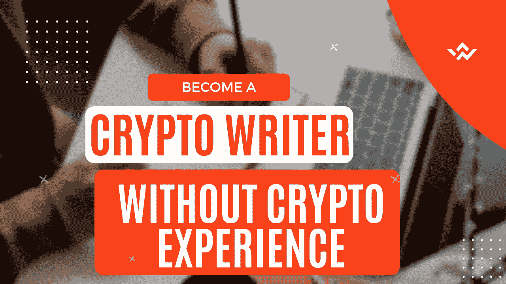

# 如何成为零密码知识的加密货币内容作者

> 原文：<https://medium.com/coinmonks/how-to-become-cryptocurrency-content-writer-with-zero-crypto-knowledge-e1d9d1abf833?source=collection_archive---------12----------------------->

这篇文章是我在 [**如何成为一名加密货币和区块链作家**](https://contentking.medium.com/how-to-become-cryptocurrency-and-blockchain-content-writer-4d4916979a9d) 上开始的系列文章的延续。我们知道这个行业是新兴的，在全球范围内越来越受关注，因此更多的人愿意投身于这个行业，需要有人在那里帮助那些将在 web 3.0 生态系统中从事内容和/或技术写作的人。

**I Designed It With Canva:)**

***我知道你可能很忙，所以你更喜欢看视频而不是看文章。我给你做了一个视频教程，现在就看。***

**Video on how to become a cryptocurrency writer**

写作*加密内容*有很多好处，除了钱，它还伴随着名气和自我实现。我知道许多新作家都想创建一个写作作品集来展示他们的能力水平，所以如果这是你想要的， [***我建议你从这里开始阅读***](https://contentking.medium.com/how-to-become-cryptocurrency-and-blockchain-writer-get-crypto-writing-jobs-54253a5c7604) ***。***

要成为一名医学作家，你需要有医学背景，至少，你应该有基础科学知识。

如果你想成为一名优秀的加密货币内容作者，了解加密和区块链的基本术语是很重要的。

# 加密货币教育资源

如果你是这个行业的新手，一个很好的开始方式是 [coinmarketcap](https://coinmarketcap.com/) 网站，在他们网站的 [**Alexandria**](https://coinmarketcap.com/alexandria) 版块有一堆短小精悍的文章。

> 祝你学习新术语愉快。

开始的时候，很多事情对你来说没有意义，不要烦恼。只要你不停止，你很快就会掌握它的窍门。

有一个加密字典可以帮助你，不幸的是，没有人创建它。那是在一个较轻的音符上:)

当你学习加密、NFT、Defi、区块链、交易、套利等等。你会遇到你不理解的单词，没问题。停止阅读，上网，搜索你看到的任何陌生单词的意思。

这个技巧将帮助你在 6 个月内学会别人 5 年内学会的东西。

[**Source**](https://tenor.com/search/gift-love-gifs)

接下来， [**参加这个关于加密交易**](https://www.youtube.com/playlist?list=PLxSYXsDy5xzGg7rbCeMMwGZBWO2GjFDcY) 的免费课程，这是一个初学者课程，它将帮助你比 95%没有参加课程的人更好地了解这个行业。

这是 YouTube 上的一个播放列表，我打赌它会在这个旅程中帮助你。

# 参与游戏

很多时候，Web 3.0 行业中的许多雇主更喜欢与在游戏中有关系的人一起工作，那些有密码的人被视为更好的员工。

你是一个加密货币作者，你连比特币或者以太坊都没有，这说不通。

在你作为 Web 3.0 作者的所有收获中，获得比特币或任何替代货币。说明你对这个行业充满热情。

下载像《傻瓜比特币》这样的书，它以一种 10 岁孩子也能理解的方式教授密码。

# 看好个人研究

尽可能多地获取关于这个生态系统的信息。

搜索引擎是你最好的朋友，没有理由无知。

希望这些信息对你有帮助。现在，给这篇文章 50 个掌声。

PS:我有一门课程，可以让你在 30 天内成为加密货币作者，当你进入这门课程时，你将能够加入我的私人导师小组，我将帮助你建立你的加密写作生涯。 [**买得起的课程。**](https://cryptoniche.gumroad.com/l/cryptowriting)

# 关于作者

**Ojeniyi Ayobami Abimbola** 自 2015 年以来一直从事加密货币交易，他是区块链的内容创作者和 Cryptoniche 的加密教练。你可以和他联系:[https://t.me/cryptoniche_hangout](https://t.me/cryptoniche_hangout)

**Tubebuddy 附属链接:**[https://www.tubebuddy.com/abimbola](https://www.tubebuddy.com/abimbola)

注意:如果你注册了会员链接，我会从中获得一小笔佣金，这也是从经济上支持这个博客的一种方式。

**或者加入隐壁龛电报频道:【https://t.me/cryptoniche_hangouts】T22**

**在推特上和他连线:**[https://mobile.twitter.com/ojeniyi_ayobami](https://mobile.twitter.com/ojeniyi_ayobami)

要不要终身被动收入？在这里看他上一篇文章 [**！！！**](https://contentking.medium.com/this-undoubtly-the-best-way-to-earn-passive-income-through-cryptocurrency-7ce547cedbe)

我有一个免费的礼物给你:“如何在年底前成为密码百万富翁。” [**点击这里下载吧。**](https://ojeniyiayobami.crd.co/)

几十个为你制作的加密内容， [**现在就订阅**](https://www.youtube.com/c/CryptoNiche/videos)

> 交易新手？尝试[加密交易机器人](/coinmonks/crypto-trading-bot-c2ffce8acb2a)或[复制交易](/coinmonks/top-10-crypto-copy-trading-platforms-for-beginners-d0c37c7d698c)