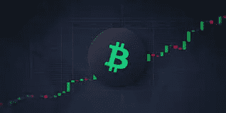
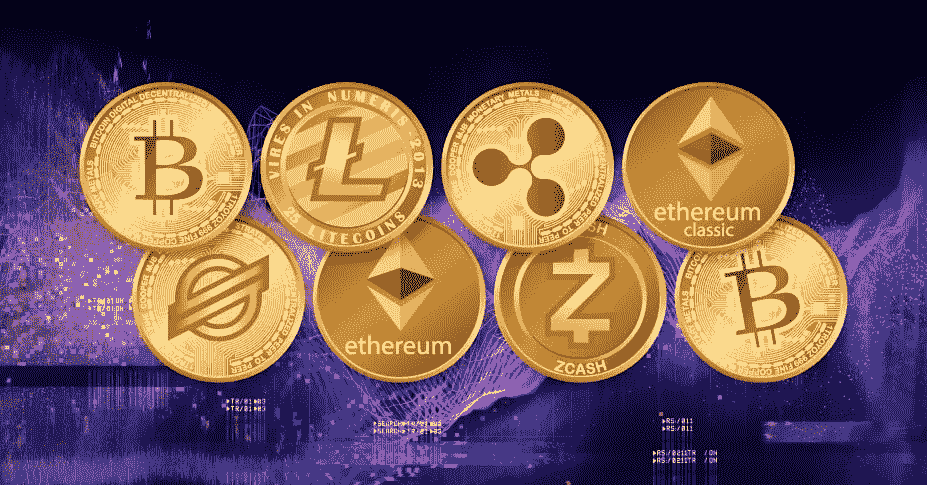
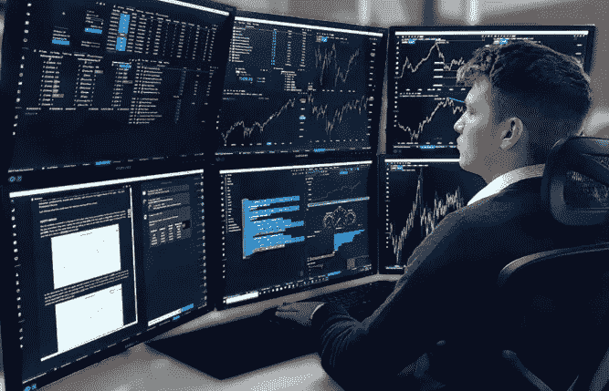
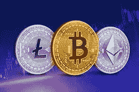

# 如何在加密货币交易中获得成功(如何)

> 原文：<https://medium.com/coinmonks/how-to-become-successful-in-cryptocurrency-trading-how-to-174d4a9e332f?source=collection_archive---------17----------------------->

BTC and trading image

加密货币交易是买卖加密相关代币的艺术。

这些代币可以是比特币、Ripple、以太坊、Cardano 等。

> 从顶级交易者那里复制交易机器人。免费试用。

Cryptocurrencies

加密货币交易赋予你作为市场交易者的独特能力，就像股票市场和外汇交易行业的交易者一样。

它是相关的、可获得的、独特的、对交易者有用的、真实的和可能的金融和投资自由感，是一个舒适的地方。

它有时会很有趣、容易、困难和令人沮丧，并附带其自身的计算风险，这就是本文将帮助您了解如何在加密货币交易中获得成功的地方。

许多个人发现很难进入加密货币交易行业，因为在市场上变得有利可图和失去大量辛苦赚来的钱的挫折的可实现的目标

学习成为成功的交易者，主要是在密码行业，你必须成为游戏的学生。

这和任何技能一样，不是几个小时甚至几天就能完成的。想一想，今天成功的交易者和专家，用了年复一年的汗水、泪水、辛劳、磨砺和不眠之夜才到达那里。

要想取得成功，你必须让人们知道，在交易加密货币时，从初学者到成为该领域的专家，你必须采纳所有的最佳实践。

你会遇到很多术语和技术术语，比如支撑位和阻力位、趋势线、蜡烛图、熊市和牛市/季节、时间框架、历史高点和历史低点、累积和反弹。

还使用移动平均线、指数移动平均线、布林线等指标。

**你想成为什么类型的交易者？**

*   黄牛:小额价格变化的利润，通常使用 1 分钟和 5 分钟的时间框架。
*   日内交易者:顾名思义，他们在日内交易。
*   摇摆交易者:通常在几周或几个月内交易。
*   持仓交易者:这是在 50 天到 200 天的时间框架内完成的，顺便提一下，还有像 EMA(指数移动平均线)这样的指标

**新手如何在加密货币交易中获得成功并盈利**

Trader with a lot of screens

十个专业的加密货币技巧和窍门，帮助您保持领先

1.永远要有一个导师，参加游戏中的导师的课程。

2.坚持一个策略，了解它的来龙去脉。

3.记日记，记录你的交易，这有助于你了解成功交易和失败交易的模式。

4.明白交易需要时间，不是快速致富的计划。

5.把它当成一门生意。

6.控制你的情绪和心理。

7.切忌贪心。

8.让你的技术和基本面分析正确。

9.每一次的得失都是在你的交易之旅下经历的。

10.跟上市场的发展。

**谁是加密货币交易商**

A Trader trading n motion

任何一个在加密货币市场以下单的形式买卖加密货币的人都可以被称为 ***加密货币交易者*** 。

加密货币市场是继股票市场和外汇市场之后金融市场的最新领域之一。

比特币、以太币、Ripple、Aave、比特币现金等加密货币的交易，无论是通过币安、火币和北海巨妖等成熟的交易所买卖这些货币，都是让你成为交易者的原因，简单来说，买卖行为就是交易，在这种情况下，资产就是加密货币。

最新的金融机构随着比特币白皮书的诞生而诞生，该白皮书详细介绍了如何使用分散的货币形式，而不是银行和金融贷款机构的日常规范。

交易包括盈利和亏损，在大多数情况下，交易者总是希望盈利多于亏损，这样才能被认为是成功的交易者。

**如何成为一名成功的加密货币交易员**

既然我们现在知道了谁是交易者，他做什么，我们现在可以知道如何成为一个成功的交易者，成功的交易者有哪些因素。

交易时，了解交易的来龙去脉以及是什么让交易成功是有利的。

你可能会问自己的问题是:

作为初学者，我如何交易加密货币？

要想交易成功，我需要知道什么？

我需要参加一个项目或课程才能擅长它吗？

我需要找一个导师吗？在哪里可以找到？

我需要什么才能买卖加密货币？

买什么加密货币？

我使用哪些加密货币交易所，可以信任它们吗？

上述问题和更多的问题会使任务变得令人生畏，可能会让你认为这是不可实现的，这就是本文要回答的问题。

回答上面的问题，你必须很有计算能力，并断言这是你想做的，并且擅长于此。

你应该能够知道你什么时候亏损，尽早止损，什么时候盈利，不要让它进入你的头脑变得贪婪，失去你已经取得的一点点收益，因为它通常会让你否认，并陷入永无止境的亏损的螺旋斜坡。

如果你喜欢这篇文章，并想更多地喜欢它，请关注我的[https://twitter.com/thisnaDev](https://twitter.com/thisnaDev)，别忘了为这篇文章鼓掌。

# 关于作者

**Aliyu Baba** 是一名技术和加密货币爱好者，也是一名 Web3 和区块链内容提供商和教育家。

> 加入 Coinmonks [电报频道](https://t.me/coincodecap)和 [Youtube 频道](https://www.youtube.com/c/coinmonks/videos)了解加密交易和投资

# 另外，阅读

*   [OKEx vs KuCoin](https://coincodecap.com/okex-kucoin) | [摄氏替代品](https://coincodecap.com/celsius-alternatives) | [如何购买 VeChain](https://coincodecap.com/buy-vechain)
*   [币安期货交易](https://coincodecap.com/binance-futures-trading)|[3 comas vs Mudrex vs eToro](https://coincodecap.com/mudrex-3commas-etoro)
*   [如何购买 Monero](https://coincodecap.com/buy-monero) | [IDEX 评论](https://coincodecap.com/idex-review) | [BitKan 交易机器人](https://coincodecap.com/bitkan-trading-bot)
*   [CoinDCX 评论](/coinmonks/coindcx-review-8444db3621a2) | [加密保证金交易交易所](https://coincodecap.com/crypto-margin-trading-exchanges)
*   [红狗赌场评论](https://coincodecap.com/red-dog-casino-review) | [Swyftx 评论](https://coincodecap.com/swyftx-review) | [CoinGate 评论](https://coincodecap.com/coingate-review)