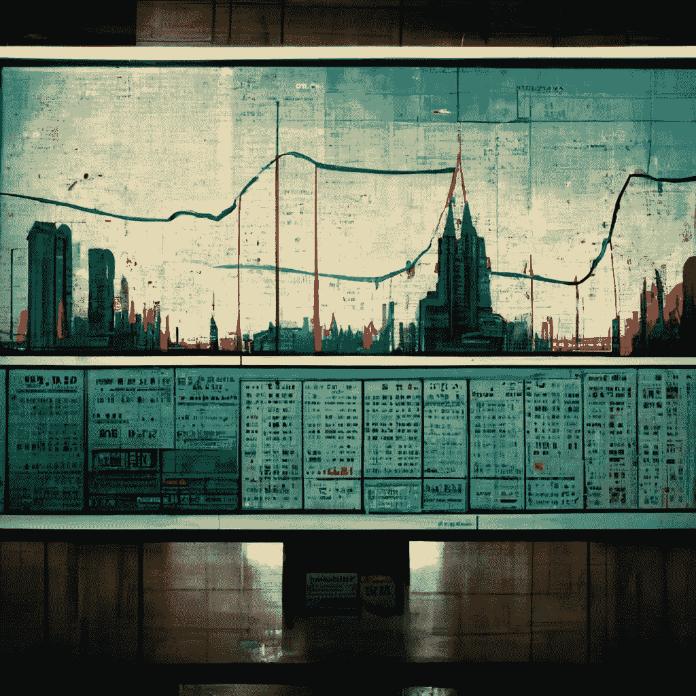

# 如何开始交易——新手指南

> 原文：<https://medium.com/coinmonks/how-to-begin-trading-a-guide-for-beginners-c362b0177070?source=collection_archive---------41----------------------->

This article was originally published on [www.BOOMISH.org](http://www.BOOMISH.org), Visit now!

# 介绍

‍

如果你正在寻找最简单的方式开始交易，那么你来对地方了。

‍

我将解释什么是交易，以及你如何在金融市场开始交易来赚钱。

‍

交易就是拿钱冒险，希望在未来某个时间点从投资中赚更多的钱。

‍

这就是技巧和经验发挥作用的地方，因为没有多少人知道如何交易和赚钱，所以确保你遵循了自己做研究的建议。

‍

因此，如果你正在寻找一个简单的方法来开始日内交易，那么这篇文章将会给你很大的帮助！

‍

今天你就可以把你的第一笔交易(或纸上交易)放到市场上去了！

‍

‍

# 什么是交易？

‍

‍

股票市场、外汇市场和加密货币市场彼此都非常不同。但是，他们都有一个共同点:**交易**。

‍

**交易是以你认为会上涨或下跌的价格购买或出售资产的行为。为了成为一个成功的交易者，理解交易是如何进行的是很重要的。**

‍

当你交易时，你可以让你的钱比你只是把它放在银行账户或用它买股票增长得更快。这可以帮助你增加财富，而不必等到退休年龄，那时你想开始享受生活，而不是整天担心钱。

‍

交易是一门复杂的手艺，所以不要盲目地进入，要确保你知道你在做什么，许多人损失了很多钱，但也有许多人赚了很多钱。

‍

‍

# 谁能交易？

‍

任何人都可以交易，尽管这需要技巧，情绪控制，和每个人都可以积累的知识。

‍

要想在交易中快速赚钱，你需要知道如何交易。

‍

你需要知道的第一件事是如何阅读图表。你可以使用任何制图软件，或者只使用 Tradingview 上的图表，甚至是你经纪人网站上的图表。最好的图表网站是 Tradingview，第二好的是停留在你经纪人的本地图表上。

‍

图表会告诉你一只股票，一对货币，或者你正在交易的其他资产的价格变化。你可以交易的不同时间框架也很重要，这些时间框架包括日内交易、刷单、波动交易、投资等等。

‍

**交易赚钱的方法有很多种，但是最简单的一种方法就是使用一种** [**的交易策略**](https://www.boomish.org/blogs/how-to-build-a-trading-plan) **让你有很高的胜算概率。**

‍

你需要做的第一件事是找到一个适合你个性和风格的市场，我们会在这篇文章的“哪种交易风格最适合你”部分深入讨论。

‍

一些开始学习的方法是通过课程，尽管 YouTube 上有很多。最终，最好的学习方法当然是实践。

‍

‍

# 交易能赚多少？

‍

你在交易中实际能赚多少钱是一件很难确定的事情。虽然我们在这里会简单介绍一下。

‍

成功的交易者平均每年赚 10%,所以如果你有足够的资金，良好的 T2 情绪控制和技术理解，这可能就是你的结果。

‍

有很多原因可以解释为什么交易对很多人来说如此有利可图，以及普通交易者赚了多少钱。

‍

一般交易者每小时的工作收入约为 10-15 美元，这取决于他们的技能水平，他们花了多少时间练习和建立自己的知识库，直到他们有足够的信心开始用真钱自己交易，而不需要其他人的任何帮助，这些人在独自交易之前已经成功了，他们还可以通过阅读书籍，在线文章或听播客来学习在选择哪些股票或其他资产(如加密货币)时什么是最好的。

‍

‍

# 开始交易需要多长时间

‍

对大多数人来说，交易不是一个快速致富的计划。如果你认为不需要努力就能马上成功，那你就错了，这很难进入，但事实证明对一些人来说非常有利可图。

‍

尽管如此，你今天就可以开始交易！建立经纪人账户等的过程如下所示。最重要的是，你可以先从纸上交易开始尝试，同时学习一些课程或 YouTube 视频。

‍

T4:用一小笔钱试试看，或者更好的办法是尝试纸上交易。纸上交易是用假钱交易，你可以在里面测试你的技巧。

‍

如果你认为你喜欢交易，任何时候都是开始交易的好时机，只是要小心和管理风险。

‍

‍

# 什么类型的交易最适合新手

‍

大多数想成为交易者的人应该从了解什么类型的交易最适合他们开始，如股票、外汇和加密货币市场，这样他们就可以了解每种交易的工作原理以及它们之间的区别。

‍

不仅有不同的市场可以交易，还有不同的交易风格。

‍

交易风格是由不同的时间框架和不同类型的图表模式定义的，交易者倾向于交易。

‍

你可以交易的不同时间框架也很重要，这些时间框架包括日内交易、刷单、波动交易、投资等等。

‍

一些不同类型的交易者是动量交易者、突破交易者、回调交易者和区间交易者。

‍

最容易开始交易的地方是外汇交易区间。这是因为一般来说，它比股票和密码更不稳定。无可否认，在我们现在所处的全球经济动荡中，这种情况最近发生了很大的变化。

‍

外汇通常更容易的另一个原因是它提供了许多区间交易。在区间交易中，你需要做的就是在支撑位买入，在阻力位卖出，因为突破很少发生。突破当然会发生，但通常需要相当长的时间。

‍

最重要的是，与股票和密码相比，外汇通常不那么不稳定。无可否认，在我们现在所处的全球经济动荡中，这种情况最近发生了很大的变化。

‍

大多数想成为交易者的人将从学习不同的市场开始，如股票、外汇和加密货币市场，这样他们就可以了解每个市场的工作原理以及它们之间的差异。

‍

每个市场都有不同的交易时间*，*，所以找到哪种类型的市场对你来说有最好的交易时间对你交易市场来说是至关重要的。尤其是作为一个日内交易者*。*

‍

外汇市场周一至周五每天 24 小时开放。

美国股票市场(交易量最大)开放时间为美国东部时间周一至周五上午 9 点至下午 4 点

‍

与外汇和股票不同，加密货币市场从不关闭，它每周 7 天、每天 24 小时在全球范围内进行日间交易。

‍

只要找到最适合你的交易风格，尝试所有的交易风格，不要冒太大的风险，因为你不知道你在做什么。

‍

‍

# 如何创建交易计划

‍

[制定交易计划](https://www.boomish.org/blogs/how-to-build-a-trading-plan)是成为持续盈利交易者的开始。没有交易计划，你只是随波逐流，没有自己的规则，这是赔钱的原因。

‍

交易规则对你的交易计划至关重要。你的交易计划的规则应该给你提供一个要求清单，你应该在交易前检查。有成千上万的规则可供你选择。你的规则/要求都归结于你喜欢的交易风格。

‍

管理风险绝对是你在交易市场生存的核心。无论你是想日内交易，波段交易，还是头皮交易，你都需要管理风险，所以做一些关于交易计划和风险管理的研究。

‍

头寸规模、账户规模和风险都相互影响，但不是一回事，点击阅读更多关于[的内容。](https://www.boomish.org/blogs/how-to-build-a-trading-plan)

‍

‍

# 如何开始交易加密货币

‍

交易加密货币的第一步是研究一下什么是加密货币。这可以通过学习 Web 3.0 和[词汇学](https://www.boomish.org/blogs/what-are-the-tokenomics-of-a-cryptocurrency)这样的东西来实现。

‍

首先，一件简单的事情是理解比特币是什么，并从那里深入到密码世界。

‍

**交易加密市场很容易是最不稳定的，也是最难学习交易的地方，因为这种不稳定性。**

‍

尝试学习在加密市场交易将意味着不断的清算，因为货币的市值很小，很容易用小额资金上下波动。

‍

波动性也提供了所有三个市场中最快的收益，以及所有三个市场中最快的损失。

‍

您可以开始在以下交易所进行加密交易，这些交易所对用户非常友好，开户也很容易:

‍

*   [币安](https://www.binance.com/en)
*   [库币](https://www.kucoin.com/)
*   [FTX](https://ftx.com/en/)
*   [逐位](https://www.bybit.com/)
*   [双子座](https://www.gemini.com/eu)
*   [北海巨妖](https://www.kraken.com/)

‍

‍

# 如何开始炒股

‍

你可以在大多数证券交易所进行网上股票交易。股票/外汇交易所列表列在下面的“新手最佳交易应用”部分

‍

**股票交易涉及买卖公司股票，试图从公司股票的价格变化中获利。**

**‍**

由于这是一个相当大的市场，并且有相当大的交易量，股票价格全天波动相当大。

‍

‍

# 如何开始外汇交易

‍

**外汇交易是指外汇交易，即国际货币对的交易。**

‍

在这里列出的三种市场类型中，外汇市场通常是波动性最小的交易市场。

‍

出于同样的原因，外汇交易通常会给小账户带来最少的财务收益。

‍

尽管外汇市场是最“可预测”的，但根据坊间经验，出于同样的原因，外汇市场给小规模市场参与者带来的金融机会最少。

‍

外汇经纪商不同于证券交易所和加密货币交易所。然而，许多证券交易所也为用户提供外汇交易市场。

‍

在你开始外汇交易之前，建议你研究一下经济货币对和货币所属国家的经济。

‍

通货膨胀和一个国家的经济状况在很大程度上影响货币的价格，所以如果你不了解全球事件，这是一个很难交易的市场。

‍

‍

# 新手用哪个交易 App 最好

‍

**你应该从哪里开始炒股？**

‍

交易股票、密码或外汇的第一步是在经纪人或交易应用程序上开户。

‍

有很多可以开始交易的交易 app。有些交易经纪人只给你提供一两个你可以交易的市场。无论是股票、加密货币还是外汇。

虽然，有一些经纪人在其平台上提供所有三个市场，如 Trading 212，它提供了一些最知名的加密名称，如比特币、以太坊、索拉纳和 Dogecoin。

‍

在寻找交易平台的时候，你想看的东西是不同的。这些事情包括:

‍

*   低交易费用
*   可靠性，你不希望你的订单出现巨大的价差，或者经纪人经常中断。
*   针对最相关的市场事件的内置新闻通知
*   内置图表

‍

‍

**这里是初学者最好的网上股票交易网站:**

*   [保真度](https://www.fidelity.com/)
*   [交易 212](https://www.trading212.com/)
*   [TD Ameritrade](https://www.tdameritrade.com/)
*   [E *贸易](https://us.etrade.com/home)
*   [电子托罗](https://www.etoro.com/en-us/)

‍

**只需在其中任何一个交易平台开立交易账户(也称经纪账户)并开始交易即可。**

‍

大多数交易平台都提供如何交易的警告和教程。开始时会强调不要冒太大的风险。

‍

不要以为自己掌握了交易就把钱全押上了，好好保管自己的钱，不要下大赌注。

‍

‍

# 开始杠杆交易

‍

开始日内交易需要多少钱？这取决于你的技术水平。有期货交易，杠杆交易，期权交易(都是指一个非常相似甚至相同的概念)。

‍

对杠杆要非常、非常、非常小心。作为初学者，这是 100%不推荐。我们建议你在任何时候都远离杠杆。

**‍**

以前有人问我如何“用 1 美元开始交易”，“用 100 美元开始交易”，甚至如何“不用钱开始交易”。

‍

不幸的是，这几乎是不可能的，除非你有很高的技术，并且已经交易很多年了。

‍

‍

# 投资与交易

‍

交易的现实是复杂的。有一点可以肯定，这不是一个快速致富的计划。如果你认为不需要努力就能马上成功，那你就大错特错了。

你要问自己想要什么，为什么要交易。如果你认为与投资相比，这是一笔快钱，那你就错了。投资是等待回报，交易是等待学习，两者都需要时间。

‍

**交易和投资是非常相似的概念。交易需要交易计划，就像投资需要投资策略一样。交易也适用于许多类似的工具。**

**‍**

所以，选择你是想做交易还是明智地投资，对于大多数没有时间和精力投入交易的人来说，投资会更好。

‍

‍

# 结论

‍

总之，任何人都可以在任何时候交易。你只需要建立一个经纪账户并开始交易。

‍

但是一定要注意，交易不是一件容易的事情，所以不要被愚弄。在你拿自己的血汗钱去冒险之前，先做好需要做的工作。

‍

参加一些课程，接受教育，询问专业交易者和投资者他们的计划和建议，在 boomish，我们只是传递信息，让你更好地了解交易是什么，以及如何开始这个过程。

> 交易新手？尝试[加密交易机器人](/coinmonks/crypto-trading-bot-c2ffce8acb2a)或[复制交易](/coinmonks/top-10-crypto-copy-trading-platforms-for-beginners-d0c37c7d698c)