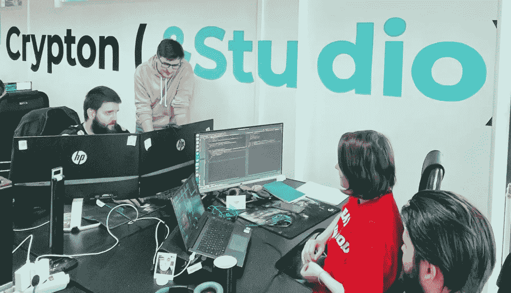

# 如何搭建一个 DeFi App？

> 原文：<https://medium.com/coinmonks/how-to-build-a-defi-app-92aa8cfa596b?source=collection_archive---------32----------------------->

第一步是决定你想要的 DeFi 应用类型。

DeFi 应用程序以各种方式帮助借贷数字资产、交易资产、挖掘加密货币、获得保险等。

此外，您需要做 custdev

进行全面的市场研究，了解你的竞争对手正在开发什么，哪些功能在 DeFi 用户中受欢迎，以及哪些功能符合你的 DeFi 商业理念。

> 交易新手？试试[加密交易机器人](/coinmonks/crypto-trading-bot-c2ffce8acb2a)或者[复制交易](/coinmonks/top-10-crypto-copy-trading-platforms-for-beginners-d0c37c7d698c)

# 您将需要一个软件开发团队，即:

## **商业分析师**

为了一个成功的 DeFi 项目，在开始应用程序开发之前，请确保不要屈服于区块链的喧嚣，并进行适当的市场调查。

## **项目经理**

他们对整个项目范围、项目团队和资源、项目预算以及项目的成败负责。

## **区块链开发者**

对于 DeFi 应用程序，您可能需要一些额外的集成，如加密钱包、访问离线数据的数据馈送等。

## **移动或网络应用开发者**

你需要决定是使用网络应用还是移动应用。决定你是想到达安卓用户市场还是苹果市场。

## **质量保证工程师**

优先考虑漏洞测试程序。

## **UX/UI 设计师**

经验丰富的 UX/UI 开发人员可以开发一个直观的应用程序界面，这是建立您的企业身份和留住应用程序用户的一个很好的来源。

联系我们，让我们一起开始你的项目！ [https://crypton.studio](https://crypton.studio)