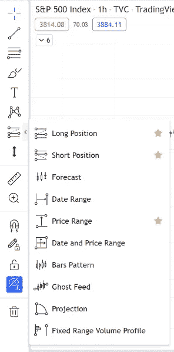
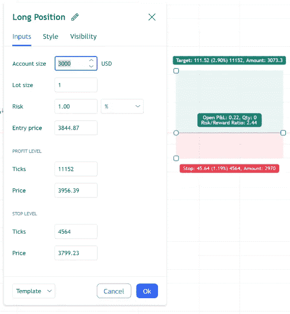

# 如何建立交易计划:一步一步的指南

> 原文：<https://medium.com/coinmonks/how-to-build-a-trading-plan-a-step-by-step-guide-5952b8f5a28c?source=collection_archive---------52----------------------->

Boomish.org

**关键见解**

创建个性化的交易计划是持续盈利交易的基础

认真对待风险管理

找到你在市场中的定位

学习如何正确使用保证金

永远遵循你的个性化交易计划

不要匆忙制定交易计划，努力去做，并根据你的喜好个性化它

不要在几次失败的交易中改变你的交易计划

**简介**

建立交易计划是成为持续盈利的交易者的开始。没有交易计划，你只是随波逐流，没有自己的规则，这是赔钱的原因。

你可能正在读这篇文章，因为你曾经经历过没有计划的痛苦。那么，如何制定计划呢？建立一个交易计划有很多方面，在整篇文章中，我将把交易计划的不同方面分解成简单易行的步骤。

**风险管理**

从定义每笔交易的风险开始。定义你的风险也可以被称为风险管理，这对于不要让你的账户破产至关重要。风险管理是一个过程，知道你的总资本/你的账户中有多少钱是你每次交易的风险，以及如果交易不按你的方式进行，你愿意损失多少

需要区分的是头寸规模、账户规模和风险。头寸规模是你用多少资金购买一定数量的股票，你的账户规模是你经纪账户中的资金总额，你的风险是你在一次交易中可能损失的资金数额。

一般来说，一个好的风险管理规则是允许你自己每次交易损失不超过账户的 1-2%。举个例子:你有一个 1000 美元的账户，你的风险管理策略允许你每笔交易承担 1%的风险。如果你把 1000 美元的账户全部放在一个单独的交易上，你的止损应该比你的进场价格低 1%，这意味着交易对你不利，你会止损 10 美元。根据交易风险管理策略，该交易将遵循 1%的风险。

用同样的账户，你可以交易 100 美元，你的风险管理策略仍然只允许 10 美元的损失，因为它仍然占你 1000 美元账户总额的 1%。这意味着在 100 美元的交易中，你可以在你的进场价格下止损 10%,并且仍然遵循你的风险管理计划。

我希望这个例子已经阐明了什么是风险管理，以及它是如何受到头寸规模和账户规模的影响的。同样，一个很好的风险管理规则是每次交易的风险不超过你账户的 1-2%。

**免责声明:**本文不提供投入使用的交易计划。这篇文章使用随机的例子只是为了阐明建立一个交易计划的必要性，以及建立一个交易计划的不同组成部分。

**市场结构和交易设置**

问问你自己，你是哪种类型的交易者，找到你理解的市场结构，并找到容易交易的市场结构。你喜欢做多/交易上升势头，你喜欢做空/交易下降势头，还是你喜欢交易区间？随着时间的推移，通过交易所有这些不同的市场结构，可以最好地发现这一点。在尝试了所有类型的市场结构后，你一定会找到你觉得最舒服的交易方式。

无论你交易的方向是什么，都会有不同的设置可供选择。你可以选择在上涨趋势/下跌趋势中交易回调，在盘整期或任何你喜欢的设置中交易突破。

交易设置可能出现在不同的时间框架。根据你想多快进出交易，以及你想在交易上花多少时间，你必须找到最适合你和你的交易计划的时间框架。一些选项包括摇摆交易日线图，1-4 小时图的日交易，或者 1-15 分钟图的日交易。找到你的偏好并建立优势。

**规则/要求**

你的交易计划的规则应该给你提供一个要求清单，你应该在交易前检查。有成千上万的规则可供你选择。你的规则/要求都归结于你喜欢的交易风格。

你最好为你的交易计划选择最多五条规则，任何你想交易的设置都必须满足这五条要求。

规则可以由指标和条件组成，如 RSI 超卖/超买，RSI 或 OBV 背离，价格行为处于看跌或看涨的较高时间框架(HTF)结构，或价格高于关键移动平均线。无论你的偏好要求是什么，在你进行交易之前，列出你的交易要求并检查它们是否得到满足。

**免责声明:**这套交易规则没有经过回溯测试，不是建议。这些仅仅是为了便于解释而使用的例子。

**位置输入**

当你制定了风险管理计划，找到了你喜欢的系统图表，制定了一套规则后，是时候为交易找一个好的进场点了。

如果你是突破交易者，在突破或重新测试关键阻力位时会发现进场信号。如果你是回调交易者，进场信号可以是看涨或看跌的反转信号，预示着在更高的时间框架方向上的延续。

当你找到其中一个进场指标或其他你喜欢使用的进场指标后，你必须决定在哪里设置止损。设置止损时，首先要注意的是你的风险管理规则。

最好是看看一个你觉得不太可能被止损的安全汇合点，看看在遵守你的风险管理规则的情况下，你可以在这个首选点买入多大的止损头寸。

**风险回报比**

进行交易时，一个值得关注的事情是你的风险回报比。一个众所周知的交易规则是最低 3 比 1 的风险回报比。这个比率意味着如果你赢了，你的收益至少是如果交易对你不利，你的损失的 3 倍。风险回报比超过 3 比 1 的交易更好，但是要确保你的利润水平是现实的。

如果你的交易想法是错的，那么你损失很少，如果你是对的，你会赢很多。你的风险回报比可以通过本文后面工具部分描述的多头/空头头寸绘图工具轻松看出。

**贸易管理**

下单后，你需要管理你的交易。假设你找到了一张符合你的交易规则要求的图表，你已经在交易中设置了风险管理止损。假设这是一笔成功的交易，到目前为止对你有利。现在是正确管理交易的时候了。

你不想过早地 FOMO 出仓并获利。但你也不想看到所有的利润都变成亏损。有几个解决方案可以包含在你的交易计划中。

你可能希望你的计划包括 2-4 个不同的止盈水平，在这个水平上你可以从交易中获得更多的利润，剩下的让它继续运行。设置不同的获利水平可以确保如果交易逆转，你不会一无所有。这也确保了你不会一下子把所有东西都拿出来，以防价格继续朝着正确的方向发展。

在你达到 1R (1 个风险对回报点/1:1 的风险对回报水平)后，把你的止损点设在盈亏平衡点，这将确保你永远不会在赢利的交易中亏损。另一种常见的交易管理技术是跟踪止损，用来确保成功的交易不会对你不利。跟踪止损跟踪价格，当价格反转并比近期高点低一定百分比时，止损出局，这些通常可以在你经纪人的交易页面上找到。

**积分保证金**

保证金交易是许多交易者无法在他们的交易计划中安全实施的，因此会在整个交易生涯中造成严重的问题。

假设我们使用和前面一样的例子，一个 1000 美元的账户，有一个风险管理计划，每次交易你都用账户的 1%来冒险。假设在交易回调时，你发现了一个好的进场点，你的止损只需比进场点低 2%，你只需在交易中投入 100 美元。在你的进场水平下止损 2%，你在冒 2 美元的风险。然而，你的风险管理计划允许你每笔交易承担 10 美元的风险(占你 1000 美元账户总额的 1%)。这意味着你的计划允许你在这笔交易中使用 5 倍的保证金。

所以本质上，只有当你的账户在某笔交易中没有达到 1%的风险时，你的计划才允许你使用保证金。

以同样的账户和交易为例，你决定建立 500 美元的头寸，而不是 100 美元。你的止损仍然比进场价格低 2%。500 美元的 2%是 10 美元，因此，您的风险水平完全达到，这意味着您无法以此头寸规模进行保证金交易。我希望我已经说清楚了，保证金应该只在你无法在无保证金头寸规模的交易中达到你的风险管理%时使用。

**免责声明:**保证金交易应该**只有**当保证金交易的技术细节和含义被彻底理解后才能进行。

**工具**

进行交易时需要理解和使用的最重要的工具是 Tradingview 上的多空绘图工具或工具栏中的首选经纪人交易界面(图 1)。在使用空头或多头头寸工具时，您还可以提供您的账户规模和首选风险百分比，然后该工具会立即计算出您每次交易可以购买多少股特定股票(图 2)。这是在确定潜在交易时，立即知道你的仓位大小的最简单的方法。

‍

(图 1)工具栏

(图 2)位置设置

‍‍

像这样的 BOOMISH.ORG v‍isit！

 [## 及时发现金融趋势

### BOOMISH 的目标是为交易者、投资者和商业人士带来透明性和对加密经济的理解

www.boomish.org](https://www.boomish.org/) 

‍

‍

‍

‍

‍

‍

‍

‍

‍

‍

‍

‍

‍

‍

‍

‍

‍

‍

‍

‍

‍

‍

**如何始终遵循你的交易计划**

在交易中保持自律和冷静是非常困难的。因此，即使你已经制定了一个完美的交易计划，坚持下去也是很难的。恐惧和贪婪经常支配我们的理性，但幸运的是，交易者可以做一些事情来避免情绪化。确保你遵循交易计划的一个好方法是在下单前[记录你的交易](https://www.boomish.org/blogs/how-to-create-and-maintain-a-trading-journal)。

首先，在交易日志的顶部写下你的全部交易计划和交易规则。第二，无论何时你发现了一个交易，并打算进入，写下这个交易，以及为什么它是一个好的交易。第三，进行交易。

在交易前记录交易记录可以让你反思交易的想法，看看这是不是一笔好交易。你经常会发现自己差点做了一笔不遵守你的交易规则的交易，而且看起来没有你想象的那么好。进场前写日记会阻止你进场。

日志还能让你在交易后反思，记录交易和你的进展。这样，你就可以经常反思执行得不好和执行得好的交易，从你的错误和优势中学习是理解你自己交易风格的关键。

提示:一个简单的方法是在你的电脑上安装一个屏幕记录软件，比如 OBS，实时记录你的交易想法，给自己讲述这个想法。记录你的交易想法和交易记录会让这个过程更快，同时还能让你有片刻的停顿来回顾你所有的交易规则。

**最终评论**

不要匆忙制定交易计划，它不需要马上变得完美。找到最适合你的计划需要时间。当你发现某些你更喜欢的规则时，交易计划可能会改变。但是记住改变你的计划不应该是对一些亏损交易的立即反应。

当你最终制定了一个似乎对你有用的计划时，尽可能长时间地坚持下去。只有当**真的对你不起作用的时候，你才应该改变你的计划。只要记住有一个计划，并坚持执行它，你就会领先于 90%的散户。所以尽快制定一个交易计划，坚持下去，在市场中生存下来，直到你学会盈利。**

> 交易新手？尝试[加密交易机器人](/coinmonks/crypto-trading-bot-c2ffce8acb2a)或[复制交易](/coinmonks/top-10-crypto-copy-trading-platforms-for-beginners-d0c37c7d698c)