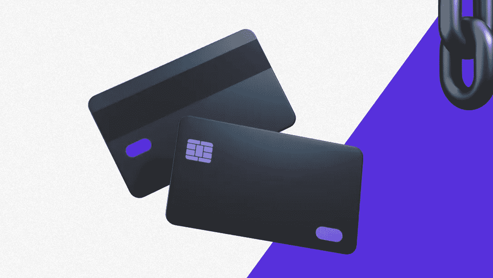

# 如何建立加密钱包

> 原文：<https://medium.com/coinmonks/how-to-build-crypto-wallet-90915a20ce7f?source=collection_archive---------36----------------------->

在世界各地，加密资产的普及正在快速增长。

与过去几年相比，加密货币的使用有所增加。因此，加密货币钱包应用正在成为交易者、投资者和创业公司的新趋势。

一个[加密货币钱包应用程序帮助交易者从一个钱包地址到另一个钱包地址存储、发送和接收他们的加密资产。](https://crypton.studio/blog/How-to-build-crypto-wallet)

# 为什么需要 De-Fi 加密货币钱包？

分散融资有许多优势，包括透明、自主、可用和没有第三方，这些优势已开始得到用户的赞赏。非保管钱包，如 DeFi 钱包，让您完全控制您的加密私钥。

在参与 DeFi 项目时，平台将只与钱包及其公共地址进行交互，不会透露任何个人数据。

# 开发最好的加密钱包需要什么？

*   创建加密钱包应用程序的策略和规划
*   开发和部署
*   技术工具
*   用户化
*   加密钱包应用程序的质量测试和发布

在这种情况下，您可以从区块链地区最好的加密货币钱包开发公司雇佣我们的区块链开发团队。

[Crypton Studio](https://crypton.studio) 是一家专注于区块链开发的 IT 公司。在全球市场 6 年的时间里，我们已经成为欧洲定制区块链开发领域最大的公司。从那时起，我们已经为来自 20 个国家的客户做了 100 多个不同的项目。

联系我们，让我们一起开始你的项目！

> 交易新手？尝试[加密交易机器人](/coinmonks/crypto-trading-bot-c2ffce8acb2a)或[复制交易](/coinmonks/top-10-crypto-copy-trading-platforms-for-beginners-d0c37c7d698c)