# 作为初学者，如何构建您的第一个区块链分析仪表板

> 原文：<https://medium.com/coinmonks/how-to-build-your-first-blockchain-analytics-dashboard-as-a-beginner-8d78bcb8d0ae?source=collection_archive---------4----------------------->

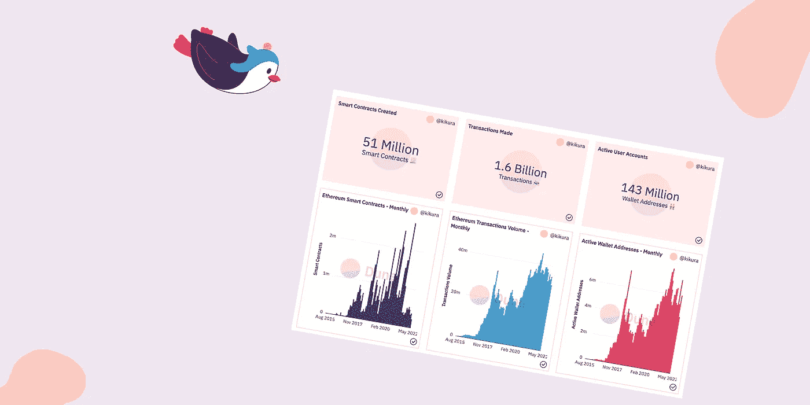

Illustration : [Sammy](https://icons8.com/illustrations/style--sammy) by [Icons 8](https://icons8.com/illustrations/author/zD2oqC8lLBBA)

如果你不熟悉以太坊或者 SQL 也没关系。您可以按照以下步骤构建仪表板。我希望这将激励你进一步探索区块链分析。

## 区块链数据

以太坊是一种支持智能合约执行的分散式协议。它是最受欢迎的区块链平台之一。每个节点存储区块链数据的完整副本。

但是，这些数据并没有以合适的方式存储，因此无法编写高效的搜索、过滤和聚合查询。许多数据提供商(Graph、Google Bigquery、Dune、Flipsidecrypto)正试图让分析师和研究人员能够访问数据。

Dune 是一个数据提供者/映射器，允许用户对区块链数据运行 SQL 查询。它解析来自节点的数据，并将其加载到 postgres 数据库中。它是免费的，但有一些限制。

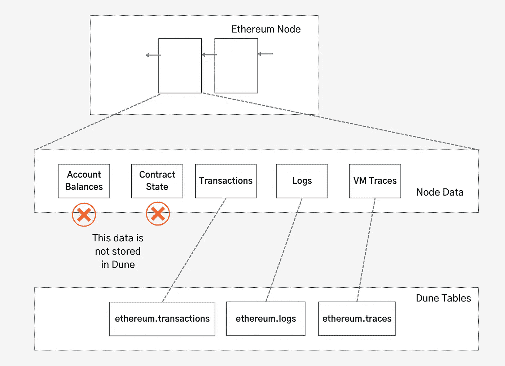

Dune base tables

在本文中，我们将尝试创建一个简单的仪表板来回答以下问题:

*   *以太坊网络中智能合约、交易和用户账户的总数。*
*   *随着时间的推移，它发生了怎样的变化？*

> 交易新手？尝试[加密交易机器人](/coinmonks/crypto-trading-bot-c2ffce8acb2a)或[复制交易](/coinmonks/top-10-crypto-copy-trading-platforms-for-beginners-d0c37c7d698c)

完成后，仪表板将如下所示:

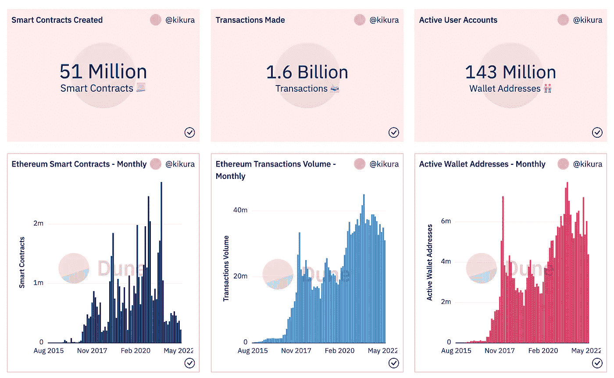

Dune dashboard

## 步骤 1:设置新的查询

导航至 Dune.com，启动如下所示的查询窗口。

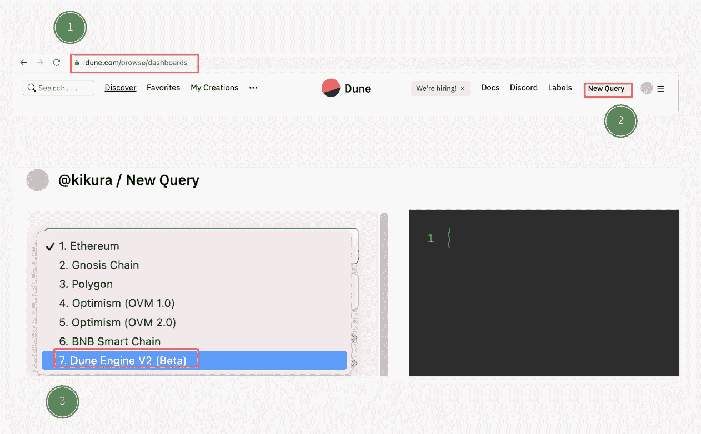

Dune Analytics Query Window

## 步骤 2:自开始以来创建的智能合同

智能合约是在分散网络中运行的代码行。

为了创建智能合约，以太坊虚拟机(EVM)执行创建操作码，该操作码被记录在 VM 跟踪中。我们可以通过扫描 CREATE 操作码的跟踪来找到契约创建事件。

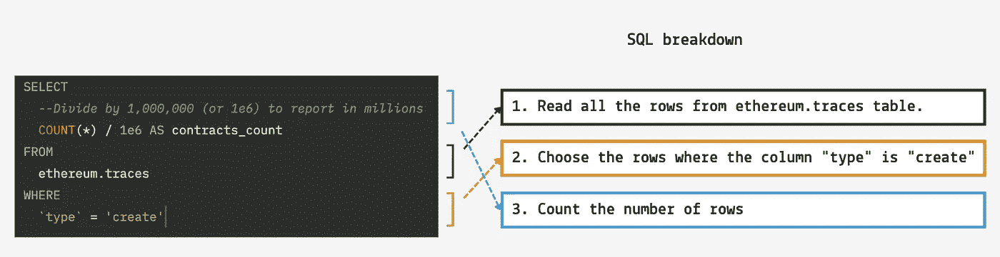

Source: [https://dune.com/queries/1024314](https://dune.com/queries/1024314)

将上述查询复制到新的查询窗口中并运行它。运行查询后，我们可以创建一个计数器图表来显示结果。

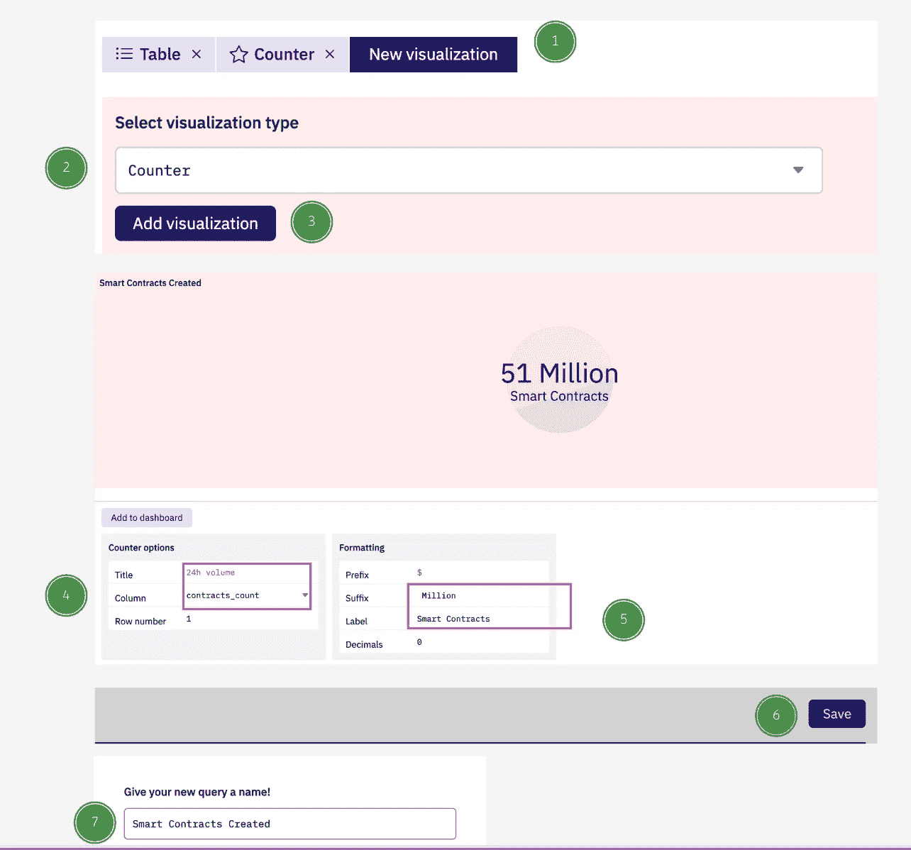

Steps to create smart contracts counter chart

## 第 2 步:截止日期处理的每笔交易

帐户余额或智能合约数据的任何更改都通过交易发生。交易由用户账户(称为 EOA 账户)触发，并在*以太坊.交易*表中捕获

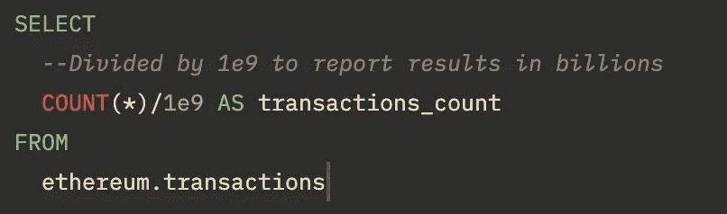

Source : [https://dune.com/queries/1028650/1774737](https://dune.com/queries/1028650/1774737)

关闭上一个查询窗口。基于上面的查询创建一个新的查询，和前面一样，为结果创建一个计数器可视化。最终的图表应如下所示:

Transactions counter chart

## 步骤 3:网络中的活跃用户

当用户发起交易时，用户地址被记录为交易数据的一部分。我们可以通过查看来自列的*的唯一值，列出所有至少交互过一次的钱包帐户。*

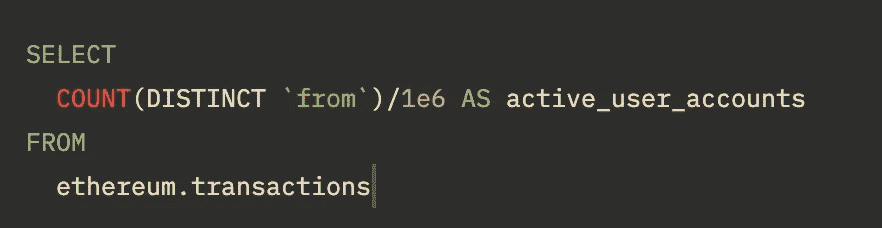

Source: [https://dune.com/queries/1030369/1783007](https://dune.com/queries/1030369/1783007)

让我们使用与之前相同的步骤制作计数器图表。结果将如下所示:

## **第 4 步:让我们创建第一个仪表板。**

启动新的仪表板。将在前面步骤中创建的查询添加到仪表板中。确保包括计数器图表而不是结果。下面详细说明了每个步骤。

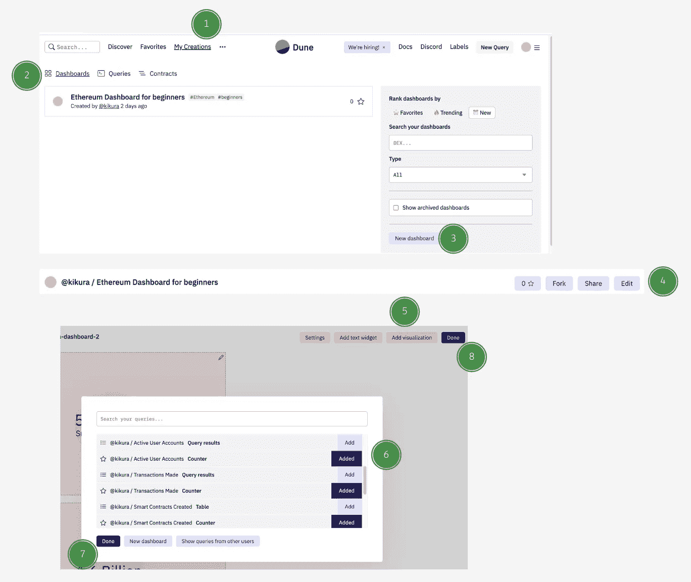

Steps to create Dune Dashboard

调整小部件的大小和位置，使它们都在同一行。

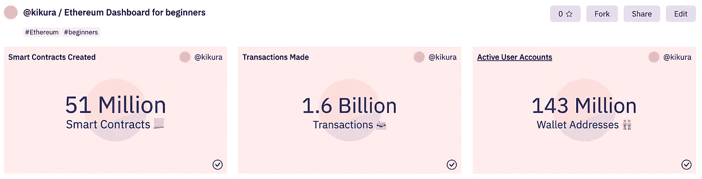

Dune Dashboard v1

## 第 6 步:让我们从智能合约开始，随着时间的推移检查上述数据。

上面的数字代表了以太坊成立以来的总数。它没有说明当前的趋势。

*   *智能合同部署有什么变化吗？*
*   *最近的熊市对用户活动有什么影响？*

要了解趋势，我们可以按月对数据进行分组。

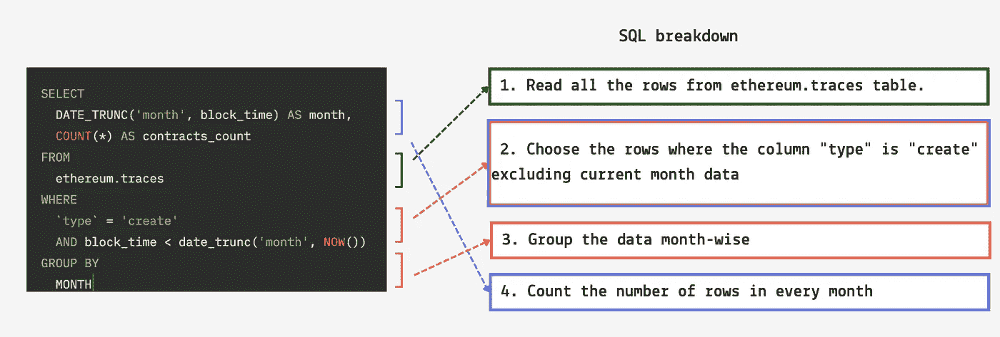

Source: [https://dune.com/queries/1034180/1783991](https://dune.com/queries/1034180/1783991)

打开一个新的查询窗口，执行上面的查询。然后，如下图所示，创建一个图表。

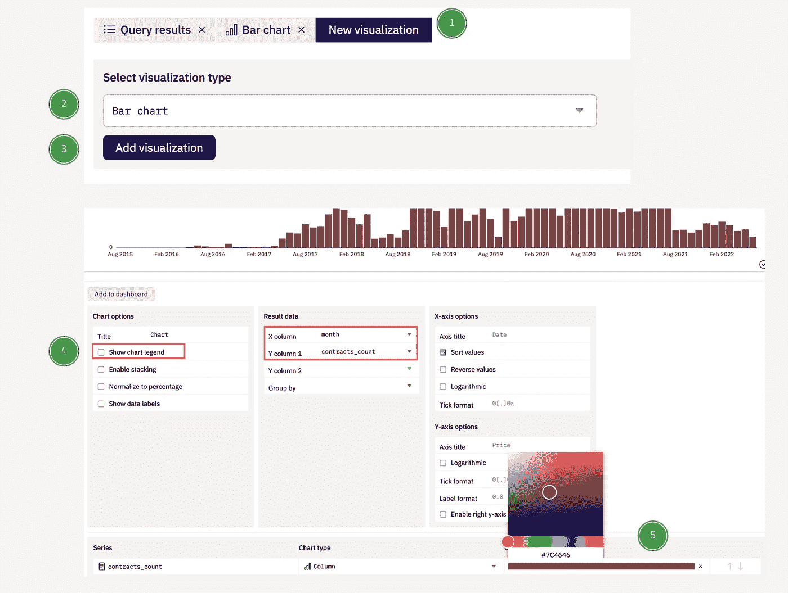

Steps to create bar chart

现在是时候按月对交易和用户帐户进行分组，并创建类似于上面所示的图表。

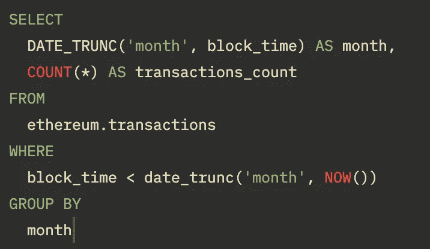

Source: [https://dune.com/queries/1033605/1783099](https://dune.com/queries/1033605/1783099)

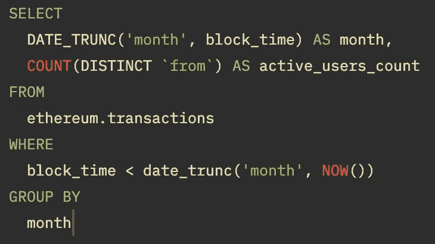

Source: [https://dune.com/queries/1034273/1784088](https://dune.com/queries/1034273/1784088)

最后，和步骤 4 一样，将上面创建的三个图表添加到仪表板中。

我希望你的仪表板现在看起来像这样或者更好。

Dune Dashboard — [Ethereum basic metrics](https://dune.com/kikura/ethereum-dashboard-beginners)

现在，使用文本小部件，添加您的评论来解释您观察到的内容。

保存仪表板，向世界展示您的成就！

## 常见问题

1.  *为什么我的查询失败或耗时太长？*

*请确保您使用的是步骤 1 所示的“沙丘引擎 V2”。*

*2。我可以下载数据做进一步分析吗？*

*很遗憾，Dune 不允许我们在免费账户中下载。人们可以升级他们的计划来启用下载选项。*

*3。接下来是什么？*

*我们将通过调查交易、天然气价格和代币标准来深入研究以太坊。注意这个空间。*

## 参考

1.  *以太坊总览仪表盘由*[*hildobby*](https://dune.com/hildobby/Ethereum-Overview)*组成。*

我希望这篇文章对你开始使用区块链分析有用。如果您有任何问题或意见，请随时联系我们。 [*推特*](https://twitter.com/kirubakumaresh) *|* [*领英*](https://www.linkedin.com/in/kirubakumaresh/)

> 加入 Coinmonks [电报频道](https://t.me/coincodecap)和 [Youtube 频道](https://www.youtube.com/c/coinmonks/videos)了解加密交易和投资

# 另外，阅读

*   [OKEx vs KuCoin](https://coincodecap.com/okex-kucoin) | [摄氏替代度](https://coincodecap.com/celsius-alternatives) | [如何购买 VeChain](https://coincodecap.com/buy-vechain)
*   [ProfitFarmers 回顾](https://coincodecap.com/profitfarmers-review) | [如何使用 Cornix 交易机器人](https://coincodecap.com/cornix-trading-bot)
*   [如何匿名购买比特币](https://coincodecap.com/buy-bitcoin-anonymously) | [比特币现金钱包](https://coincodecap.com/bitcoin-cash-wallets)
*   [瓦济里克斯 NFT 评论](https://coincodecap.com/wazirx-nft-review)|[Bitsgap vs Pionex](https://coincodecap.com/bitsgap-vs-pionex)|[Tangem 评论](https://coincodecap.com/tangem-wallet-review)
*   如何使用 Solidity 在以太坊上创建 DApp？