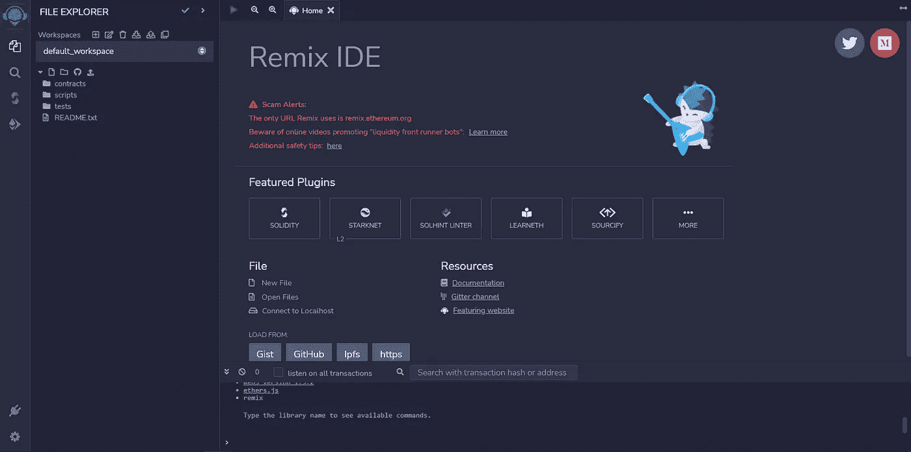
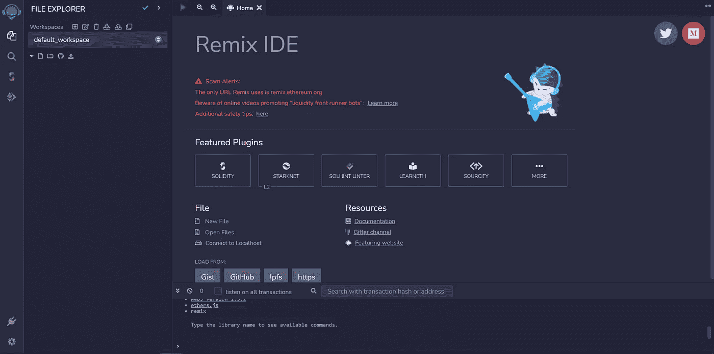
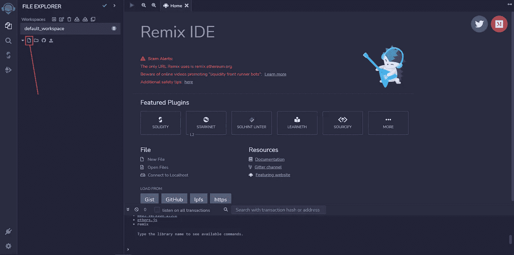
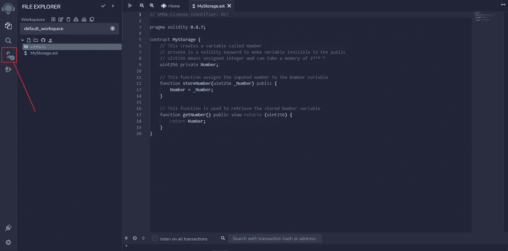
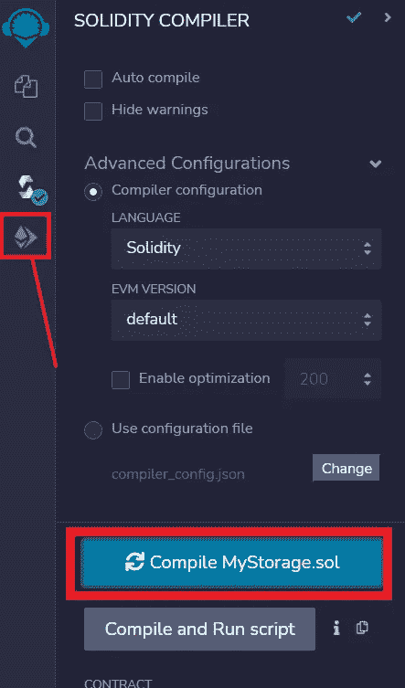
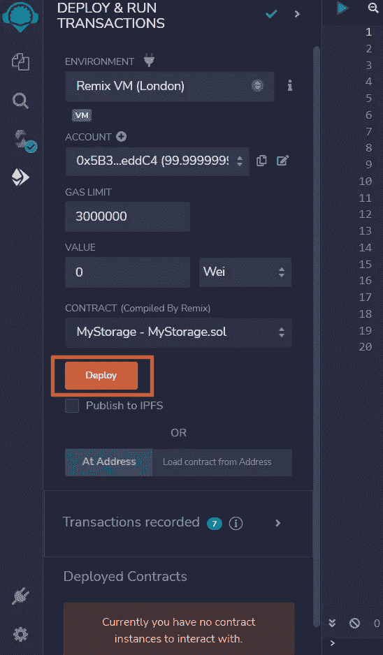
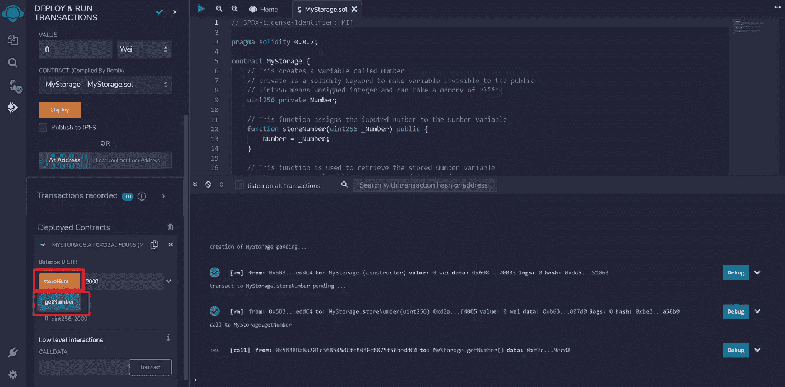

# 如何用 Solidity 建立你的第一份智能合同

> 原文：<https://medium.com/coinmonks/how-to-build-your-first-smart-contract-with-solidity-feca18eadeda?source=collection_archive---------26----------------------->

Photo by [Emmanuel Edward](https://unsplash.com/@tbonz?utm_source=medium&utm_medium=referral) on [Unsplash](https://unsplash.com?utm_source=medium&utm_medium=referral)

智能合约是在满足预定义条件时在区块链上运行的程序。因为它们运行在区块链上，所以一旦部署就不可改变，不能更改。在本文中，您将学习如何构建您的第一个智能合约，并将其部署到本地网络。

# 什么是扎实？

Solidity 是一种面向对象的高级语言，用于开发智能合约。它是静态类型的，支持继承，设计目标是以太坊虚拟机(EVM)。

# 先决条件

要学习本教程，您需要

*   对编程语言的基本理解
*   混合 IDE

Remix 是一个在线集成开发环境(IDE ),用于原型开发、开发和部署智能合约。

# 你将建造什么

在本教程中，您将构建一个简单的存储契约，您可以在其中写入和存储一个数字，例如 50000。这是为了帮助你熟悉 Solidity 及其语法。

# 设置开发环境

1.  前往[混音](https://remix.ethereum.org/)

在那里你会看到一个像下面这样的页面

2.右键单击所有文件夹和文件以删除它们

删除后，您应该有一个如下所示的空白工作区

3.点击文件图标，创建一个名为 **MyStorage.sol** 的新文件

# 构建合同

## 声明合同结构

创建了名为 **MyStorage.sol 的文件后，**将下面的代码复制到文件中

在上面的代码中；

*   第 1 行声明了契约的许可权限。这意味着代码是开源的，并得到了麻省理工学院的许可。
*   第 3 行声明了您正在使用的 Solidity 版本(v0.8.7)。需要注意的是，Solidity 的最新版本是 v0.8.17
*   在第 5 行，您用名称 **MyStorage** 声明契约

## 契约逻辑

在这里，你想要；

*   将输入存储在名为 Number 的变量中
*   将输入写入合同存储器的功能
*   将输入写入合同存储器的函数

在你的混合集成开发环境中，你的代码应该类似于下面

## 编制合同

编译您刚刚创建的合同；

1.  点击**下方的图标搜索**图标

2.点击**编译 MyStorage.sol** 按钮，然后点击屏幕左侧的**最后一个图标**

# 部署合同以重新混合虚拟机

在当前屏幕中，保留默认参数，并单击黄色的**部署**按钮。这是您的合同被部署到 Remix IDE 的本地虚拟机的地方。

一旦您的合同部署完毕，您将能够在**已部署合同**选项卡中与合同进行交互。

## 与已部署的合同交互

*   输入您希望储存在合同中的号码，然后点击黄色的**储存号码**按钮
*   点击**获取号码**按钮**获取你刚刚存储的数值**

如果您能够正确地存储和检索这些值，那么您的契约就会运行良好。

# 结束语

值得注意的是，当与 Remix VM 这样的本地网络交互时，帐户会自动附带测试以太网(100 ETH)来执行交易和部署您的合同。当使用像 Goerli 这样的 testnet 时，您需要批准从水龙头中获得的测试以太网的交易。

# 结论

恭喜你走到这一步。您学习了如何为智能合约开发设置 Remix 并构建您的智能合约。此外，您还学习了如何部署您的契约并与之交互，以确保它按预期工作。

我确信这篇文章为您提供了指导，并帮助您建立了一个明智的合同。

干杯🥂

> 交易新手？试试[密码交易机器人](/coinmonks/crypto-trading-bot-c2ffce8acb2a)或[复制交易](/coinmonks/top-10-crypto-copy-trading-platforms-for-beginners-d0c37c7d698c)