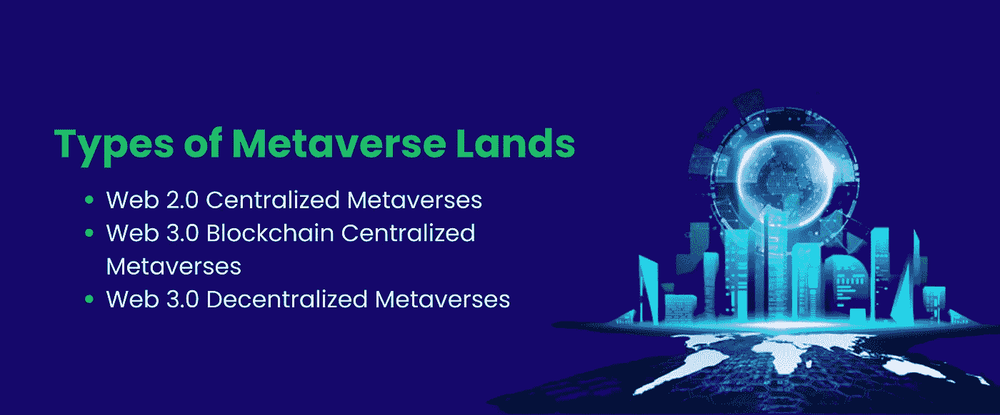
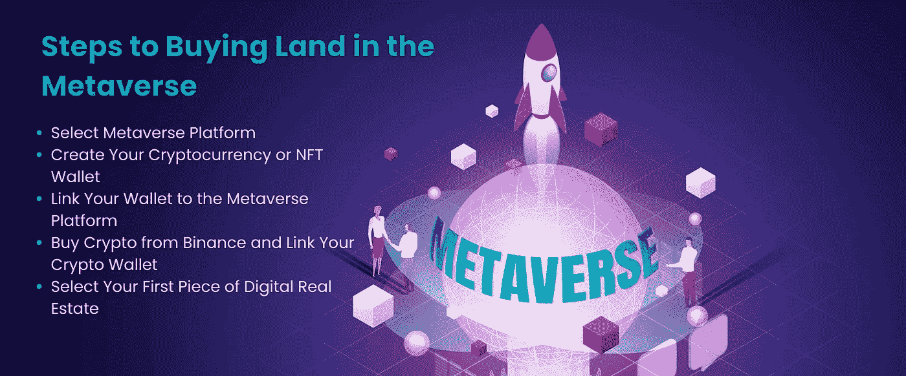
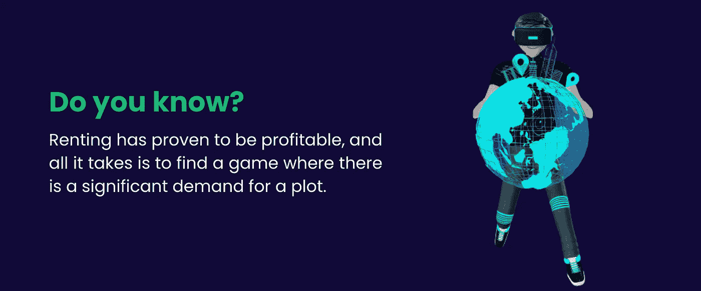

# 如何在元宇宙买地——房地产的未来

> 原文：<https://medium.com/coinmonks/how-to-buy-a-land-in-metaverse-the-future-of-real-estate-33ea4cfc2085?source=collection_archive---------44----------------------->

元宇宙的技术发展势头强劲，将我们带入了一个数字化互联的新时代。自从脸书将自己重新命名为“Meta”以来，世界已经开始探索这种古怪的新技术革命因此，在元宇宙有很多投资房地产和拥有虚拟土地的机会。如果你想知道如何在元宇宙买地，这篇文章是必读的！

## 什么是元宇宙土地？

术语“元宇宙”结合了“元”和“诗”两个词。Meta 的意思是“超越现实或一种想象”，Verse 的意思是“世界”。元宇宙是一个虚拟世界，它允许用户进行交互、社交和创作，而无需实际置身其中。创作者可以通过收取访问费或交易 NFT 来赚钱。

目前，元宇宙正在经历一个不断增长的房地产市场。很多人都在占便宜，因为太早了。名人买房是为了让粉丝参观，品牌创建商店是为了加价销售产品，企业买卖房产是为了赚钱。

成千上万的人正在创造虚拟世界，这将很快非常普遍。他们计划从出售新元宇宙的土地开始，玩家可以拥有这一新的现实。

## 在购买元宇宙房产之前，你需要什么？

你不必购买真正的土地。相反，你可以购买数字房地产，一种只存在于虚拟世界的在线财产。但为此，你应该获得像法力、以太或沙子这样的加密货币。这里有一个例子，说明了虚拟现实平台是如何工作的，以及在元宇宙购买土地之前你需要得到什么；

## 分散土地:

分散土地是第一个运行的虚拟现实区块链平台，用户可以买卖土地或相互交易。

## 加密货币:

该平台有其加密货币 MANA，并将其作为主要的支付形式。该平台有一个独特的现实世界的基础设施，用户也可以定制。一旦你学会了如何在元宇宙购买土地，你就可以检查它的价值，以增加你赚钱的机会。

## 钱包:

元宇宙土地交易的记录类似于 NFTs 和数字资产。虚拟钱包存储您的代币，并允许您进行数字交易。例如，Metamask 和币安是用户用来保护数字资产安全的最常用的钱包。

如果你需要为你的元宇宙分散融资， [BloxBytes](https://bloxbytes.com/) 可以提供帮助，但在你决定之前，让我们看看一个关于获得元宇宙土地的快速指南；

## 在元宇宙购买土地的 5 个步骤

## 1.选择平台:

选择值得信赖和正确的平台来拥有虚拟土地是至关重要的。它会显著影响您的投资和整体成功。有各种各样的虚拟房地产平台，他们给出了在元宇宙购买土地的指导方针。你可以在一级和二级市场购买地块。虽然有许多平台，但一些最好的平台包括:

分散土地:

该平台位于以太坊区块链，使其能够创建新的代币和智能合约。NFT 是新的代币，代表分散平台上的一块虚拟土地。

沙盒:

一个平台目前持有所有平台的一半以上的包裹。通过增加每处房产的人口和价格，这一新平台将使土地重新成为人们关注的焦点，并使其更适合作为投资。

NFT 世界:

一个平台，让用户根据链上数据的资源信息完全控制他们获得的世界和实际所有权。每个玩家都可以生成他们的土地及其特征。

## 2.隐体诗

一个令人兴奋的充满智慧和信息的探索和学习的地方。地块可以从他们的网站上购买。gamer 考虑的主要因素是所有权、互操作性、生态系统和透明性，Cryptoverse 就是关于这些术语的。

创建您的加密货币或 NFT 钱包:

有许多不同的钱包用于存储您的数字令牌和资产。MetaMask、trust wallet 和 Venly 就是一些例子。选择一个平台，并确保它与您要使用的钱包兼容！

将您的钱包与元宇宙联系起来:

每个元宇宙平台都有自己的注册方式；

*   首先，创建一个帐户
*   链接您的钱包

## 3.购买加密货币

首先注册一个像币安这样的市场。一旦你准备好探索或投资一个 ICO(初始硬币发行)，确保你的钱包里有足够的 ETH/SAND/MANA。

## 4.将它移到您的加密货币钱包中

你可以用你的币安账户用信用卡或借记卡购买一种合适的加密货币，然后把它从交易所转移到你的钱包里。

## 5.你的第一个数字房地产

决定拥有一块虚拟的土地？现在，你必须确定哪个包裹最有价值。然后，如果你的预算允许，你可以“出价”或者买下它。为物品出价时，您必须输入讲价金额。如果卖家接受你的出价，恭喜你！你现在拥有一项虚拟资产。

## 投资元宇宙房地产的好处

1.  可以为特定位置创建和控制虚拟体验，包括静态 3D 内容、游戏和事件，如以化身(人的虚拟表示)为特征的音乐会或会议。
2.  市场所有者将允许你以分散的方式在其他用户之间交易你的土地。
3.  作为土地所有者，你可以控制用户进入你的世界后的体验。
4.  通过与您所在地区的广告商互动来赚取代币。

## 业主可以用他们的元宇宙土地做什么？

1.  参与构建、设计、举办活动以及为游戏玩家构建游戏。
2.  你可以成为一名房东，出租你在 NFT 的土地，获得可观的被动收入。
3.  出租和赚钱，而不必最终出售 NFT。

## 总结:

我们努力为您提供在元宇宙购买土地所需的所有信息，因为我们在本文中讨论了该过程的每个方面。你可能在想这项技术的未来会怎样。答案很简单；虚拟现实将比互联网或社交媒体更具沉浸感和耗时，这表明虚拟现实在大众娱乐中有很大的优势。如果你获得了你的元宇宙平台或者一个你想整合元宇宙的游戏，BloxBytes 可以帮你选择适合你的货币的协议。我们的区块链专家可以通过使用最新的技术堆栈将元宇宙集成到游戏中，并可以帮助您为您的元宇宙创建 Defi。

需要 Metafi 为你的元宇宙而战？用 [BloxBytes](https://www.linkedin.com/company/bloxbytes) 连接！

> 交易新手？试试[密码交易机器人](/coinmonks/crypto-trading-bot-c2ffce8acb2a)或者[复制交易](/coinmonks/top-10-crypto-copy-trading-platforms-for-beginners-d0c37c7d698c)