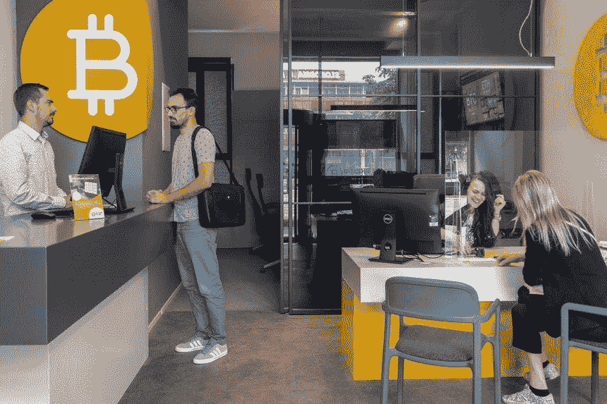

# 2022 年如何购买比特币和加密——如何设立币安账户

> 原文：<https://medium.com/coinmonks/how-to-buy-bitcoin-and-crypto-in-2022-how-to-set-up-a-binance-account-f58682aa9d6b?source=collection_archive---------22----------------------->

## 初学者开始密码之旅的 3 种方法

你可能想开始投资加密，但不知道如何做，那么这篇文章是给你的。我们将总结如何以安全便捷的方式推进您的加密之旅。

# 1.加密货币交易所

如果你想快速简单地开始，集中金融(CeFi)加密交易所将是最好的选择。他们通常有网络和应用程序版本，用户界面易于导航。以下是我个人使用的一些推荐的加密交换。

*   币安
*   比特币基地
*   FTX

这三家交易所是交易量和流动性最大的交易所。这类交易所的缺点是，它们需要了解你的客户程序(KYC)，因此你需要向平台提供个人信息和有效身份证件。由于法律和合规问题，CeFi 交易所仅限于某些地区，所以请务必检查交易所是否在您的国家提供服务。

## **在集中交易所购买密码的步骤**

> 我将以币安为例来说明这些步骤。

1.  **在 Web/App 上开户**

首先注册一个帐户使用应用程序使用链接[这里](https://accounts.binance.com/en/register?ref=359427632):[https://accounts.binance.com/en/register?ref=359427632](https://accounts.binance.com/en/register?ref=359427632)

Sign up with Phone/Email

您可以选择使用电子邮件或电话号码登录。这些信息将用于在您以后登录时向您发送验证码。

**2。为 KYC 提供信息并等待批准**

创建币安账户后，您必须填写 KYC 表格并扫描您的个人 ID 以解锁存款和交易功能。

Binance Identity Verification

你还需要进行面部验证。请注意，你不能戴帽子或眼镜，确保相机清楚地捕捉到你的脸。

**3。向您的账户转账**

你可以直接在交易所用信用卡购买，也可以进行 P2P 交易。你可以和其他人交易，以预先指定的价格购买 USDT 或 BTC。为了安全起见，一旦交易发生，币安将锁定卖家的密码，并在卖家收到你的法定货币后将密码发送到你的钱包。我大部分时间都在用它，它们提供了比用你的信用卡购买更好的价格和更少的交易费用。如果卖家没有释放你的硬币，你可以联系币安客服，他们会跟进。我建议你寻找交易量和成功率较高的卖家，这些统计数据都可以在 P2P 页面上看到。

币安也提供经过验证的卖家，但与其他 P2P 卖家相比，他们通常收取额外费用或更高的费率。

**4。在交易所购买密码**

在你买了需要的 USDT 后，你可以跳进现货交易，用 USDT 对(如 BTC/USDT)买密码。如果你直接用信用卡购买密码，你可以跳过这一步。你可以选择进行现货交易(即你拥有你购买的加密货币)，也可以进行保证金交易(即杠杆交易)，甚至可以交易跟踪基础加密货币价格的期货。

至于替代硬币，并不是所有的替代硬币都可以在大型交易所买到，所以你可能必须转移到像 Bybit 和 Kucoin 这样的小交易所。但我建议新手先尝试比特币，了解其令牌学和用例后再投资 Altcoins。敬请关注更多关于**山寨币**和**令牌经济学**的信息！！

然后你就可以开始你的秘密投资之旅了！

# 2.物理比特币 ATM 或无预约交易所

对于不喜欢 KYC 验证的人，你可以用现金直接从比特币 ATM 机或实物交易所**以略高于市场价的价格购买密码。这些交易所允许 18 岁以下且没有法律要求的购买者在交易时提供 KYC。**

我不建议在币安使用 P2P 功能购买 f2f 现金结算，因为那里是大多数诈骗和绑架发生的地方。如果你想避免 KYC，你最好去实物交易所购买。

Bitcoin ATM | Bitcoin Physical Walk-in Exchanges

# 3.链上指数

对于一直在学习区块链技术和 DeFi 的人来说，你可以在 chain 上设置一个热钱包来购买加密和比特币。您可以将在交易所(或从物理 ATM/交易所)购买的 USDT 转移到热钱包(如 metamask)，并将您的 USDT 交换到 wBTC(比特币的包装版本)或 DeFi 流动性池或其他 DApps(去中心化应用程序)中的其他密码。Uniswap 是一个很好的选择，它拥有大量的流动性和各种各样的池，在新的 v3 设置中，你也可以获得较低的滑点。许多连锁店都提供 Uniswap，您可以在他们的 UI 上探索它，对于其他连锁店，我会使用流动性更高的指数或 TVL 来减少滑点，DApps 的 TVL(锁定的总价值)可以在 [DefiLlama](https://defillama.com/) 上找到。

Uniswap Interface

# 结论

了解了所有这些购买 Crypto 的方式后，请提醒保持谨慎。秘密世界仍然不成熟，骗局总是发生。请继续关注避免这些加密陷阱的方法。

> *祝好运，注意安全！*

#

#

#

**在推特上关注**我:[https://twitter.com/tvstsang](https://twitter.com/tvstsang)

**跟着**我上媒:[https://medium.com/@tvstsang](/@tvstsang)

去看我关于**比特币底部指标**:[https://medium . com/coin monks/is-this-the-the-crypto-market-Bottom-5-important-Bottom-Indicators-for-bit coin-the-crypto-market-70 BC 5 f 20 f1 a 4](/coinmonks/is-this-the-crypto-market-bottom-5-important-bottom-indicators-for-bitcoin-the-crypto-market-70bc5f20f1a4)

去看我的[最新故事](/@tvstsang/celsius-network-crash-what-happened-to-celsius-network-adc363387c21)关于**比特币价格预测&技术分析**:[https://medium . com/@ TVs tsang/best-bit coin-fundamental-Technical-Analysis-in-2022-bear-and-bull-case-for-cryptocurrency-c 72 cdfbecddc](/@tvstsang/best-bitcoin-fundamental-technical-analysis-in-2022-bear-and-bull-case-for-cryptocurrency-c72cdfbecddc)

去看看我的故事吧，关于**摄氏度发生了什么**以及**阿拉米达研究**如何在其中发挥作用。:[https://medium . com/@ TVs tsang/celsius-network-crash-what-happed-to-celsius-network-ADC 363387 c 21](/@tvstsang/celsius-network-crash-what-happened-to-celsius-network-adc363387c21)