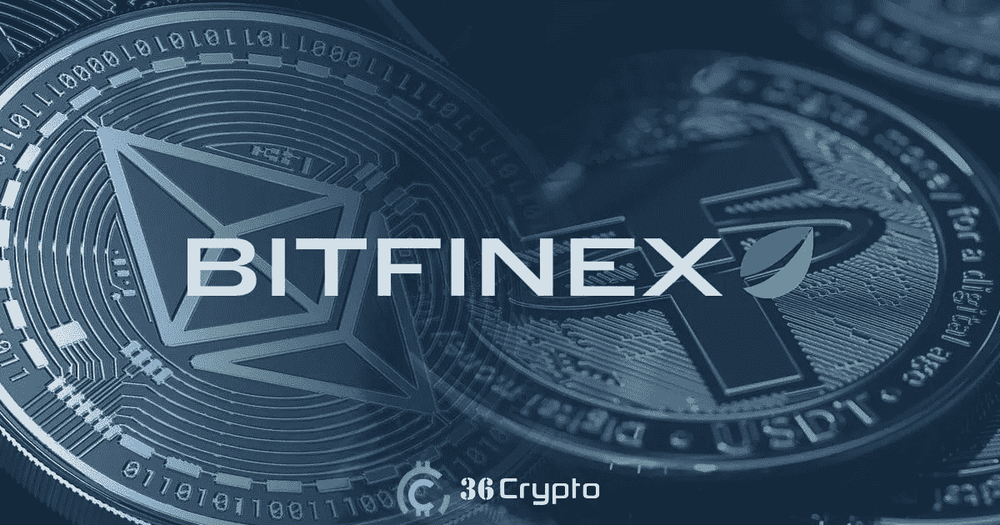
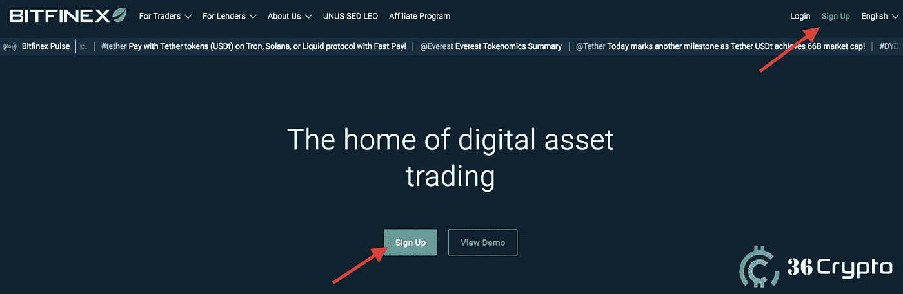
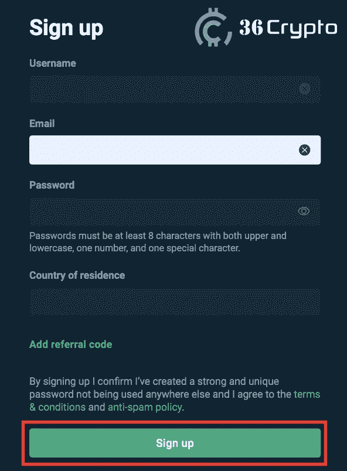
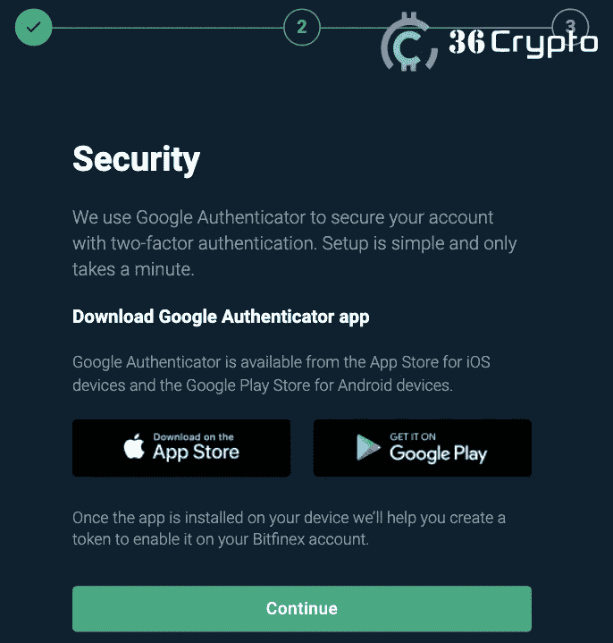
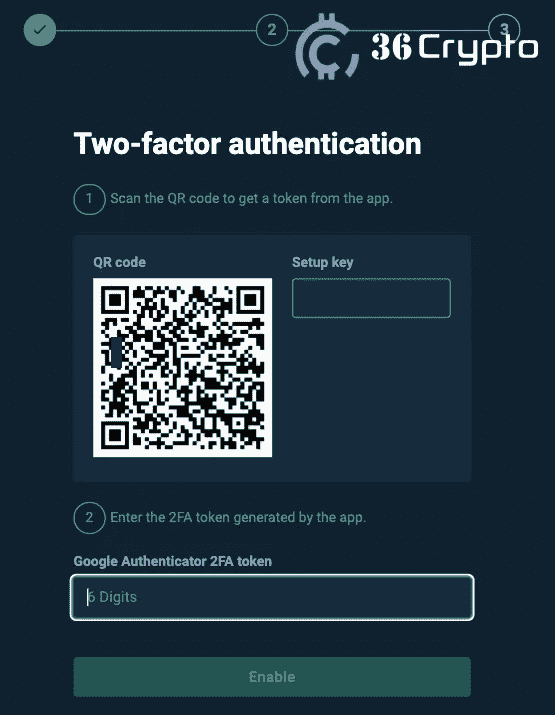
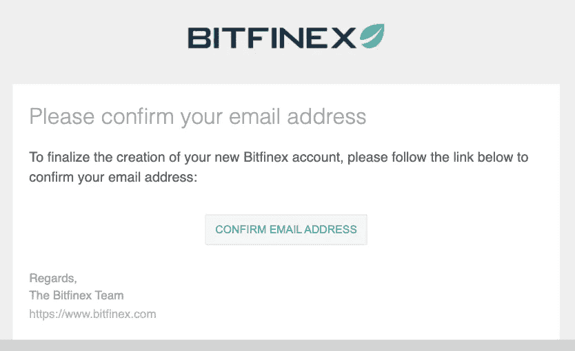
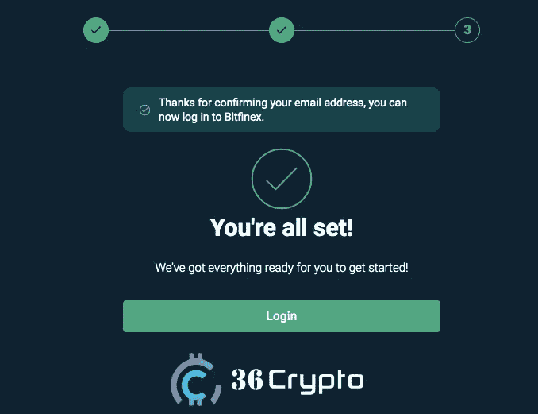

# 如何在 Bitfinex 上购买加密货币—分步指南— 36Crypto

> 原文：<https://medium.com/coinmonks/how-to-buy-cryptocurrency-on-bitfinex-a-step-by-step-guide-36crypto-de31e10f3079?source=collection_archive---------34----------------------->

加密货币正在缓慢但肯定地成为一个家喻户晓的词，人们对这一现象的兴趣开始与日俱增。作为新手，你可能听说过一个名为 Bitfinex 的[加密货币交易所](https://36crypto.com/the-best-cryptocurrency-exchanges-in-2022/)，并且你想知道[如何从该平台购买 crypto](https://36crypto.com/cryptocurrency-investment-best-coins-to-buy-in-2022/) 。

加密市场认为 Bitfinex 是交易量最大、最先进的交易所之一。许多经验丰富的交易者已经将 Bitfinex 作为他们买卖加密货币的首选交易所。

万一你是第一次看到**加密货币兑换**这个词，不知道是什么；一个[加密货币交易所](https://36crypto.com/what-is-a-cryptocurrency-exchange/)是一个在线平台，在这里你可以买卖和交易加密货币。交易所通常在其市场中列出许多加密货币，并支持交易对。阅读更多关于[什么是加密货币交易所](https://36crypto.com/what-is-a-cryptocurrency-exchange/)的信息。

交易对允许用户将一种加密货币交易或交换为另一种加密货币，而无需先将其中任何一种货币交换为法定货币。交易最频繁的加密对是世界领先的加密货币比特币和市场上最受欢迎的稳定币 USDT。

Bitfinex 由 iFinex Inc .拥有和运营，于 2012 年在香港成立，此后发展成为市场上最常用的加密交易所之一。Bitfinex 对初学者来说不是很友好，但是如果你找到了解决方法，它对用户来说是友好的。了解更多关于我们的 [Bitfinex 评论 2022](https://36crypto.com/bitfinex-review-2022/) 帖子。

# Bitfinex 核心功能

Bitfinex 平台上提供的一些功能会让你考虑使用它们。这些功能列举如下:

*   保证金融资
*   保证金交易
*   Bitfinex 的场外交易市场
*   交易所交易
*   衍生品交易
*   票据交易
*   用信用卡/借记卡购买加密货币

你可以在这里阅读更多关于这些 [Bitfinex 特性](https://36crypto.com/bitfinex-review-2022/) [的信息。](https://36crypto.com/bitfinex-review-2022/)

# Bitfinex 上可用的加密货币交易对

加密货币对允许在不使用法定货币或当地货币的情况下对每个加密资产进行估价和估计。使用 [**加密货币交易对**](https://36crypto.com/top-8-cryptocurrencies-to-invest-in-october-2022/) 的原因之一是降低交易费用。

如果交易对不存在，您可能需要使用两个或更多交易对来获得所需的加密货币。因此，交易对的可用性是有利的，在有好的交易对的平台上交易是非常必要的。以下是 Bitfinex 交易所[提供的一些交易对。](https://36crypto.com/bitfinex-review-2022/)

*   **BTC/USDT**
*   **瑞士联邦理工学院/BUSD**
*   **XRP/USDT**
*   **阿达/USDT**
*   **圆点/USDT**
*   **戴/ETH**
*   **TRX/瑞士联邦理工学院**
*   **马蒂奇/BTC**
*   总督/BTC
*   **IOTA/BTC**
*   **EOS/ETH**

点击查看更多 [Bitfiniex 交易对](https://www.bitfinex.com/) [。](https://www.bitfinex.com/)

# 如何在 Bitfinex 上注册和创建帐户

就像其他加密货币交易所一样，你必须在平台上注册并创建一个账户，然后才能开始购买、出售或交易加密货币。在 Bitfinex 上创建一个帐户是一个简单的过程，你可以在几分钟内完成。

Bitfinex 并非在所有国家都可用，因此检查并浏览他们的[使用条款和条件](https://www.bitfinex.com/legal/exchange/terms)以了解您是否有资格根据您的居住国使用该平台非常重要。

幸运的是，Bitfinex 在全球超过 52 个国家可用。他们的服务在除美国、孟加拉国、玻利维亚、厄瓜多尔和吉尔吉斯斯坦之外的大多数国家都可用。根据 Shetcoiner 上的一篇帖子，Bitfinex 在美国不可用的原因之一是因为它需要提供许多法律要求，而他们没有，而且在美国使用 VPN 无法访问交换平台。

下面是注册 Bitfinex 的分步指南:

*   **访问位于[https://www.bitfinex.com/](https://www.bitfinex.com/)的 Bitfinex 网站**，找到主页右上角的注册按钮。注意:为了避免被骗，请确保检查链接，并确保您在 Bitfinex 网站上。

*   **在注册页面上输入您的详细信息:**注册所需的一些详细信息包括一个*用户名*、一个*电子邮件地址、*和一个*密码。*进一步从下拉列表中选择您的居住国，如果您有推荐代码，请输入。点击注册按钮。

*   **启用谷歌双因素认证器:** 2FA 是额外的安全层，用于[保护你的账户免受黑客攻击](https://36crypto.com/crypto-scammers-hack-british-armys-youtube-and-twitter-account/)。您必须启用它。

*   点击继续按钮，配置**双因素认证**

*   **确认你的邮箱地址**:打开你用来注册账户的邮箱，你会发现一封来自 Bitfinex 的邮件，里面有一个**验证链接**。点击“确认电子邮件地址”继续。

*   **一切就绪:**在确认您的电子邮件地址后，当您返回注册页面时，您应该会看到一条消息，显示一切就绪，您可以继续了。点击登录按钮开始使用您的新帐户。

# 如何在 Bitfinex 上购买加密货币

## [在这里继续阅读](https://36crypto.com/buy-cryptocurrency-on-bitfinex-a-beginners-guide/)

你喜欢阅读我们带给你的内容吗？如果是，请点击“**拍手**按钮，增加其他人看到这个帖子和了解到这个帖子的机会。

你最多可以鼓掌 50 次。你还在等什么？马上按下那个按钮。感谢您的阅读。

# 阅读更多信息:

## 【2022 年 10 月你应该投资的 8 种加密货币

## [现在投资 7 种最佳 Web 3.0 加密货币](/coinmonks/top-7-web-3-0-cryptocurrencies-to-invest-in-right-now-a14ae756a37b?source=user_profile---------1----------------------------)

*原载于 2022 年 10 月 14 日***。**

> *交易新手？尝试[加密交易机器人](/coinmonks/crypto-trading-bot-c2ffce8acb2a)或[复制交易](/coinmonks/top-10-crypto-copy-trading-platforms-for-beginners-d0c37c7d698c)*