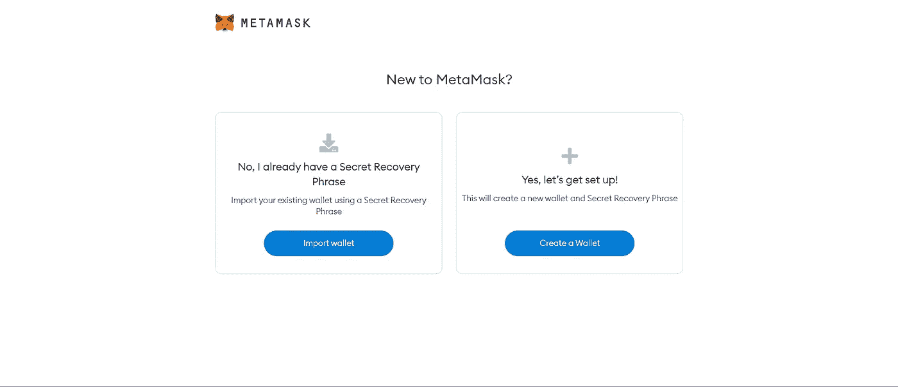
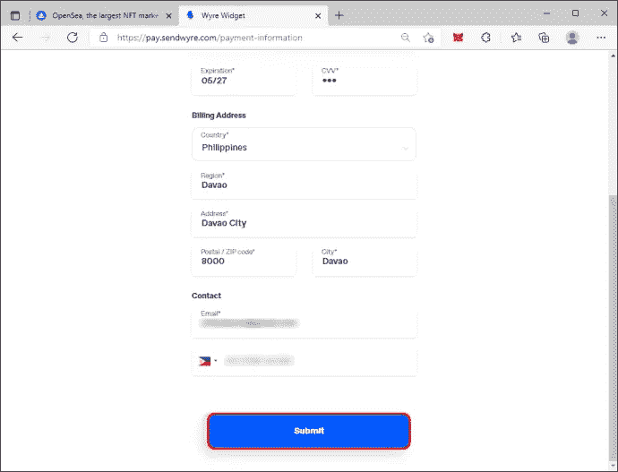

# 如何在 OpenSea 上购买你的第一个 NFT——初学者指南

> 原文：<https://medium.com/coinmonks/how-to-buy-your-first-nft-on-opensea-a-beginners-guide-289db6a9d395?source=collection_archive---------33----------------------->

不可替代代币 NFT 多年来越来越受欢迎。随着加密货币的福音每天都在传播，NFT 也在传播。2021 年为 NFT 市场带来了一个新的阶段，OpenSea 是让购买加密资产变得容易的主要参与者之一。

2021 年进行了几次高调的销售和艺术拍卖，这引起了人们对该项目的浓厚兴趣。如果你仍然不熟悉什么是 NFT，[查看我们以前的帖子](https://36crypto.com/nftnon-fungible-token/)，获得全面的知识。

Opensea 现在是 T4 买卖 NFT 的顶级市场之一。它于 2017 年推出，自那以来，一直是最广泛接受的市场，支持 150 多种不同的支付令牌。

尽管它很受欢迎，人们仍然不是很清楚，对于如何去做仍然有很多困惑。在这篇文章中，我仔细地描述了如何从知名平台购买 NFTs 的步骤。

在开始使用 opensea 之前，您必须下载 Metamask，这是一个加密钱包，允许您快速购买加密和其他令牌。在你的浏览器中安装这个是你迈向 NFT 之旅的第一步。

# 如何安装 Metamask Wallet

可以从 opensea 网站安装 MetaMask。请遵循以下步骤:

1.访问 [OpenSea 网站](https://opensea.com/)，点击主页右上角的个人资料图标。

2.从下拉列表中选择“个人资料”选项。在下一页中，选择“MetaMask ”,然后将必要的扩展下载到您的浏览器中。

3.选择您的浏览器，然后单击页面上的“安装元掩码”选项。稍等片刻，等待安装过程完成，然后将显示“欢迎使用 MetaMask”页面。单击下面的“开始”按钮。

4.使用 MetaMask 之前，请阅读、理解并同意条款和条件。

5.由于您是 MetaMask 的新手，接下来您应该选择“创建钱包”，然后设置您的密码。将它写在安全的地方，确保不要共享，因为它是帐户的备份。

6.在下一页，点击“下一步”,然后选择您的机密短语。

7.正确排列短语后，单击“确认”按钮。下一页将加载显示“祝贺。”

8.单击下面的“全部完成”按钮，如果弹出窗口告诉您交换令牌，请单击“X”。

9.回到 opensea 网站，在主页上选择“创建”。这将带您回到列出元掩码的页面。只需点击“MetaMask ”,然后选择“下一步”,即可将您的钱包与您的 opensea 帐户关联起来。

祝贺您安装了 MetaMask 钱包。下一件你想做的事是在我们继续购买 [NFTs](https://36crypto.com/nftnon-fungible-token/) 之前购买 ETH。

# 如何购买 ETH

1.打开你的浏览器，点击新安装的 MetaMask 扩展，可以在你的浏览器的右上角看到。

2.如果您的其他钱包中已经有 ETH，如或其他钱包，请选择“直接存入 ETH”。

3.在下一页，点击“继续交易”按钮，选择您想购买的 ETH 数量。注意:每次购买都需要支付交易和网络费用，因此建议购买大量 ETH 以避免支付额外费用。

4.在下一页选择首选付款方式，然后单击“下一步”

5.添加您的付款信息和电话号码，然后点击“提交”

6.检查你的手机支付验证码，输入并选择“提交”

7.通过输入六位数字代码来授权您的购买，以便进行待定的 Wyre 转帐。

8.几分钟后，您的余额将反映在您的 MetaMask 钱包中。

现在，您已经安装了 MetaMask 钱包并购买了一些 ETH，是时候购买您的第一台 NFT 了。

# 如何在 OpenSea 上购买 NFT

1.  打开浏览器，访问 [OpenSea 市场网站](https://opensea.io/)。
2.  浏览平台，寻找你想要的 [NFT](https://36crypto.com/nftnon-fungible-token/) (假设你已经有了你想要购买的特定产品)。
3.  点击“立即购买”按钮。
4.  通读并同意平台的条款和条件，然后选择“结帐”您将看到 MetaMask 扩展中的一个下拉菜单，允许您查看您的购买价格以及相应的汽油费。燃气费取决于网络活动。

祝贺你购买了你的第一个 NFT。

要知道，就像一个加密骗局，有很多 NFT 骗局，你应该知道。阅读这篇文章，了解[常见的 NFT 骗局和避免它们的方法](https://36crypto.com/common-nft-scams-and-8-ways-to-avoid-them/)。

最初发布于 [36crypto](https://36crypto.com/how-to-buy-your-first-nft-on-opensea-a-beginners-guide/) 。

> 交易新手？试试[加密交易机器人](/coinmonks/crypto-trading-bot-c2ffce8acb2a)或者[复制交易](/coinmonks/top-10-crypto-copy-trading-platforms-for-beginners-d0c37c7d698c)