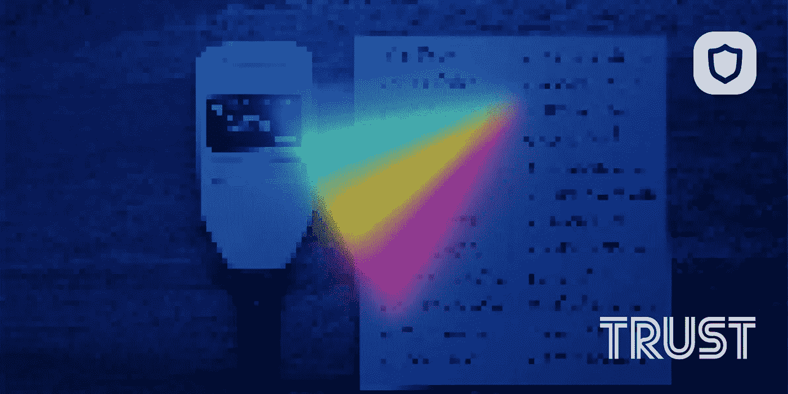

# 如何检查信任钱包中的种子短语

> 原文：<https://medium.com/coinmonks/how-to-check-seed-phrase-in-trust-wallet-df5eb029c445?source=collection_archive---------2----------------------->

什么是信任钱包恢复短语？

私钥是加密数据，用于通过可共享的公共地址对交易进行签名。

种子短语作为一种人类可读的形式来声明您的多资产加密钱包的所有权。

如何在信任钱包应用程序中找到您的恢复短语

当您创建钱包时，系统会向您显示恢复短语。

尽管如此，您还可以访问

创建帐户后的恢复阶段

步骤 1:在手机上打开信任钱包

假设您的帐户已经设置好，并且

准备好了，你只需要打开

手机上的应用程序。

第二步:进入钱包设置进入屏幕右下角的“设置”，然后点击“钱包设置”由于您可以在信任钱包中拥有多个多硬币钱包，因此所有多硬币钱包都会显示在此处。

每个钱包都有不同的恢复短语

只需选择您想要访问的钱包

第三步:点击“显示恢复短语”

在那里，点击显示您的恢复短语的选项。

这个应用程序会给你一个合理的警告，提醒你丢失你的短语的含义，所以要注意

步骤 4:复制恢复短语

恢复短语后，您需要将它存储在某个安全的地方，这样您就不会失去对它的访问。

> 交易新手？试试[加密交易机器人](/coinmonks/crypto-trading-bot-c2ffce8acb2a)或者[复制交易](/coinmonks/top-10-crypto-copy-trading-platforms-for-beginners-d0c37c7d698c)

请注意，不仅 12 个单词很重要，而且它们显示给你的顺序也很重要。

专业提示:信任钱包允许用户为不同的交易访问多个钱包地址。虽然仅仅存储密码不需要支付信任钱包费用，但是跨不同的钱包进行交易确实需要支付费用。

点击这里，关注我们的更多故事[。](http://t.me/etellworld)

> *加入 Coinmonks* [*电报频道*](https://t.me/coincodecap) *和* [*Youtube 频道*](https://www.youtube.com/c/coinmonks/videos) *了解加密交易和投资*

# 另外，阅读

*   [Bookmap 点评](https://coincodecap.com/bookmap-review-2021-best-trading-software) | [美国 5 大最佳加密交易所](https://coincodecap.com/crypto-exchange-usa)
*   [加密交易机器人](/coinmonks/crypto-trading-bot-c2ffce8acb2a) | [造币评论](https://coincodecap.com/coingate-review)
*   最佳加密[硬件钱包](/coinmonks/hardware-wallets-dfa1211730c6) | [Bitbns 评论](/coinmonks/bitbns-review-38256a07e161)
*   [新加坡十大最佳密码交易所](https://coincodecap.com/crypto-exchange-in-singapore) | [收购 AXS](https://coincodecap.com/buy-axs-token)
*   [红狗赌场评论](https://coincodecap.com/red-dog-casino-review) | [Swyftx 评论](https://coincodecap.com/swyftx-review)