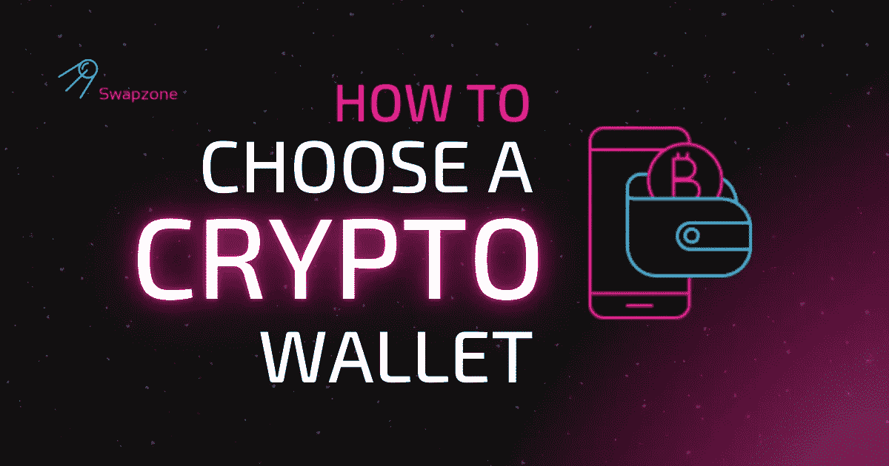

# 如何选择加密货币钱包？

> 原文：<https://medium.com/coinmonks/how-to-choose-a-cryptocurrency-wallet-95b378bc31ac?source=collection_archive---------31----------------------->

随着加密货币话题的流行，越来越多的人希望参与到这个领域中来。那么，如果你想成为加密社区的一员，但对现有的钱包类型了解不多，你该怎么做呢？在本文中，我们将引导您了解加密存储之间的主要差异及其优缺点。希望，在你继续与 [Swapzone](https://swapzone.io/) 交换密码之前，度过这个难关将有助于你做出最终决定，选择最好的服务来信任你的硬币。

# 软件加密货币钱包

软件钱包是属于“热门”存储类别的程序——它们中的大多数都与互联网相连。这些加密服务根据特定平台的用途被细分成不同的组，其中最重要和最流行的类型是 Web、桌面、移动和浏览器扩展钱包。

*   **网络钱包**
    网络钱包用于直接从浏览器访问区块链。不需要下载和安装任何程序——用户需要做的就是自己设置钱包。交易所钱包和特定的网络钱包提供商都属于这个分组。使用基于网络的钱包相当容易——你需要创建一个密码并保存备份。一些服务提供商代表用户操作密钥(保管服务)。对于开始加密货币之旅的用户来说，网络钱包是一个很好的选择，因为这些存储的界面通常不复杂，易于理解。此外，网络钱包通常提供额外的功能，如购买，交换，特殊功能，等等。
*   桌面钱包是一种需要下载并安装在电脑上的软件。桌面存储是非托管式的，用户可以控制私人密钥——备份存储在本地计算机上。通常的非保管服务使用注意事项适用于此版本的加密钱包的使用:确保密钥文件被正确存储并使用个人密码加密。选择运行该程序的计算机也必须没有恶意软件和病毒。
*   **移动钱包**
    作为一种正在兴起的类型，移动加密货币钱包是加密货币存储联盟的一个便捷补充。这些钱包很方便，因为它们允许在旅途中存取硬币，并使用 QR 码管理交易。移动加密货币钱包旨在解决采用问题——这些应用程序旨在用于日常交易和现实世界的加密货币支付。现在，移动钱包已经从过去几年的单一货币应用中取得了很大的进步——这些钱包现在拥有内置服务、附加功能和更多功能，以方便加密货币的使用。就像桌面版本一样，用户应该在创建钱包之前确保他们的智能手机上没有恶意软件。备份也要妥善保存，绝不与任何第三方共享。在手机之外的某个地方藏一份备份也很棒——以防手机被盗或损坏。我们都知道那是怎么回事。

软件加密货币钱包最知名的例子有 [Guarda Wallet](https://guarda.com/) 、 [Trust Wallet](https://trustwallet.com/) 、 [Atomic Wallet](https://atomicwallet.io/) 、 [Exodus](https://www.exodus.com/) 和 [NOWWallet](https://walletnow.app/) 。

# 离线加密货币钱包

加密货币钱包有多种形式。从一张纸到一个多功能的应用程序，它们都服务于一个目的——允许访问一个人的硬币，并使资金管理变得相当容易。这里有一些例子来说明现有的离线加密货币存储的种类。

*   **纸质钱包**
    纸质钱包实际上是一张纸，上面印有或写有加密货币地址和私钥。打印出来的二维码版本也是可以用来做交易的东西。当然，这种类型的钱包可以抵御通常在网上进行的攻击，但安全性肯定是有代价的。纸质钱包由于其众多缺陷而被认为是一种多余的加密货币存储选择。例如，如果存储在钱包中的金额的一部分需要花费，则必须将全部金额转移到其他类型的钱包中。当然，稍后零钱可以放回一个新的纸钱包，但有什么必要这么麻烦呢？此外，纸质钱包不可重复使用，请记住这一点，以防您选择这种存储方式。
*   **硬件钱包**
    硬件钱包正是“冷”存储段落想要说明的——设计用于离线存储加密货币的物理设备。密钥由随机数生成器创建，并离线存储在设备上。这种类型的加密钱包提供了更高的安全级别，但总体上比“热”存储选项更不友好。

硬件加密货币钱包最知名的例子是[总账](https://www.ledger.com/)、 [Trezor](https://trezor.io/) 和[芭蕾](https://www.balletcrypto.com/)(也是非电子的)。

# 选择加密货币钱包的提示

为了使选择加密货币钱包的任务稍微容易一些，我们收集了一份按存储类型划分的提示列表。在下一段中，你会发现一些关于你的加密习惯的信息——如果你与这些习惯有关，考虑选择“热”存储(基于网络的钱包或智能手机应用程序，取决于你的需求)。

*   **您存储的加密货币数量较少，并且经常使用**
    在线加密货币钱包对于那些经常进行加密交易的人来说要方便得多。选择可靠的服务(无论是 exchange“热”钱包还是免托管存储解决方案)、正确的平台和钱包提供商支持的货币。请记住，加密钱包现在比过去发展得多——如果你有好奇的心情，请尝试寻找额外的功能，如赌注或私人交易。
*   **你在寻找更好的 UX**
    正如我们在分解硬件加密货币钱包的基础的段落中已经说过的，“冷”存储通常缺乏用户友好性。如果你是一个重视产品良好体验的用户，那么转向“热门”钱包可能会更好——大多数服务提供商都付出了大量努力，尽可能使使用流程顺畅。
*   **你想要一个易于使用的钱包**
    与他人分享你的钱包数据是不安全的。然而，可以创建一个多重签名钱包来管理合作的加密资金。Multisig 钱包要求交易由多方签署，并且可以通过各种设备访问。
*   **你需要与他人共享钱包**(在这种情况下，选择多签名钱包)
    与他人共享你的钱包数据是不安全的。然而，可以创建一个多重签名钱包来管理合作的加密资金。Multisig 钱包要求交易由多方签署，并且可以通过各种设备访问。

如果上面提到的几点还不能让你想起什么，这里还有一些要考虑的。如果你认为自己是这种类型的加密货币用户，那么考虑“冷”存储选项可能是正确的。

*   **你用加密货币**
    储存了大量资金，就像任何其他有价值的资产一样，保证加密货币的安全至关重要。如果你是一个长期投资者，并且藏了大量的密码，把它放入“冷”储存是一个好主意。保持硬币离线带来了额外的一层安全，以及安心。
*   **你不需要经常访问你的钱包**
    硬件钱包需要更多的努力来访问资金——首先，你需要钱包设备本身，然后是用于管理加密货币、互联网连接等的计算机或智能手机。如果你正在交易现实世界的加密货币购买，硬件钱包可能会给你管理硬币的方式带来更多障碍，而不是增强安全性。
*   **你准备为设备本身付费**
    虽然大多数“热门”钱包都是在应用商店或服务提供商的网站上免费提供的，但硬件钱包需要购买。每台设备的价格可能会有所不同，所以我们建议在可靠的来源上检查每个选项(尝试 Trezor 或 Ledger 的官方网站)。如果你是加密货币的新手，还没有准备好投资钱包设备，你可以很容易地选择上面文章中提到的其他钱包选项。
*   **你关注的是金融隐私**
    线下加密货币存储从金融隐私的角度来说更可靠。如果您是一个关心匿名的用户，并且不真正依赖第三方服务来信任您的资金，硬件选项可能是您的正确选择！也就是说，硬件钱包(指的是设备，而不是纸质选项)仍然不是完全匿名的。

# 摘要

在本指南中，我们试图将目前存在的所有类型的加密货币存储集合在一起。从我们上面提到的所有要点可以看出，有几十种不同的加密货币钱包，选择一种合适的钱包可能是一项具有挑战性的任务。考虑到用户是负责将资金存放在安全地方的个人，首先评估你的钱包的目标是至关重要的。我们真心希望我们在这里收集的信息对您有用，并帮助您在进行[兑换](https://swapzone.io/)之前挑选您的第一个加密钱包。

> *加入 Coinmonks* [*电报频道*](https://t.me/coincodecap) *和* [*Youtube 频道*](https://www.youtube.com/c/coinmonks/videos) *了解加密交易和投资*

# 另外，阅读

*   [有哪些交易信号？](https://coincodecap.com/trading-signal) | [Bitstamp vs 比特币基地](https://coincodecap.com/bitstamp-coinbase) | [买索拉纳](https://coincodecap.com/buy-solana)
*   [密码交易机器人](/coinmonks/crypto-trading-bot-c2ffce8acb2a) | [维护审查](https://coincodecap.com/uphold-review)
*   [如何给 MetaMask 钱包添加 Arbitrum？](https://coincodecap.com/how-to-add-arbitrum-to-metamask-wallet)
*   [KuCoin vs 北海巨妖 vs BitYard](https://coincodecap.com/kucoin-vs-kraken-vs-bityard)
*   [加密交易的最佳 VPN](https://coincodecap.com/best-vpns-for-crypto-trading)