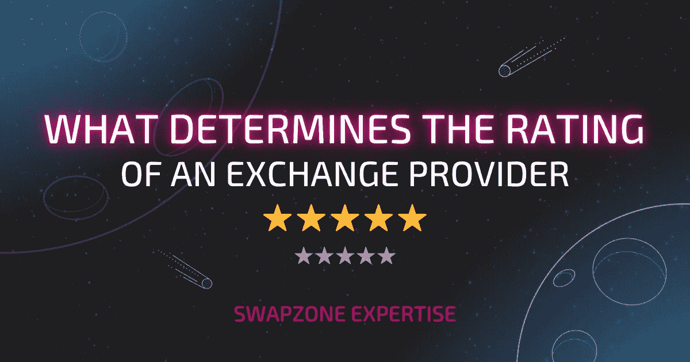

# 如何选择最佳交换提供商:Swapzone 专业知识

> 原文：<https://medium.com/coinmonks/how-to-choose-the-best-exchange-providers-swapzone-expertise-933888a0a846?source=collection_archive---------45----------------------->

在选择加密交换时，没有一个放之四海而皆准的解决方案，但是 Swapzone 已经为您做了所有的评估。在我们的供应商研究期间，你会看到通过实施一些基本技巧形成的评级:这可以帮助避免可能损害我们客户交易策略的潜在问题。在本文中，我们揭开了我们内部流程的帷幕，告诉您我们如何确定提供商在 Swapzone 上的评级，以便我们的客户总能获得最好的费率和服务。

# 可信的交换提供商:为什么它很重要？

毫无疑问，正如你所知，加密货币市场近年来呈爆炸式增长。截至 2022 年 9 月，所有硬币的总价值超过 9000 亿美元，但这并不意味着每个想投资的人都有能力这样做。事实上，根据估计的数据，只有 10%的美国人拥有或投资了 crypto 这意味着有很大的增长空间。但是，如何决定在哪里购买或交换硬币呢？像任何投资机会一样，交易所伴随着风险和回报。这就是为什么在决定哪家交易所提供商最适合您的需求时，仔细选择是值得的:从安全措施和用户体验到转账的速度和便利性(更不用说声誉了)，在为您的比特币或以太坊等加密货币投资选择交易所提供商时，您应该考虑许多因素。

现在轮到 Swapzone 了——为了缓解这一具有挑战性的过程，我们已经汇编和审查了领先的加密货币交易所，并通过评级、利率、交易时间、稳定性和资产多样性仔细评估了提供商。

# 交易所的声誉和合法性:在开始之前

评估过程甚至在交易所成为 Swapzone 上的合作提供商之前就已经开始了，我们确保它是合法合规的。在整合任何交易所之前，我们检查它们的条款和条件、用户协议和隐私政策。我们还检查交换提供商是否按照所有规定的规则获得许可。

此外，评估加密货币交易所时要考虑的最重要的因素之一是安全性。加密货币交易所是黑客的目标，他们想窃取用户的资金。因此，交易所采取措施保护用户资产非常重要。

如果不符合这些参数，则交换机**不能包含在 Swapzone 交换聚合器的提供商列表中**。

# 是什么决定了供应商的评级

在确定了交易所提供商的法律地位之后，我们在指定特定评级之前会检查其他几个因素。

# 用户体验:评论

用户体验对 exchange 提供商来说非常重要，因为它决定了用户对其服务的满意度。如果一家公司有糟糕的用户体验，那么它就会受到影响，因为在竞争激烈的加密领域，客户通常不会再次使用该平台。

确定交换提供商的用户体验是好是坏的最有指示性的方法是通过评论。你可以通过阅读我们网站上[【评论】](https://swapzone.io/reviews)部分的评论，了解人们对某个交易所的客户服务的看法。我们通过我们的提供商收集 Swapzone 上的任何交易后的评论，以便我们自己的评级是相关的和最新的。如果您看到许多关于糟糕的客户服务的负面评论，那么这可能表明所选择的 exchange 提供商与其工作领域中的其他提供商相比有问题。我们通常会仔细查看任何负面评论，并与提供商一起调查有争议的情况。

# 转账的速度和便利性:交易时间、约束和限制

顶级 exchange 提供商在快速、安全的传输方面享有盛誉。他们允许你在几分钟内转移硬币和代币，所以你可以支付你的账单，而不必等待几天甚至几周。

然而，在一些交易中，你可能会发现你能送出的最低金额超过了你的需求。如果其他交易所不接受您所在国家的法定货币(例如美元)，则需要单独的注册过程，但有些交易所不需要任何注册或 KYC 程序。

所有这些特征也会影响交易所提供商的评级状况:我们编制指标，并根据这些指标对客户的影响程度对评级进行调整。

# 可用加密资产和对的范围

我们主要感兴趣的是为我们的用户提供大量的汇率和汇率对进行比较和选择，因此我们的交易所提供商提供大量资产的可能性也会影响提供商在我们网站上的受欢迎程度。交易所拥有的交易对越多，它就越有可能成为“最佳选择”。

资产数量和支付方式(加密对加密/法定对加密)不会直接影响评级，但为用户提供更多选择可以带来更多交易、更多评论，如果交易所提供优质服务，评级也会更高。

尽管我们合作伙伴的平均资产数量约为 300 件，但在 Swapzone 上总共可以交换超过 1000 件资产——我们从所有交换者[这里](https://swapzone.io/currencies)收集所有硬币和硬币对。

# 汇兑收益:费用和费率

基本加密交易所对交易、存款和取款收取费用。这些费用可能因交易的加密货币类型和用作支付方式的货币而异。

通常，如果交易所在买卖加密货币时不收取任何交易费用，那么他们很可能在他们的商业模式中做一些见不得人的事情，例如通过网络钓鱼攻击窃取用户数据/信息，或者在事情变糟时携带投资者资金逃跑(如 Mt Gox)。

当形成特定交易所对的报价列表时，费用和费率是决定性因素——当用户进行交易所时，他们看到由费率和费用的估计形成的不同报价的评级列表。作为一个交换聚合者，我们不收取任何额外的费用，但是交换提供商仍然会收取一些费用。

一些交易所提供比其他交易所更好的利率，但只提供浮动利率。其他交易所可能会对将资金转移到另一个账户或转移出交易所(如通过银行卡)收取费用。有浮动汇率和固定汇率，有些交易所同时提供这两种汇率，有些交易所指定一种特定的汇率。

我们还比较支出和估计，并监控偏差—如果差异很大，提供商可能会获得“支出比估计差”的徽章。

# 技术稳定性和支持

交换机的正常运行时间越长，遇到的技术问题就越少，客户的体验就越顺畅。我们仔细监控我们的交换提供商的性能，以便及时覆盖其中一个，这样我们的用户就不会因为提供商方面的技术问题而损失任何金钱或时间。

频繁的技术问题和用户投诉会对 Swapzone 上的交换器的额定值产生负面影响。如果您作为用户在使用我们的服务时遇到任何技术问题，请不要犹豫，通过聊天表单联系支持人员。

# 结论

请记住，每种交换都有其利弊。例如，一个交易所可能收费较低，但界面不太友好，而另一个交易所可能更贵，但对投资者来说更安全。没有一个交易所是完美的，但有一些交易所因其易用性、安全特性或低费用而脱颖而出。

Swapzone 通过研究不同的交易所和了解每个交易所提供的东西来释放您的时间，以便您可以在做出决定和找到适合您需求的正确选择之前做出选择。

这里要记住的最重要的事情是，你永远不要投资超过你能承受的损失。如果你能始终坚持这一经验法则，那么我们相信你的经历将是非常积极的。

> 交易新手？试试[加密交易机器人](/coinmonks/crypto-trading-bot-c2ffce8acb2a)或者[复制交易](/coinmonks/top-10-crypto-copy-trading-platforms-for-beginners-d0c37c7d698c)